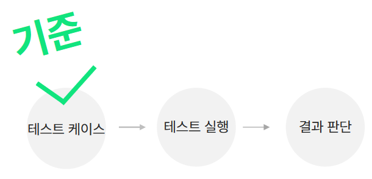
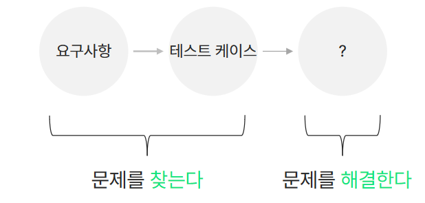
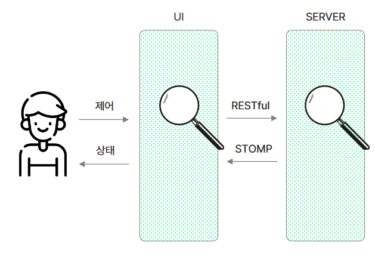
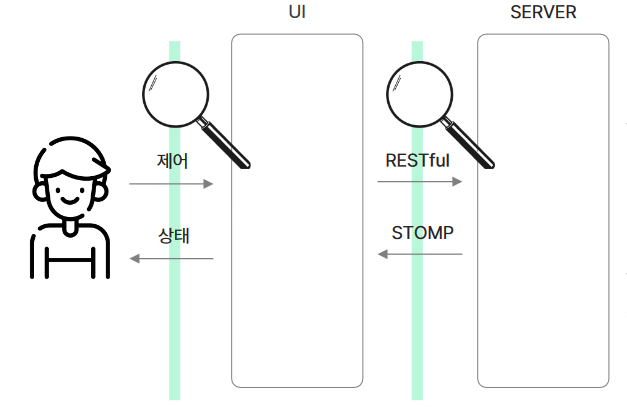
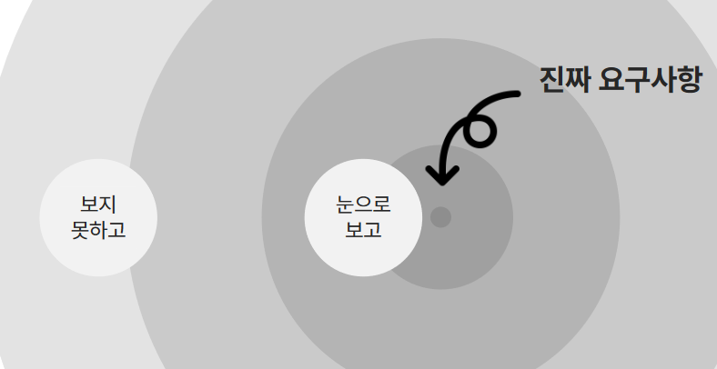

# 나도 내 코드의 문제를 찾고 싶다고요(테스트할때 기억할 7가지)

## 기본적인 세가지

하지 않으면 문제가 되는 세 가지

1. 테스트 케이스

테스트케이스는 `사전 조건`, `입력`, `기대결과`라는 세 가지 요소가 존재한다.

- 테스트 케이스는 앞으로 실행될 테스트 실행 및 결과를 판단하는 기준이 되기 때문에 가장 중요하다.
- 엉뚱한 테스트 케이스를 정의하면 비정상이 정상으로 둔갑하게 된다.
- 그렇다면 어떻게 테스트 케이스를 바르게 정의할 수 있을까?

2. 제품 요구 사항

- 테스트 케이스와 제품 요구 사항은 본질은 같지만 다른 표면을 가진것으로 볼 수있다.
- 즉, 요구사항을 바르게 이해해야 테스트 케이스를 바르게 정의할 수 있다.

3. (외부) 인터페이스를 확인한다

문제 발생 시 원인을 찾을 때, 접근 방법은 크게 두가지로 나눌 수 있다

- `내부` 구현 먼저
  - 보통 자신에게 할당된 부분에서 문제를 찾게 된다
  - 주관적인 근거를 기반으로 문제가 없음을 얘기하기에 상대방에게 신뢰를 주기 어렵다.

- `외부` 인터페이스 먼저
  - 협력하는 상호간의 약속 이행을 확인한다
  - 서로 같은 문제를 다른 방향에서 확인하고 문제의 범위를 좁혀 나간다
  - 객관적인 데이터를 근거로 대화할 수 있어서 서로 신뢰를 할 수 있다.
- 외부 인터페이스를 먼저 검사하는 방법의 순서
  1. 협력하는 외부 인터페이스를 모두 찾는다
  2. 어떤 메시지로 요청하고 응답하는지에 대한 모든 메시지를 확인한다
  3. 특정 기능이 동작할 때, 메세지들이 협력해서 하나의 흐름을 가지는데 어떻게 데이터를 주고받는 지에 대한 흐름을 이해한다.

## 더 나아가면 좋은 세가지

4. 처음 만나는 프로턱트

개발자는 테스트를 수행할 때야 비로소 각 기능들이 결합된 하나의 제품을 보게된다.하지만, 요구사항 정의는 제품을 개발하기 전에 제품을 보지 못하고 정의하게 된다.
여기서 `개발 프로세스의 아이러니`가 발생한다. 즉, 제품의 문제를 테스트하기 전 요구사항 정의에서는 정확하게 파악하기가 어렵다.
또한, 실제 고객이 요구하는 진짜 요구사항은 실제 제품이 나오고 사용하기 전까지는 명확하게 파악하기 어렵고 개발에서도 이런 간극이 발생하게 됨을
인지해야한다.

5. 사용자

이 간극을 줄이기 위해선 내가 사용자 관점으로 내가 만든 제품의 첫 사용자가 되어보는 것이 중요하다.

- 고객의 상황을 상상해 본다
- 똑같은 기능을 좀 더 편리하게

6. 일관성

고객이 사용할 때 기능은 일관성이 있어야 한다.
- 사용법에 대한 기억 할 것을 최소화하고
- 쉽게 익숙해지도록

## 가장 기본적인 한가지

7. 테스트 해야지

실제 업무를 진행하다 보면 테스트를 하지않아서 발생하는 문제가 빈번하게 발생한다. 그런데, 왜 개발자들은 간혹 테스트를 하지 않을까.
여러가지 이유가 있겠지만,
- 테스트 환경 구성이 까다롭거나
- 너무 간단한 코드여서

가장 기본적이고 단순하지만 테스트를 꼭 잊지말자.

## Reference

- 나도 내 코드의 문제를 찾고 싶다고요 : 테스트 할 때 기억할 7가지
- CONTEC 한주승
