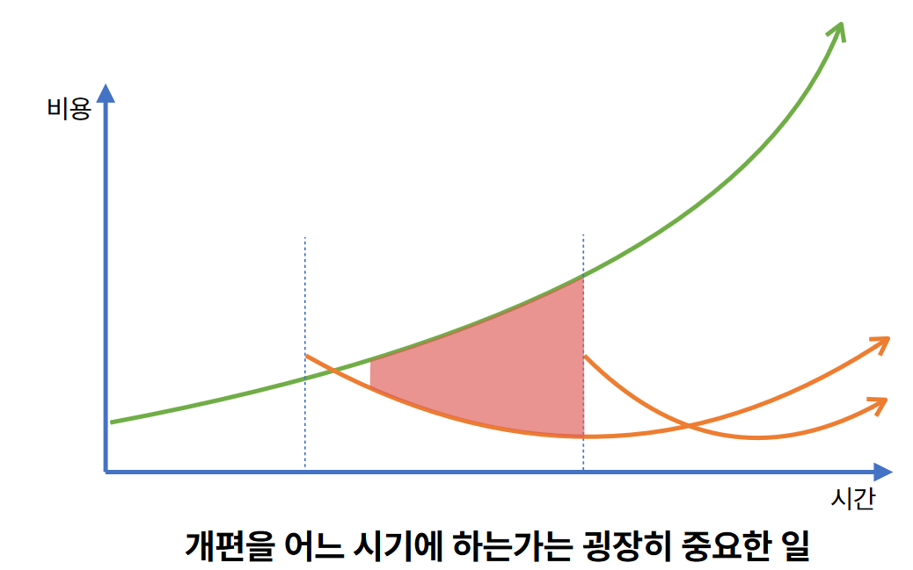
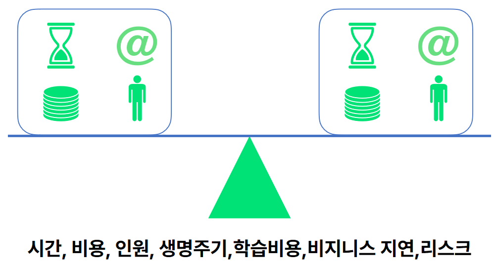
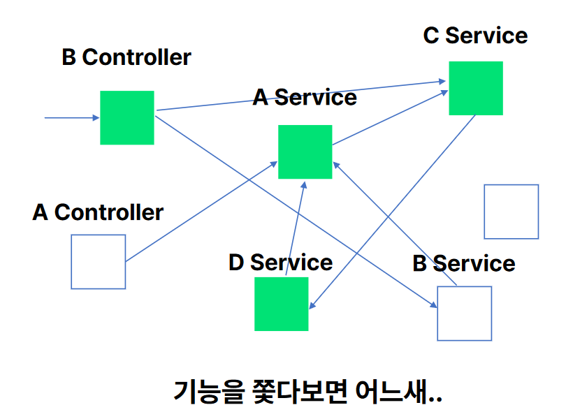
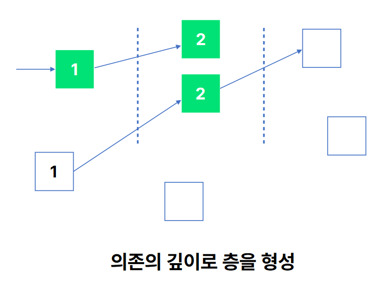
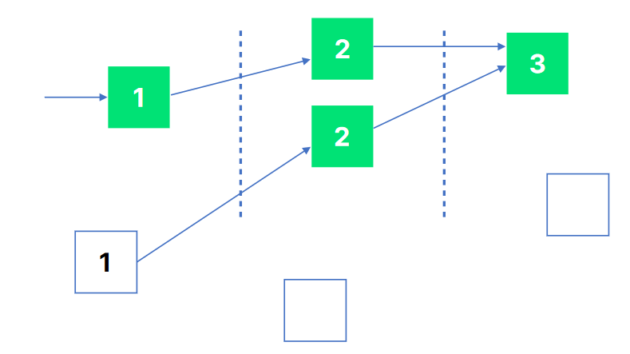
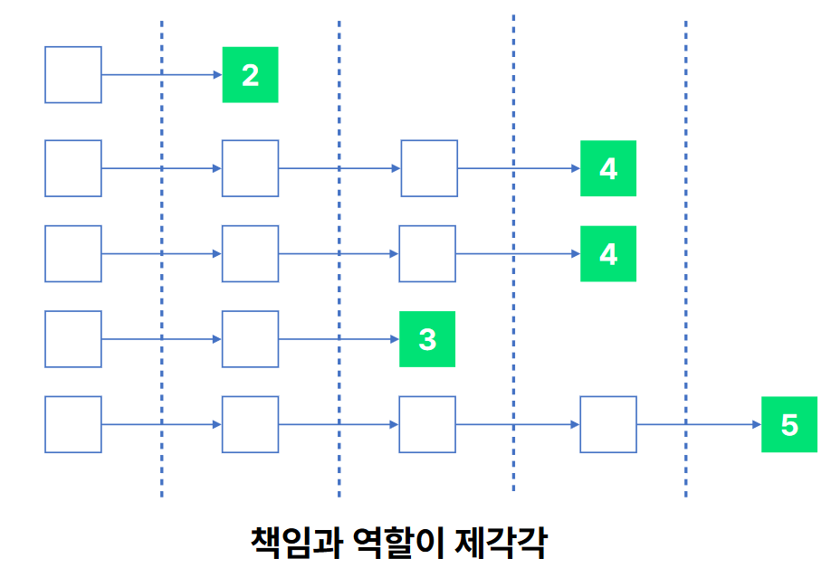
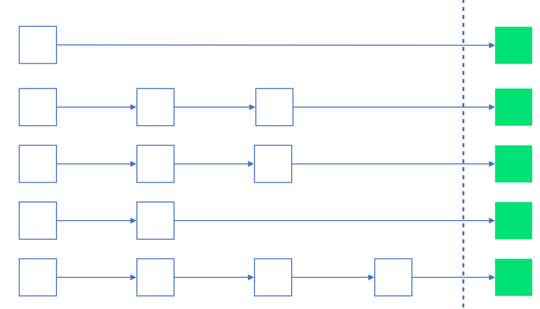
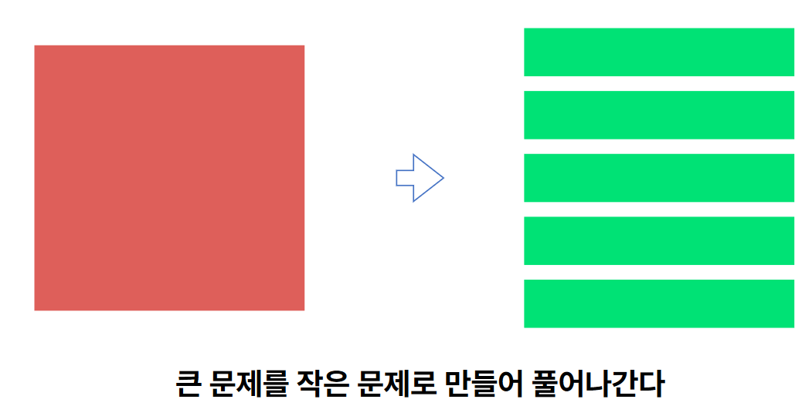

# 레거시 시스템 개편의 기술

## 레거시 시스템 개편은 왜 일어나는가?

서비스를 지속, 성장 시키기 위해 일어난다.

### 레거시 시스템은 무엇일까?

레거시 시스템은 낡은 또는 과거에는 선호했던 기술이지만 시간이 지나면서 `현재는 비주류가 되는 기술`을 가진 시스템이라고 볼 수 있다.
또한 과거에는 성능이 충분했으나 `현재는 성능이 부족한 시스템`, 현재 구조로는 `새로운 요구 사항에 대응할 수 없는 시스템` 또한
레거시 시스템이라고 볼 수 있다.

### 개편은 언제 결정될까?

투자 자본 수익률(ROI), 즉 가성비가 있어야한다. 노력을 들인거에 비해 얻을 수 있는게 얼만큼인지를 측정해야한다.

## 개편의 기술

### 의존성을 한 방향으로 정리하라

객체나 컴퍼넌트의 의존성의 방향이 복잡하게 꼬여있을 수 있다. 이렇게 복잡하게 꼬인 `스파게티 의존성`을 가진 코드의 경우
문제를 수정할 때 발생하는 사이드 이펙트를 측정하기가 어려워진다. 그렇기에 개편하기가 어려운 상태라고도 볼 수있다.

- 왜 스파게티 코드가 발생했을까?
- 새로운 기능이 개발되면서 재사용성을 늘리기 위해 기존 코드를 가져다 쓰는 상황이 계속 발생하면 결과적으로 스파게티 소스가 되어버리는 걸 볼 수있다.

어떻게 이 문제를 해결할 수 있을까?
- 방향을 설정해야한다
  - 방향을 기준을 의존성의 깊이로 시도해본다
  - 같은 층을 의존하는 것도 다른 방향으로 볼 수 있다
    - 이 경우 재사용될 코드를 하나로 묶어서 다음 계층으로 만들어 줄 수 있다.
- 방향을 설정함으로써 사이드 이펙트를 추적할 수 있게된다.

### 변경 대상에 대한 경계를 나눈다

의존성을 의존성의 깊이로 정리하게 되면, 위와 같은 그림이 될 수 있다. 이 경우 의존성의 깊이가 깊어질 수록 책임과 역할을 이전의 
계층이 일부 분리되면서 진행됬을 것이다. 즉, 2계층이 4계층보다는 더 많은 책임을 가지고 있다고 볼 수 도 있다.
이 경우, 변경 범위를 파악하기 어려워지는 단점이 있다.

어떻게 이 문제를 해결할 수 있을까?
- 일단 계층을 허물어버리고 나누고 나눠진 변경 대상을 하나의 계층이라고 정의해본다.
- 이렇게 정의된 계층내에서 책임과 역할을 다시 재정의해본다
  - 즉, 소프트웨어에서 다루어여할 계층을 확보하는 것
- 그렇게 분리된 계층에서 현재 계층에 맞지 않는 코드는 분리해 다른 계층으로 통합시킨다.
- 이렇게 함으로써, 변경 범위에 대한 가시성을 확보할 수 있다.

### 테스트를 확보한다

변경된 계층에 대한 테스트 케이스를 작성해야 한다. 추가적으로 의존성의 깊이로 나뉜 계층의 직전 계층까지 테스트 커버리지를 올리는걸 추천한다.
하지만, 개편에는 일정이 존재할 수 있고 테스트 케이스를 모두 확보하는건 어렵고 어느정도 까지는 확보하는게 좋을까?
테스트 케이스를 모두 작성하면 좋겠지만, 불가능하다면 Endpoint to Endpoint 테스트는 반드시 진행해야한다.

- 이렇게 테스트를 확보함으로써, 개편 완료된 코드로 변경해도된다는 안정감을 가져갈 수 있다.

### 프로젝트 가시성 확보

큰 문제를 작은 문제로 만들어 풀어나가는 식으로 해야나갈 일들을 가시화하고 문서화하는 것이 중요하다.
이렇게 작은 부분으로 가시화함으로써 더 정확한 일정 예측이 가능해지고 리스크를 더 잘 관리할 수 있다.

## Reference

- 레거시 시스템 개편의 기술
- 우아한형제들 권용근