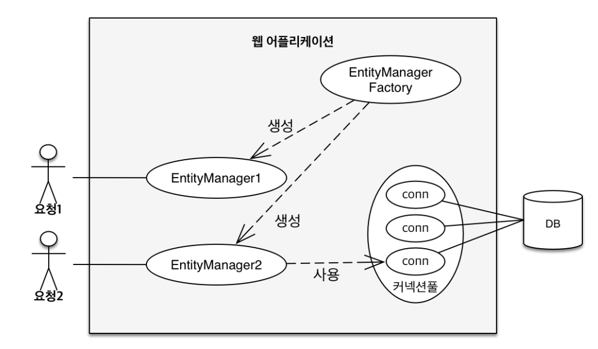
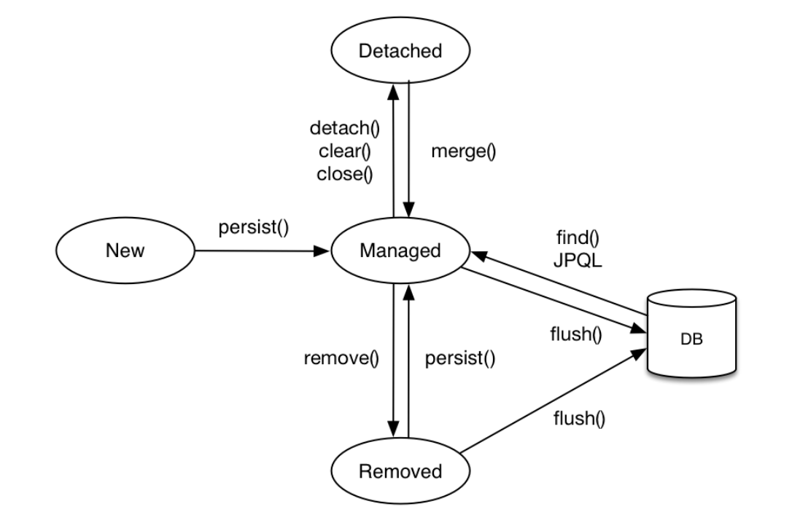
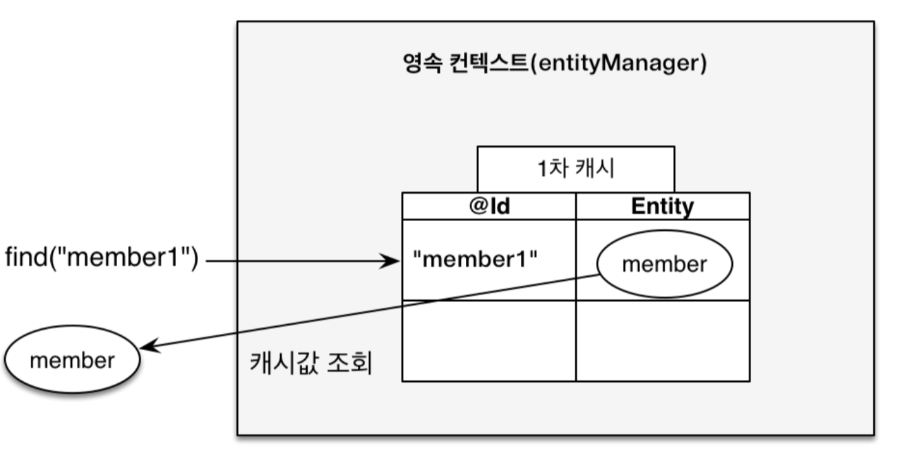
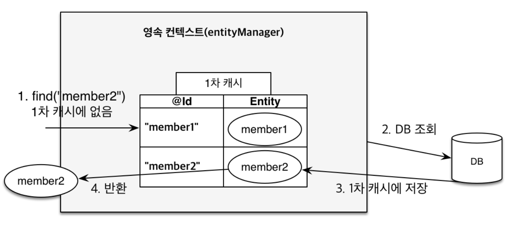
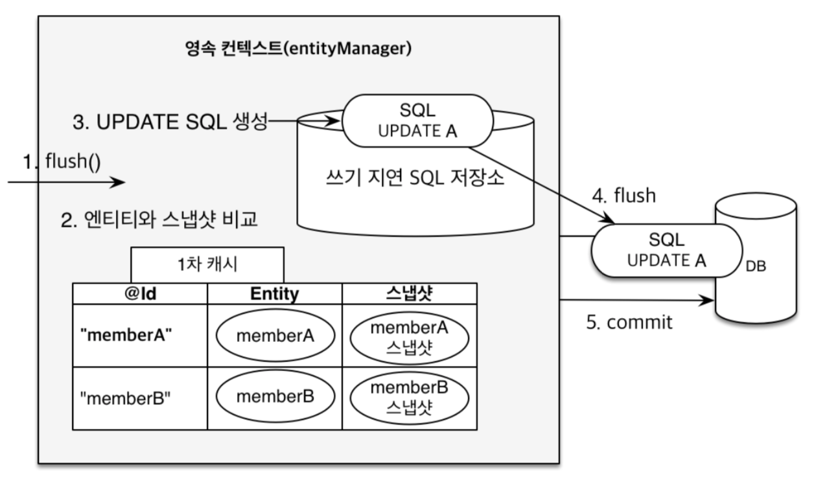

# Persistence Context (영속성 컨텍스트)

영속성 컨텍스트는 `Entity`를 영구 저장하는 환경이라는 의미이다.
`Entity Manager`로 `Entity`를 저장하거나 조회하면 `Entity Manager`는 영속성 컨텍스트에 `Entity`를 보관하고 관리하게된다.
사실상 영속성 컨텍스는 논리적인 개념이며 `Entity`의 DB같은 느낌이지만, 실제 DB에 있는 데이터와 분리해서 생각해야한다.
영속성 컨텍스는 `Entity Manager`를 통해서 접근이 가능하다.

## Entity의 생명주기

- 비영속(new/transient)
  - 영속성 컨텍스트와 전혀 관계가 없는 새로운 상태
- 영속(managed)
  - 영속성 컨텍스트에서 관리되는 상태
  - em.persist한 후 commit되거나 find로 찾은 상태이다
- 준영속(detached)
  - 영속성 컨텍스트에 저장되었다가 분리된 상태
- 삭제(removed)
  - 삭제된 상태

## 특징

### 1차 캐시

영속성 컨텍스트 내부에는 캐시가 존재하여, 이를 `1차 캐시`라고 부른다.
영속 상태의 엔티티(JPA가 관리하는 상태)는 모두 이곳에 저장되며, Key-Value 형태로 key는 @Id, value는 엔티티 인스턴스에 해당한다.
1차 캐시에 저장된 값은 당연히 중복을 허용하지 않으며, 캐시 내 데이터가 존재할 시 빠르게 전달 가능하다.
만약 1차 캐시 내 데이터가 존재하지 않는다면, DB를 조회하여 조회된 데이터를 1차 캐시에 저장하는 과정을 진행한다.

### 동일성 보장

영속성 컨텍스트에서 `find`를 통해 값을 가져오는 경우, 당연하게도 1차 캐시에서 데이터를 가져오게 된다.
당연하게도 1차 캐시는 Map과 같은 형태로 구성되어 있어 `같은 @Id에 대한 같은 엔티티 인스턴스를 반환`을 보장한다.

### 트랜잭션을 지원하는 쓰기 지연

`EntityManger`는 데이터를 변경할 시 트랜잭션을 시작하게되는데 `persist()`라는 영속화를 진행하여도 DB에 바로
쿼리를 보내 `INSERT`를 하는 것이 아니고 트랜잭션이 `commit`이나 `flush` 되기 직전까지 지연된다.
내부 쓰기 지연 쿼리 저장소에 모아둔 쿼리를 DB로 한번에 전달하기 때문에 성능 최적화가 가능한 장점이 존재한다.

### 변경 감지(Dirty Checking)

영속성 컨텍스트에서 관리하는 `영속 Entity`의 데이터를 변경하게 되면, 트랜잭션이 종료되는 시점에 변경된 내역이 자동으로 update가 된다.
1차 캐시에는 엔티티 인스턴스 뿐만 아니라, 엔티티의 상태에 대한 스냅샷(snapshot)또한 저장되어 있어 변경된 내역을 자동으로 감지할 수 있따.
이 때도 변경된 내용들은 쓰기 지연 쿼리 저장소에 모아 한번에 전달된다.
