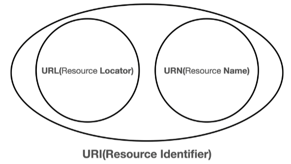
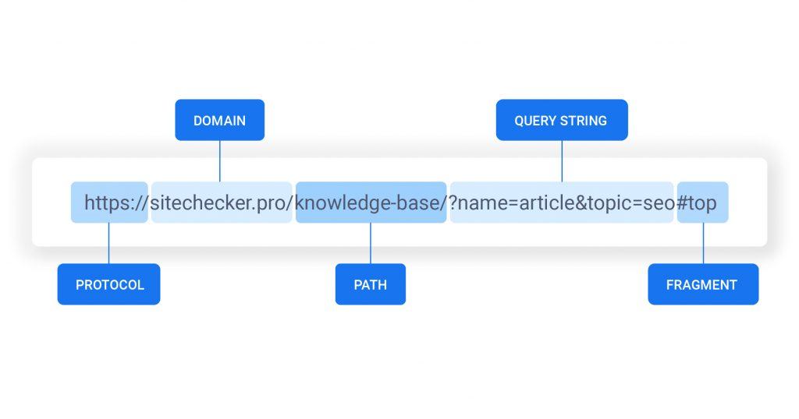
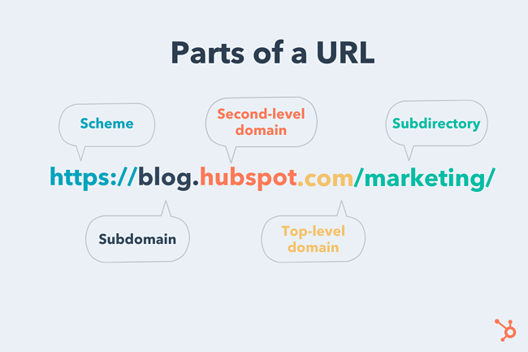

## Uniform Resource Identifier(URI)

- URI, URL, URN
  - URI 
    - 로케이터(locator), 이름(name) 또는 둘다 추가로 분류될 수 있다
    - Uniform : 리소스를 식별하는 통일된 방식
    - Resource: URI로 식별할 수 있는 모든것
    - Identifier: 다른 항목과 구분하는데 필요한 정보
  - URL(Uniform Resource Locator)
    - Locator: 리소스의 위치를 지정
  - URN(Uniform Resource Name)
    - Name: 리소스에 이름을 지정

### 문법

- Schema
  - Protocol
  - 어떤 방식으로 Resource에 접근할 지를 정하는 규칙
  - http, https, ftp
  - http는 80 port, https는 443 port를 주로 사용되며 생략 가능
- Domain
  - 호스트 명
  - 도메인명 또는 ip 주소를 직접 입력 가능
- Port
  - 접속 포트로 일반적으로 생략 가능
- Path
  - Resource 경로
  - 계층적 구조
- Query string
  - key = value 형태
  - ?로 시작하고 &로 추가 가능하다
  - 웹서버에 제공하는 파라미터이기 때문에 query parameter라고도 불린다
- Fragment
  - html 내부 북마크 등에서 사용되며 서버로 전송되는 정보는 아니다

## 웹 브라우저 요청 흐름

https://www.google.com:443/search?q=hello&hl=ko

1. 웹브라우져가 www.google.com라는 DNS를 조회하고 포트정보를 가지고 HTTP 요청 메시지를 생성한다
2. OS의 Socket 라이브러리를 통해 요청 메시지를 TCP/IP에 전달
   - TCP/IP 연결(IP, Port)
     - SYN, ACK + SYN, ACK 작업 진행(3 way handshake)
   - 데이터 전달
3. TCP/IP 패킷 생성
4. 네트워크 인터페이스(LAN 드라이버, 어댑터)를 통해 서버로 전달
5. 서버에서는 TCP/IP 패킷을 까서 내부의 HTTP 요청 메시지를 확인.
6. 응답메시지를 만들고 TCP/IP 형태로 클라이언트로 전달
7. 클라이언트에서 서버로부터 TCP/IP를 열어 내부의 HTTP 응답메시지를 보고 웹브라우져가 이를 그려준다