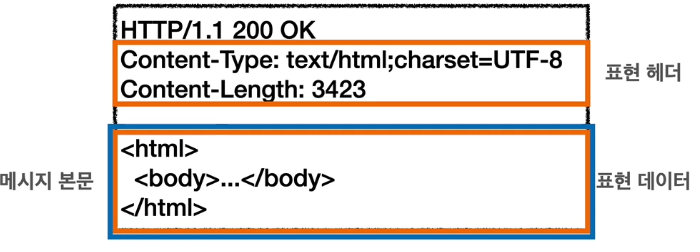
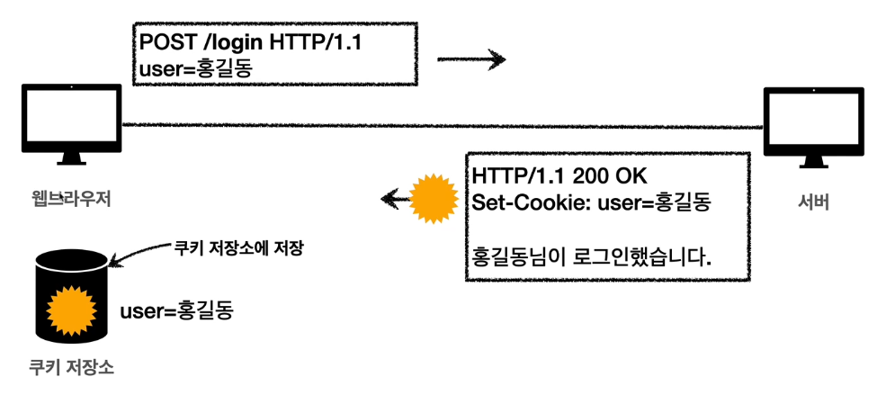

# HTTP Header

- HTTP 전송에 필요한 모든 부가정보가 포함된다
    - 메시지 바디 내용
    - 메시지 바디의 크기
    - 압축
    - 인증
    - 요청 클라이언트
    - 서버 정보
    - 캐시관리 정보 등등
- 표준 헤더가 상당히 많다
- 또한 임의의 헤더 또한 추가 가능하다

## HTTP Body (메시지 본문)

- Representation = Representation Metadata + Representation Data
- 메시지 본문을 통해서 표현 데이터를 전달한다
    - 메시지 본문 = 페이로드(payload)
- 표현은 요청이나 응답에서 전달할 실제 데이터
- 표현 헤더는 표현 데이터를 해석할 수 있는 정보를 제공한다
    - 데이터 유형(html, json, xml), 데이터 길이, 압축 정보 등등
- 어떤 리소스를 http로 전송할 때 어떤 형태로 표현할지를 결정하기 때문에 Representation 이라고 바뀌었다

## Representation

- Content-Type
    - 표현 데이터의 형식
    - 미디어 타입, 문자 인코딩
    - text/html; charset=utf-8
    - application/json 등등
- Content-Encoding
    - 표현 데이터를 압축하기 위해 사용된다
    - 데이터를 전달하는 곳에서 압축한 후 인코딩 헤더를 추가한다
    - 읽는 쪽에서는 인코딩 헤더를 통해 압축 해제 후 읽는다
    - gzip, deflate, identity 등
- Content-Language
    - 표현 데이터의 자연 언어
    - ko, en, en-US
- Content-Length
    - 표현 데이터의 길이 (바이트 단위)
    - 단, Transfer encoding을 사용하면 content-length를 사용하면 안된다
        - 이미 정보가 transfrer encoding에 다 포함되어 있기 때문에
- 표현 헤더는 전송과 응답 둘다에서 사용된다

## Content Negotiation

- **클라이언트**가 원하는 표현으로 서버에 요청한다(물론 서버가 지원 가능한 경우)
- Accept
    - 클라이언트가 선호하는 미디어 타입으로 주세요
- Accept-Charset
    - 클라이언트가 선호하는 문자 인코딩으로 주세요
- Accept-Encoding
    - 클라이언트가 선호하는 압축 인코딩으로 주세요
- Accept-Language
    - 클라이언트가 선호하는 언어로 주세요
- 협상과 우선순위
    1. Quality Values(q) 값 사용
        - 0~1, 클수록 높은 우선 순위
        - 생략하면 1이 사용된다
        - Accept-Language: ko-KR,ko;q=0.9,en-US;q=0.8,en;q=0.7
    2. 구체적인 것이 우선된다
        - Accept: text/*, text/plain, text/plain;format=flowed
            1. text/plain;format=flowed
            2. text/plain
            3. text/*
        - 구체적인 것을 기준으로 미디어 타입을 맞춘다
- 협상 헤더는 요청시에만 사용된다

## 전송 방식

- 단순 전송 (Content-Length)
    - 컨텐트의 길이를 알 때 사용한다
        - Content-Length: 3423
    - 한 번에 요청하고 한번에 받는다
- 압축 전송 (Content-Encoding)
    - Content-Encoding: gzip
- 분할 전송 (Transfer-Encoding)
    - 용량이 큰 표현을 분할해서 보내게 되면 부분 부분을 바로 표현할 수 있는 장점이 있다
    - Transfer-Encoding: chunked
    - Content-Length를 사용하면 안된다!
- 범위 전송(Range, Content-Range)
    - 예를 들어 데이터 전송 중 통신이 끊겨서 받은 데이터 이후부터의 범위를 지정하여 나머지를 받는 경우
    - Content-Range: bytes 1001-2000 / 2000

## 일반 헤더 정보

- From
    - 유저 에이전트의 이메일 정보
    - 일반적으로 잘 사용되지 않는다
    - 검색 엔진 같은 곳에서 사용한다
    - 요청에서 사용
- Referer
    - 많이 사용된다
    - 현재 요청된 페이지의 이전 웹페이지 주소
    - A에서 B로 이동하는 경우 B를 요청할 때 Referer: A를 포함해서 요청한다
    - 유입 경로 분석이 가능하다
    - 요청에서 사용
- User-Agent
    - 유저의 클라이언트 어플리케이션 정보
    - 통계 정보
    - 어떤 종류의 브라우저에서 장애가 발생하는지 파악이 가능하다
    - 요청에서 사용
- Server
    - 요청을 처리하는 ORIGIN 서버의 소프트웨어 정보
        - 여러 proxy 서버를 거쳐 실제 HTTP 응답을 해주는 서버가 ORIGIN 서버
    - 응답에서 사용
- Date
    - 메시지가 발생한 날짜와 시간
    - 응답에서 사용

## 특별한 헤더 정보

- Host
    - 요청한 **호스트 정보**(도메인), 진짜진짜 중요
    - 요청에서 사용되며 **필수** 헤더!
    - 하나의 IP 주소에 여러 도메인이 적용되어 있을 때 사용한다
        - 가상 호스트를 통해 여러 도메인을 한번에 처리할 수 있는 서버같은 경우
    - Host: aaa.com
- Location
    - 페이지 리다이렉션
    - 웹 브라우저가 3xx응답의 결과에 Location 헤더가 있으면 리다이렉트
    - 201(Created)에서도 Location 헤더가 발생할 수 있는데 이는 새로 생성된 리소스 URI
- Allow
    - 405(Method Not Allowed) 에서 응답에 포함되야하는 내용
    - 예를 들어 서버는 GET, HEAD, PUT만 제공하고 클라이언트가 POST를 사용할 경우
    - Allow: GET, HEAD, PUT 이라고 응답해줌
    - 잘 사용되지는 않음
- Retry-After
    - 유저 에이전트가 다음 요청을 하기까지 기다려야하는 시간
    - 503(Service Unavailable) 발생 시 언제까지 사용하지 못하는지 알려줄 수 있다
    - 날짜와 초단위 표기가 가능하다
    - 실제로는 언제까지인지 정확히 알 수없기에 사용하기 쉽지 않음
- 인증 관련
    - Authorization
        - 클라이언트 인증 정보를 서버에 전달하는 것
    - WWW-Authenticate
        - 리소스 접근시 필요한 인증 방법을 정의
        - 401(Unauthorized) 응답과 함께 사용된다
        - WWW-Authenticate: Newauth realm="aaps", type=1 ...

## Cookie(쿠키)

- [HTTP stateless](03_http.md) 참조 stateless protocol 참조
- HTTP는 무상태 프로토콜이기에, 클라이언트와 서버가 요청과 응답을 주고 받으면 연결이 끊어진다
- 따라서 서로 상태를 유지하지 않고 이전 요청을 기억하지 못한다
- 그렇기에 어떤 상태를 유지하는 결과를 얻기위해서는, 모든 요청에 정보를 담아서 보내야되는 문제점이 생긴다

- Set-Cookie
    - 서버에서 클라이언트로 쿠키 전달(응답)
- Cookie
    - 클라이언트가 서버에서 받은 쿠키를 저장하고, HTTP 요청시 서버로 전달한다
        - 웹 브라우저에는 쿠키 저장소가 존재하고 이를 저장한다.
        - 직접 URL에 넣을 필요없이, 자동으로 웹브라우져가 지정한 서버에 요청을 보내기전에 쿠키를 찾아 같이 전달한다
        - 지정한 서버에 대해서 모든 요청에 쿠키 정보를 자동으로 포함한다

### Cookie Detail

- set-cookie:sessionId=abcde1234; expires= Sat, 31-Jan-2022 00:00:00 GMT; path=/; domain=.google.com; Secure
    - 생명 주기 (Expires, max-age)
    - 만료일이 되면 쿠키 삭제
    - expires의 경우 GMT 기준
    - max-age의 경우 초 단위
    - 세션 쿠키
        - 만료 일자를 생략하면 브라우저 종료시 까지만 쿠키 유지
    - 영속 쿠키
        - 만료 날짜를 입력하면 해당 날짜까지 쿠키 유지
- 도메인 (Domain)
    - 도메인을 명시한 경우
        - domain = example.org
        - 명시한 문서 기준 도메인 + 서브 도메인을 포함
        - example.org는 물론이고 dev.example.org도 쿠키 접근 가능
    - 도메인을 생략한 경우
        - example.org에서 쿠키를 생성하고 domain 지정을 생략하면 example.org에서만 쿠키 접근 가능
- 경로 (Path)
    - 이 경로를 포함한 하위 경로 페이지만 쿠기 접근이 가능한다
        - path=/home
        - /home, /home/level1, home/level1/level2 -> 가능
        - /hello -> 불가능
    - 일반적으로는 **path=/** 루트로 지정한다
- 보안 (Secure, HttpOnly, SameSite)
    - Secure
        - 쿠키는 http, https를 구분하지 않고 전송한다
        - 하지만 Secure를 적용하면 https인 경우에만 전송한다
    - HttpOnly
        - XSS 공격 방지
        - javascripte에서 접근이 불가능하다
        - HTTP 전송에만 사용 가능
    - SameSite
        - XSRF 공격 방지
        - 요청 도메인과 쿠키에 설정된 도메인이 같은 경우에만 쿠키 전송
        - 아직 기능이 적용된지 오래되지 않아 브라우져에서 어느정도까지 지원되는지 확인이 필요하다

### 사용처

- 사용자 로그인 세션관리
- 광고 정보 트래킹
- 쿠키 정보는 항상 서버에 전송된다
    - 네트워크 트래픽이 추가적으로 유발된다
    - 최소한의 정보만 사용하는 것이 중요(session id, 인증 토큰)
    - 서버에 전송하지 않고, 웹브라우저 내부에 데이터를 저장하고 싶은 경우 웹 스토리지(localStroage, sessionStorage)
- 보안에 민감한 데이터는 저장하면 안된다!!

 