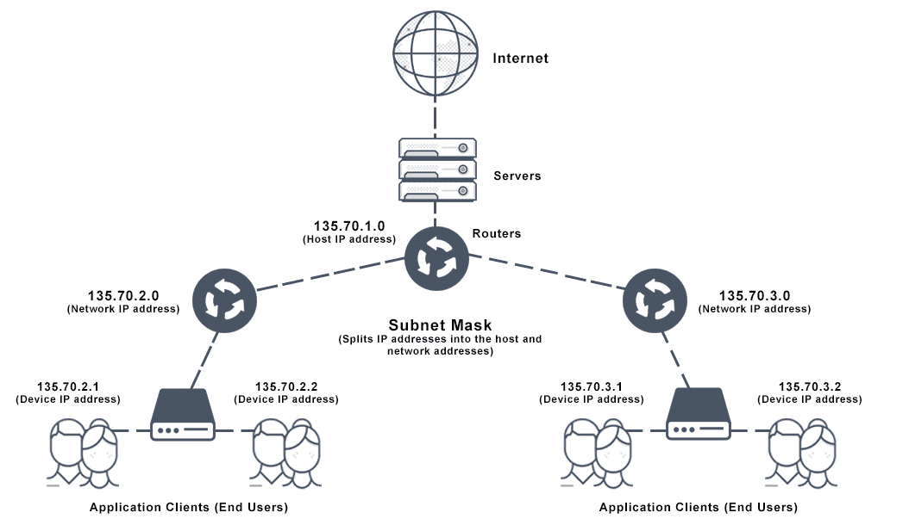
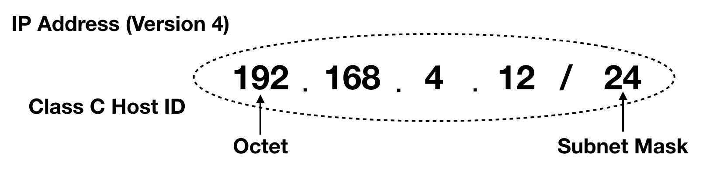

# 02.웹서버의 IP주소를 DNS서버에 조회한다

## IP(Internet Protocol) 주소의 기본

- 우리가 사용하는 인터넷 브라우저(ex. chrome, firefox 등)는 ***URL을 해독하거나 HTTP 메시지를 만들 수 있다***

- 하지만 메시지를 ***네트워크에 송출하는 기능은 OS에 의뢰*** 하여야 함

- 이때 URL안에 있는 대상의 Domain name이 아닌 실제 IP주소를 조사해야 함  
ex) 연락처에서 이름으로 전화를 걸지만 실제는 전화번호가 있듯

### **Subnet**

  

- 인터넷이나 사내 LAN은 ***TCP/IP의 개념에 기초*** 하여 만들어짐

- Subnet이라는 작은 네트워크를 Router로 접속하여 전체 네트워크가 만들어 진다고 생각할 수 있음.

- 여기서 Subnet이란 허브에 몇 대의 PC가 접속된 것이라고 생각하면 됨.
    > 허브 : 패킷을 중계하는 장치의 일종.  
    리피터 허브와 스위칭 허브의 두가지 유형이 존재.

- 'oo동 oo번지'라는 형태로 네트워크의 주소를 할당.
  - '동'에 해당하는 번호를 subnet에 할당.  
  ( = ***네트워크 번호*** )
  - '번지'에 해당하는 번호를 컴퓨터에 할당하는 것이 네트워크의 주소  
  ( = ***호스트 번호*** )
  - 이 두 주소를 합쳐서 ***IP Address*** 라고 함.  

- 송신 측이 메시지를 보내면
  1. Subnet 안의 허브가 이를 운반.
  2. 가장 가까운 router까지 도착.
  3. 1-2번 반복
  4. 최종적 end-user에 도달

- 이것이 TCP/IP와 IP주소의 기본적인 개념.

### IP Address

- 실제 IP주소는 ***32비트*** 디지털 데이터.

- 이것을 ***8비트(1바이트)씩 점으로 구분*** 하여 10진수로 표기함.

- IP주소만을 보면 네트워크 번호와 호스트 번호를 구분할 수 없으며, 이를 ***구분하기 위한 정보가 Subnet mask*** 로, 위 그림 ***24*** 에 해당

- Subnet mask는 255.255.255.0를 32비트 표현하였을 때의 비트 수.
  - Subnet mask의 0에 해당하는 부분이 호스트 번호 (0.0.0.12)
  - 나머지가 네트워크 번호 (192.168.4.0)

> 호스트 번호가 모두 0인 경우(비트수 0)는 ***Subnet 자체*** 를 나타내고,  
호스트 번호가 모두 1인 경우(비트수 32)는 Subnet에 있는 기기 전체에 패킷을 보내는  
***브로드 캐스트(Broadcast)*** 를 나타냄.

## Domain name과 IP를 구분해 사용하는 이유

- 전화를 걸 때 전화번호를 일일히 다 기억해서 전화하는 사람은 없음.(IP)
- 이를 기억하기 쉽게 이름으로 저장해둔다(Domain Name)
- IP주소는 32비트, 즉 4바이트에 해당하는 개수 밖에 없지만,  
 Domain name은 최소 수십 바이트부터 최대 255바이트나 존재.
- 그렇기에 Domain name만 존재한다면, 그만큼 router에 부하되어 데이터 운반 시간이 올라가고 네트워크 속도가 저하.
- Domain name으로 IP 주소를 얻어내는 원리가 DNS(Domain Namer System)

## Socket library가 IP 주소를 찾는 기능을 한다

- 가까운 DNS 서버에 domain name을 넘기면서 IP 주소를 요청하면 간단하게 얻을 수 있음.

- 근데 어떻게 이럴 수 있을까? 누가 DNS 서버에 요청하는 것 일까?

- DNS server에 조회한다는 것은
  1. DNS 서버에 request message를 보냄.
  2. DNS 서버로부터 반송되는 response message를 받음.

- 이것은 ***무언가가 DNS server에 대해 Client로 동작*** 한다고 볼 수 있음.

- 이 DNS client에 해당하는 것이 DNS 리졸버(Resolver) 또는 resolver.

- IP 주소를 조사하는 것을 Name Resolution이라 하는데, 이를 resolver가 실행.

- Resolver의 실체는 ***Socket Library***.
  - Socket library는 OS에 포함되어 있는 네트워크의 기능의 집합.
  - Resolver 는 그 집합 중의 하나.

## Resolver의 작동

- C 언어의 Winsock.h의 gethostbyname과 서버 주소를 입력하면 resolver를 호출할 수 있음.

- 우리가 resolver를 호출하면 DNS 서버에 메시지를 보내지만, 스스로 송신하는 것이 아님.
  - Resolver도 네트워크에 대해 데이터를 송,수신하는 기능은 없기에.
  - OS의 내부에 포함된 ***Protocol Stack*** 을 호출하여 메시지 송신을 의뢰.

> Resolver의 실제 동작 흐름  
Application(Resolver) → Socket library → Protocol stack in OS → Lan Adapter → DNS server
