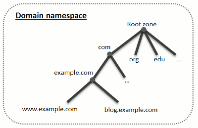
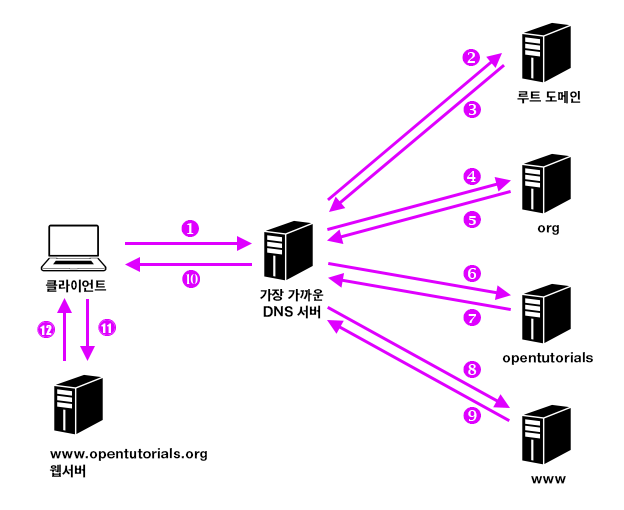

# 03. 전세계의 Server가 연대한다

## DNS 서버의 기본동작

- Client에서 조회 메시지를 받고 내용에 응답하는 것이 기본동작
- 조회 메시지에는 세가지 정보가 포함.
    1. **_이름_** : 서버 주소나 메일 주소의 목적지(@ 뒷부분의 이름)
    2. **_클래스_** : DNS가 처음 고안되었을 땐 인터넷 이외에 다른 네트워크를 식별할 클래스 정보가 있었지만, 현재는 인터넷만 존재 → 'IN'
    3. **_타입_** : 어떤 종류의 정보가 지원되는지. 타입 'A'는 IP 주소, 'MX'는 메일 주소의 목적지.  
    타입에 따라 회신되는 정보의 내용이 달라짐.
- DNS 서버에 위 세가지 정보가 일치하는 것을 찾아 Client에 회답.
- 타입이 'A'인 경우 IP 주소가 return.
- 타입이 'MX'인 경우 메일 서버의 우선 순위와 메일 서버의 이름, IP 주소가 return.
  - 우선순위는 어떤 복수의 메일 서버가 등록될 경우 필요.
  - 어느 메일 서버를 우선 선택해야 하는지를 판단하기 위한 값.
  - 낮은 값으로 되어있는 걸 우선 선택함.

## Domain의 계층

- 과연 하나의 DNS서버에 전세계의 Domain name과 IP가 등록되어 있을 수 있을까? **절대 불가**.
- 정보를 분산시켜 다수의 DNS 서버에 등록하고, 원하는 IP가 등록되어 있는 DNS 서버를 찾아내는 구조.
- DNS에서 취급하는 이름은 http://www.lab.cyber.com 처럼 점으로 구분되어 있는데, 이 점이 각각의 도메인(Domain).
- **_즉, com이라는 도메인 아래 cyber라는 도메인이 있고, 그아래 lab 이라는 도메인, 마지막으로 www라는 도메인이 계층적으로 있는 구조_**.
- 하나의 도메인을 분할 할 수는 없지만 하위 도메인을 만들고 할당은 가능(**_Sub-domain_**)
- 위 사진의 example.com의 DNS 서버 아래 www와 blog라는 하위 도메인들이 존재.

## 담당 DNS 서버를 찾아 IP 주소를 가져온다

- 분산된 DNS 서버이기에 중요한건, 찾으려는 웹 서버가 어느 DNS에 등록되어 있는지 찾는 것.
- 그래서 나온 방법이, **_하위 도메인을 담당하는 DNS 서버의 IP 주소를 상위의 DNS 서버에 등록하는 것_**.
- 즉 blog.example.com 이라는 도메인을 담당하는 DNS서버를 example.com의 DNS 서버에 등록하고,   
  example.com의 DNS서버를 com 도메인의 DNS 서버에 등록하는 것.
- 이렇게 하면 상위의 DNS 서버로 올라가면, 하위의 DNS 서버의 IP 주소를 알 수 있음.(하향식)
- **_com 위에는 root domain이 존재_**.
- 추가적으로 root domain의 DNS 서버를 모든 DNS 서버에 등록하는 것.
- 원하는 DNS 서버를 찾는 방법은 위의 사진처럼 가장 가까운 DNS 서버에 접속 후, 루트 도메인에서 부터 하향식으로 찾아 가는 것.