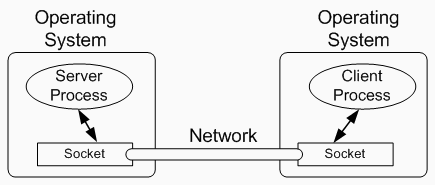
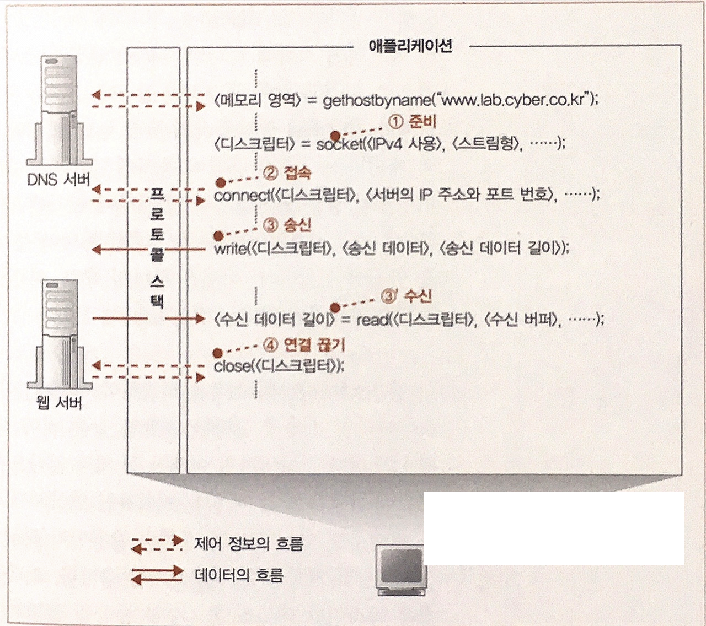

# 04.Protocol Stack에 메시지 송신을 의뢰한다.

## 데이터 송, 수신 동작의 개요

- IP를 DNS 서버를 통해 얻게되면 메시지를 OS 내부에 있는 **protocol stack** 에 의뢰.
- 이번에도 socket library에 있는 몇가지 api를 호출하게 됨.
- 송, 수신은 양방향으로 데이터를 흘릴 수 있는 모습으로 상상할 수 있음.

### Socket
- 시작은 이 파이프를 연결하는 동작부터 수행해야 함.
- 파이프 양 끝의 데이터 출입구를 **_socket_** 이라고 부름.
- 송, 수신 단계는 몇가지 단계로 나누어져 있음.
    1. Socket을 만듬(실제로는 서버쪽에서 먼저 만들고 대기)
    2. 서버측의 socket에 파이프를 연결(Connect)
    3. 데이터를 송, 수신 (read, write)
    4. 파이프를 분리하고 socket 연결을 해제(Disconnect)
- 이 모든 동작은 Application 즉 **_브라우저가 아닌 Protocol stack에 의뢰되어 동작_** 하는 것.
- Application이 -> socket을 통해 -> protocol stack에 의뢰.

### Socket의 생성 (Descriptor)

- Socket이 생성되면 **_descriptor_** 라는 것이 생성됨.
- Descriptor는 **_socket을 식별하기 위해 사용되는 번호표_** 같은 것.
- 실제로 컴퓨터 내부에는 여러 데이터 송, 수신 동작이 동시에 진행되고 있기에 이를 구별할 필요가 존재.  
  예를 들어, 두개의 브라우져를 열어, 각각 네이버와 구글에 접근하라면 2개의 socket가 생성되며 구별할 수단이 필요.
- Socket에 할당된 번호 = Descriptor
- 따라서 descriptor를 통해 **protocol stack이 어떤 socket을 사용해야할 지를 판단**할 수 있게 됨.

### Socket의 연결

- 이때 필요한 것이 descriptor, 서버의 IP, 그리고 Port..!!
- Descriptor를 통해 protocol stack은 어느 socket을 server와 연결할지 판단하여 동작을 실행.
- IP는 송, 수신하는 상대의 주소기에 주소를 protocol stack에게 알리고 접속을 요청함.
- IP + Port를 통해 어떤 컴퓨터(IP) 에 어느 소켓(Port)에 접속할지 분명히 지정할 수 있음.

>IP를 전화번호로 비유했는데, 통신과 전화의 다른점이 여기에선 존재한다.
 IP는 네트워크에 존재하는 수많은 컴퓨터들을 식별하기 위해 서로 다른 값을 할당한 것이므로,
 IP로 알 수 있는 건 네트워크 상의 어떤 컴퓨터인가 까지이다.
 즉, IP 주소만으로는 원하는 socket과 연결할 수 없으며,
 따라서 client의 socket을 서버 내에 존재하는 다수의 socket 중 원하는 socket에 연결해야 적절한 통신이 가능하다.

- 서버측 port는 application의 종류에 따라 사전에 협의된 규칙이 존재.
    ex) web은 80번, mail은 25번 등.
- 가만히 생각해보면, server에 접속하기 위해 port가 필요한데.. server는 client의 port가 필요하지 않을까?
- 이것은, client에서 초기 socket 생성 시 protocol stack이 적당한 값을 골라서 할당.
- 그리고 이 port 값을 server에 접속할 때, server 쪽에 넘겨 줌.

### Read, Write

- Socket이 연결된 이후에는 socket에 데이터를 넘기면 상대측에 데이터가 도착함.
- 사용자가 입력한 URL을 바탕으로 만든 HTTP request message가 여기서 말하는 데이터.
- 송신 시, write 함수를 호출하며, 이때 descriptor와 데이터를 전달.
- 송신 후에는 서버에 도착하게 되고 서버는 데이터의 내용을 조사후 response message를 전달.
- 수신 시에는, read 함수를 통해 메모리에 할당된 receive buffer에 response message를 저장.

### Disconnect

- Close 함수를 통해 socket과 파이프를 끊어 줌.
- HTTP protocol의 경우 서버에서 response message를 보낸 후, close를 실행.
- 서버에서 close가 호출되면 클라이언트 측에도 전달되어 역시 close를 실행.
- 브라우저에서도 read로 수신 동작을 protocol stack에 의뢰하면 데이터 대신, 연결이 끊어 졌다는 사실을 전달받고 close를 실행.

## 송, 수신의 흐름

