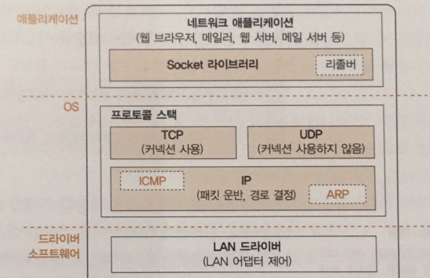

# Socket을 작성한다

## Protocol stack의 내부구성

- TCP, UDP를 선택하고, IP protocol을 이용하여 패킷 송, 수신을 제어.
- 패킷을 통신 상대까지 운반하는 것이 IP의 주 역할.
  - ICMP는 패킷 운반시 발생하는 오류나 제어용 메시지를 통지.
  - ARP는 IP 주소에 대응하는 이더넷의 MAC 주소를 조사할 때 사용.
- LAN 드라이버는 LAN 어댑터의 하드웨어를 제어.

## Socket의 실체는 통신 제어용, 제어 정보

- Protocol stack 내부에는 제어 정보를 기록하는 메모리 영역을 가지고 있음.
  - 대표적으로 상대의 IP는 무엇이고, port는 몇번인가 등.
- Socket은 사실상 **개념적인 대상**으로, 이런 제어 정보들이 Socket.
- Protocol stack은 제어정보를 참조하여 동작하며 다음에 행동을 판단하는 것도 Socket을 참조.
- netstat에서 나오는 정보들이 socket 내 일부 데이터로 볼 수 있음.

## Socket을 호출했을 때의 동작.

- Protocol stack이 최초로 하는 일은 Socket 한 개 분량의 **메모리를 확보**하는 것.
- Socket을 만들 때 한 개의 메모리 영역을 확보하고 초기 상태라는 것을 기록하고 descriptor return.
- Socket 에는 누구와 누가 통신하는지, 어떤 상태로 있는지 등의 정보가 전부 기록되어 있으므로, 
 descriptor가 가리키는 socket을 통해 필요한 정보를 protocol stack에서 사용.
- 통신 상대의 정보를 계속 통지받을 필요없이, socket만 확인하면 됨.