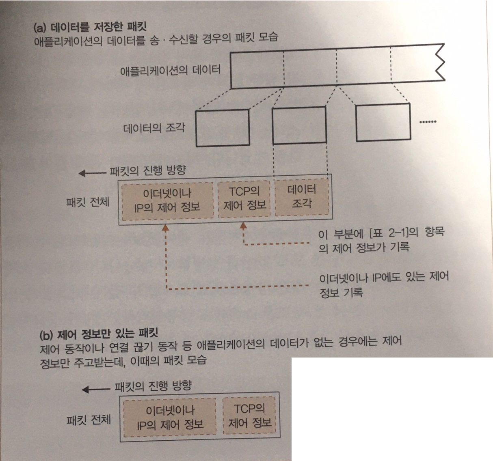

# 서버에 접속한다.

## 접속의 의미

- Client 측에서 살펴보면
  - 케이블은 항상 연결되어있으므로, 데이터를 신호로 변환하여 송신하면 언제든 통신이 가능해야 하는 것이 아닌가?
  - 만약 소켓을 만든 직후에 송신을 진행하면 protocol stack은 어떻게 될까?
  - socket()을 호출하여 소켓을 만드는 것 만으론, protocol stack에는 아무런 정보가 전달되지 않음.
  - 이를 protocol stack에 알리는 과정이 필요한데 이것이 connect의 역할 중 하나!!

- Server 측 또한 마찬가지
  - 서버 측 protocol stack에도 클라이언트에 대한 정보가 전무한 상황.
  - 그래서 클라이언트의 접속 동작을 통해, 통신을 원하는 클라이언트의 정보를 전달.
  - 그렇게 서버 측도 클라이언트의 정보를 가지게 되고 통신 동작을 진행할 수 있음.
  - 이것도 connect의 역할 중 하나!!
  
즉 connect 동작은 상대와의 제어 정보를 주고받아 socket에 필요한 정보를 기록하고, 데이터 송, 수신이 가능한 상태로 만드는 것이다.
또한 송, 수신 동작 중 데이터를 일시적으로 저장하는 메모리 영역이 필요한데, 이를 버퍼 메모리라고 부르며, 이 영역의 확보 또한 connect할 때 실행한다.

## 맨 앞 부분에 제어 정보를 기록한 header를 배치

제어정보는 크게 두가지로 나눌 수 있음.
1. TCP 프로토콜 사양으로 규정
- 클라이언트와 서버가 통신 동작 전체에 어떤 정보가 필요한지 절충하는 것.
- 이 항목은 고정이며, 각 단계에서 클라이언트와 서버가 대화할 때마다 이 제어정보를 추가.
- 접속 단계에서는 데이터 없이 제어 정보만으로 이루어져 있음.

이런 패킷의 제어 정보를 가진 앞 부분들을 Header(헤더)라고 부르며,
 클라이언트와 서버는 이 헤더에 필요한 정보를 기록하여 연락을 취하고, 통신을 진행.

2. Socket에 기록하여 protocol stack의 동작을 제어하기 위한 제어 정보.
- 여기에는 애플리케이션에서 날아온 정보, 통신 상대로 부터 받은 정보 등이 수시로 기록.
- Protocol stack은 차례로 제어 정보를 참조하며 동작.

즉 통신 동작에 이용하는 제어 정보는
    1. 헤더에 기입되는 정보
    2. 소켓(Protocol stack의 메모리 영역)에 기록되는 정보.

## 접속 동작의 실제

- Socket library의 connect를 살펴보자
  connect(<디스크립터>, <서버측의 IP주소와 Port>, ...)
- IP주소와 port를 protocol stack의 TCP 담당부분에 전달.
- 그러면 IP 주소의 대상인, 서버의 TCP 담당 부분과 제어 정보를 주고받음.
- 우선적으로, 송, 수신 동작의 개시를 나타내는 **_제어 정보를 기록한 헤더를 생성_**.
- 제어 정보를 통해 서로의 socket의 위치를 지정할 수 있고, 컨트롤 비트(SYN)를 설정한다.

## 접속 순서

### Client 
1. TCP 담당 부분이 제어 정보를 기록한 **헤더 생성**.
2. IP 담당 부분이 TCP 헤더를 가지고 **송신 의뢰**.

### Server
3. 네트워크를 통해 전달 받은 패킷을 **IP 담당 부분이 수신, TCP 담당 부분으로 전달**.
4. TCP 담당 부분에서 TCP 헤더를 조사, 수신처 port에 해당하는 socket을 찾음.
5. 접속을 대기 중인 socket(즉, 생성되어 있는 socket) 중 일치하는 번호를 찾고, 필요한 정보를 기록, 접속 동작이 진행 중 이라는 상태로 변경.
6. 서버의 TCP 담당 부분의 응답을 돌려 보내는데, 이때 패킷을 받은 것을 알리기위해 컨트롤 비트에 ACK를 변경하여 전달.

### 다시 Client
7. 서버에서 응답이 돌아오면, 패킷이 클라이언트의 IP담당을 통해 TCP 담당 부분으로 전달.
8. **SYN 비트의 성공 여부를 확인**하고, 성공했으면 서버의 IP 주소나 port 등과 함께 socket에 **접속완료를 나타내는 제어 정보를 기록**.
9. 마지막으로 클라이언트에서는 **ACK 비트를 포함한 TCP 헤더를 서버로 반송**하여, 패킷이 성공적으로 도착했음을 전달.
10. 이로써 접속 동작이 마무리되고, 데이터 송 수신이 가능한 상태가 됨.

위와 같은 순서로 접속이 이루어지면, protocol stack의 접속 동작 또한 끝나므로 애플리케이션 제어 가능.