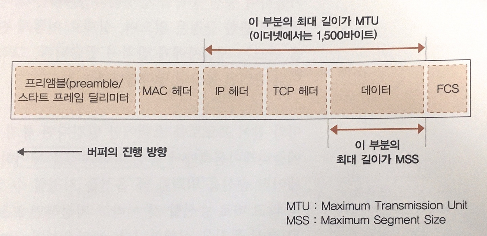
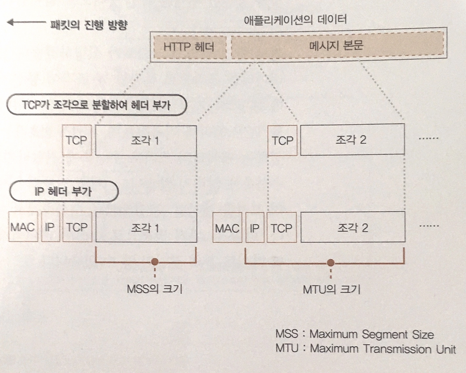
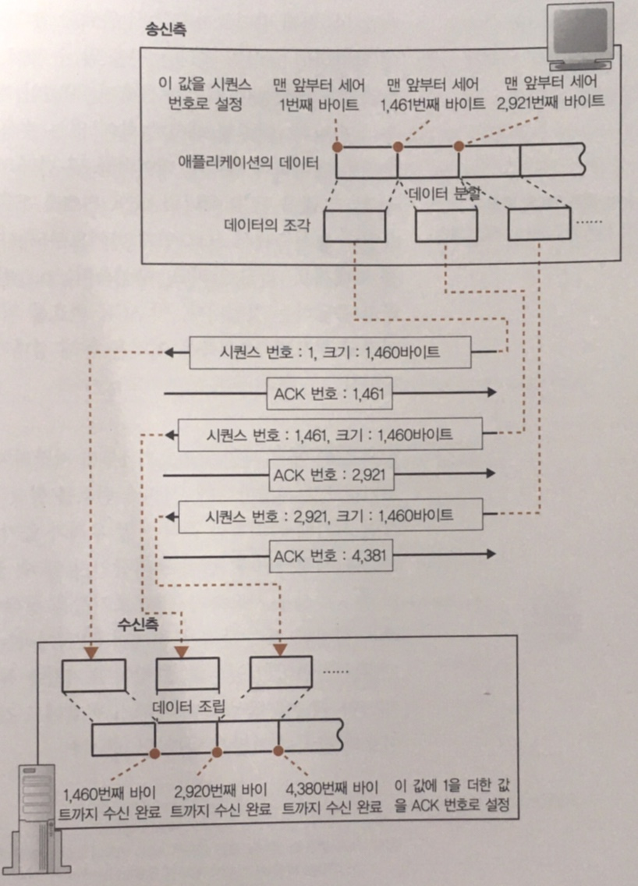
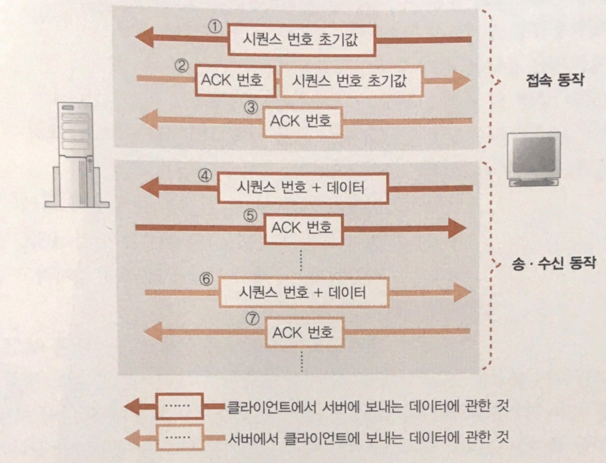
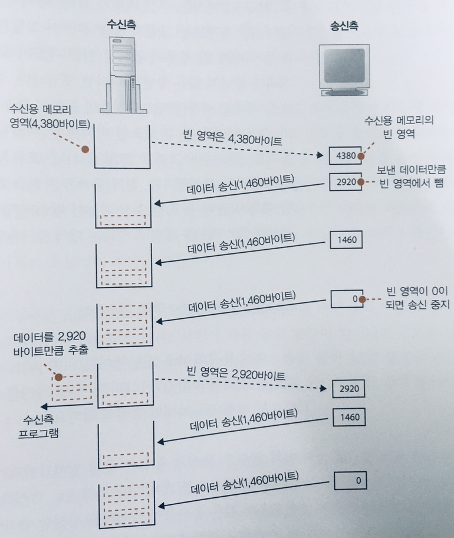

# 데이터를 송, 수신한다

## Protocol stack에 HTTP 리퀘스트 메시지를 넘긴다

- 송신동작이 시작하기전 데이터를 protocol stack에게 전달하지만, 실제로 데이터의 내용이 무엇인지 알지 못함.
- protocol stack은 단지 내부에 있는 송신용 버퍼 메모리 영역에 저장하고 어플리케이션에서 다음 데이터를 건네주기를 대기.

> 왜 바로 데이터를 송신하지 않을까?  
> 어플리케이션에서 protocol stack에 전달하는 데이터의 길이는 어플리케이션에 따라 다르다.  
> 이런 상황에서 받는 즉시 바로바로 작은 패킷단위로 보내게되면 네트워크의 이용 효율이 저하되기에, 어느정도 저장한 후 송신하게 된다.  
> 어느정도인가를 판단하는 기준은 OS마다 달라지지만 보통 다음요소로 판단한다. 
> 1. 한 패킷이 저장할 수 있는 크기
> - Protocol stack은 MTU(Maximum Transmission Unit)라는 매개변수를 바탕으로 판단.
> - MTU란 한 패킷으로 운반할 수 있는 디지털 데이터의 최대 길이. 이더넷 기준 보통 1500바이트.
> - MTU의 맨 앞 부분에는 헤더가 포함되어 있고, 이 부분을 제외한 나머지가 데이터의 최대 길이 이며 이것을 MSS(Maximum Segmentation Size)라고 함.
> - 어플리케이션에서는 MSS초과하거나 가까운 길이에 이르기까지 저장하고 송신.
> 2. 타이밍
> - 만약, 어플리케이션의 송신속도가 느리다면, MSS에 가깝게 데이터를 모으게 되더라도 송신동작에서 지연이 생기므로, 데이터가 모이지 않더라도 적당한 시간에 송신을 시작해야 함.
> - Protocol stack 내부에는 타이머가 있어서 일정 시간이 경과하면 패킷 송신. 
> 
> 1번을 중시하면 패킷의 길이가 길어져서, 네트워크의 이용 효율은 증가하지만 송신동작이 지연될 우려가 있음. 
> 2번의 경우, 지연은 적어지지만 이용 효율이 떨어지므로, 절충해서 시간을 가늠해야함.

## 데이터가 클 때는 분할하여 보낸다

- HTTP request는 보통 한 패킷에 들어가지만, 그렇지 않은 경우도 분명 존재.
- 이런 경우 MSS의 길이를 초과하므로, 다음 데이터를 기다리는게 아니고 분할하여 순서대로 송신.
- 패킷을 분할하면서 맨 앞부분에 TCP 헤더와 socket에 기록되어있는 제어 정보를 추가하고 송신을 실행.

## ACK 번호를 사용하여 패킷이 도착했는지 확인

- TCP에는 패킷의 성공적인 도착을 확인, **실패했을 경우 재송신하는 기능**이 있음.
- TCP 담당 부분은 데이터를 분할 할 때 각 조각이 통신 개시부터 몇 번째 바이트인지 카운트.
- 그리고나서, 송신할 때 세어둔 값을 TCP 헤더에 기록하는데, 이것이 **_시퀀스 번호_** 에 해당.
- 들어오는 시퀀스 번호와 크기를 바탕으로 누락된 데이터가 있는지 확인.
- 만약, 누락이 없다면, 수신 측은 이전에 수신한 데이터와 합쳐서 몇 번째 바이트까지 수신한 것인지 계산하고, TCP 헤더에 **ACK 번호**로 기록하여 송신 측에 전달.
- ACK 번호를 되돌려주는 동작을 **수신 확인 응답**이라고 하며, 송신측은 상대가 어디까지 수신했는지를 파악.

## 시퀀스 번호의 전달
- 실제로는 시퀀스 번호는 1이 아닌 난수를 바탕으로 산출되기에, 몇 번이 초기값인지 알 수 없음.
- 그래서 송수신이 시작할 때, 즉, 접속동작 부분에서 SYN이라는 제어 비트를 초기값으로 설정해서 전달.

## 실제흐름
- 접속 동작이 시작할 때, 클리이언트에서 서버로 보내는 데이터에 관한 시퀀스 번호의 초기값을 서버로 전달.
- 서버 또한 시퀀스 번호의 초기값을 클라이언트에 전달.
  - 클라이언트로부터의 초기값 통지가 서버에 도착한 것을 알리기 위해,  초기값으로부터 ACK 번호를 산출하여 시퀀스 번호와 함께 전달.
- 클라이언트에서 또한 정상 수신을 알려주기 위해, 서버로 부터 받은 시퀀스 초기값을 바탕을 ACK 번호를 산출하여 반송.
- 이로써, 서로가 송수신 하기위한 준비가 완료되었고, 메세지를 시퀀스 번호를 데이터와 함께 전달.

## 패킷 평균 왕복 시간으로 ACK 번호의 대기 시간을 조정한다

- ACK 번호가 돌아오는 것을 기다리는 시간을 타임아웃(Time-out) 이라고 함.
- 네트워크가 혼잡한 경우 돌아오는 시간이 지연되므로 대기 시간을 길게 설정해야 함.
- 대기 시간은 적절한 값으로 설정해야하는데 이것이 쉽지가 않음.
- TCP는 대기시간을 동적으로 변경하는 방법을 취함.
- ACK 번호가 돌아오는 시간을 기준으로 대기 시간을 판단.
  즉, 항상 ACK 번호가 돌아오는 시간을 계측해두고, 돌아오는 시간이 지연되면 늘리고 줄어들면 짧게 설정함.

## 윈도우 제어 방식으로 효율적으로 ACK 번호를 관리한다

한 개의 패킷을 보내고 ACK 번호가 돌아올 때 까지 기다리는 방식은 시간낭비 (핑퐁 방식)  
그래서 ACK 번호를 기다리지 않고 연속적으로 복수의 패킷을 보내는 방법 또한 존재 (윈도우 방식)
- 하지만 수신측의 능력을 초과하여 패킷을 보내게되면 문제가 발생.
- 수신측의 TCP는 패킷을 수신하면 수신용 버퍼 메모리에 데이터를 일시적으로 보관.
- 처리를 하는 동안 연속적으로 들어오는 패킷들 또한 버퍼 메모리를 할당하여 저장하는데, 이를 초과할 경우, Overflow로 버려짐.
- 따라서 수신 측에서는 수신 버퍼 메모리의 양을 송신 측에 통지하는데 이것을 **윈도우 제어 방식**이라고 함.
- 수신 처리가 끝나면 TCP 헤더의 **윈도우 필드에서 늘어난 것을 송신 측에 통지**.
- 수신 가능한 데이터 양의 최댓값을 **윈도우 사이즈**라고하며, TCP를 정밀 조장하는 매개 변수 중 하나.

## ACK 번호와 윈도우를 합승한다

윈도우 통지의 동작은 언제 일어날까?
- 송신 측에서 보내는 데이터의 양은 송신 측에서도 스스로 산출 가능.
- 하지만 수신 측의 버퍼 메모리를 어플리케이션에 넘기게 되면, 즉, 버퍼 메모리의 빈 공간이 늘어나는 때는 송신 측에서는 알 수 없음.
- 이때가 **윈도우 통지의 타이밍**.

한편으론, ACK 번호의 통지는 언제 일어날까?
- ACK 번호는 수신 측에서 데이터를 받고, 정상 확인을 전달하는 것이므로, 수신 즉시라고 볼 수 있음.

이 두 가지를 조합해보면 
- 통지의 흐름은 수신이 완료되었을 때, ACK 번호 통지되고
- 수신된 데이터를 어플리케이션에 넘겼을 때, 윈도우 통지가 됨.
- 이론대로 보면 각각의 패킷에 따로 송신 측에 보내져야 하지만, 그렇게되는 경우 효율성이 저하.
- 실제로는, ACK 번호나 윈도우 통지 할 때, 소켓을 바로 보내지 않고 잠시 대기하고 있다가 다음 통지 동작이 발생하면 한번에 묶어 한 패킷으로 전달.

## HTTP 응답 메시지를 수신한다

- 송신이 끝나게 되면 서버로 부터의 응답을 받기위해 read()를 호출.
- read를 경유하여 protocol stack에 제어가 넘어가고 protocol stack이 동작.
- 여기서도 마찬가지로 데이터를 일시적으로 보관하는 수신버퍼가 사용됨.
- Protocol stack은 수신버퍼에서 데이터를 추출하여 애플리케이션에 넘겨주고, 다음 수신이 있을 때까지 대기.
- 수신 동작도 송신 동작과 마찬가지로 움직임.
    1. 수신한 데이터 조각과 TCP 헤더를 통해 데이터 누락을 확인.
    2. 문제 없으면 ACK 번호 반송.
    3. 데이터 조각을 수신 버퍼에 일시 보관, 연결 하여 원래 모습으로 복원.
    4. 복원된 데이터를 어플리케이션이 지정한 메모리 영역으로 전달 및 제어권 넘김.
    5. 타이밍에 따라 윈도우 통지.