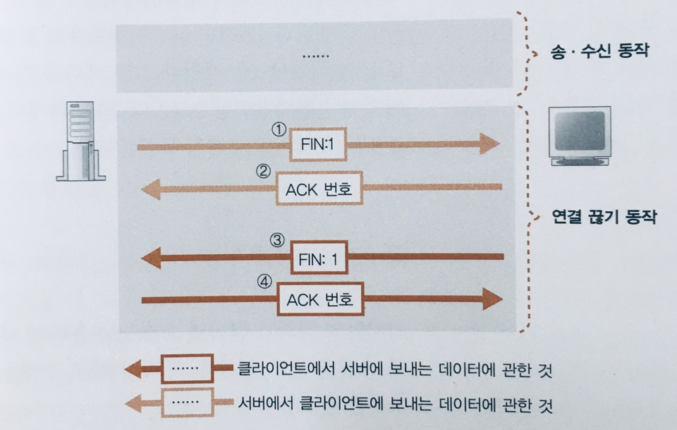

# 서버에서 연결을 끊어 Socket을 말소한다.

## 데이터 보내기를 완료했을 때 연결을 끊는다

송, 수신 데이터가 더이상 없다면 종료과정이 진행된다.
- 어디에서 데이터 송, 수신 동작이 끝나는지는 어플리케이션에 따라 다름.
  - ex) HTTP 1.0의 경우 브라우져가 웹서버에 request를 보내고 서버가 이에 응답하면, 서버 측이 연결 끊기 단계를 시작.

Server 측에서 연결 끊기를 들어가는 것으로 간주하고
- Socket library의 close()가 호출 되면 서버측 protocol stack이 TCP 헤더를 만들고 정보를 설정.
  - 컨트롤 비트의 FIN 비트에 1을 설정하고, IP 담당에게 송신을 요청.
  - 서버측 소켓은 연결 끊기 동작에 들어갔다는 정보를 기록.

클라이언트측은 서버로 부터 FIN에 1이 설정된 TCP 헤더를 받으면,
- 자신의 socket에도 서버가 연결 끊기 동작을 진행한다고 기록.
- 서버에게 정상 수신을 알리기위해, ACK 번호를 반송 하고 어플리케이션이 데이터를 수신을 대기.
- 어플리케이션에서 read()가 호출되면, 데이터를 전부 수신했다고 알림.
- 어플리케이션도 close()를 호출하고, FIN 비트에 1을 설정한 TCP 헤더를 서버로 전달.
- 서버로 부터 ACK 번호가 반송되면 서버와의 대화 종료.

## 소켓을 말소한다

서버와의 대화가 종료되었다고 socket을 바로 말소하지 않음.
- 서버가 FIN 비트를 설정한 TCP 헤더를 서버에 전달했지만, ACK 번호가 돌아오지 않는 경우 다시 한번 FIN을 보낼 수 있음.
- 클라이언트는 port 할당을 랜덤하게 하기에, 즉시 말소되어 버린다면 제어 정보가 사라져 원하는 port로 제대로 전달할 수 없음.