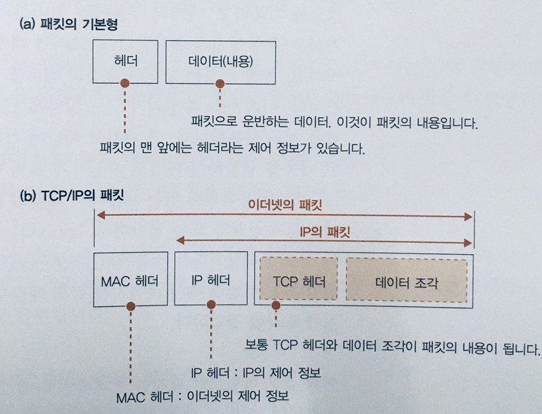
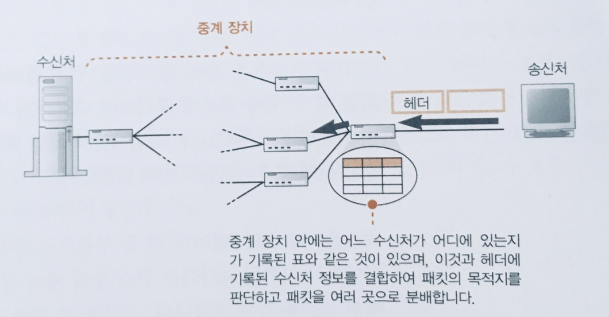
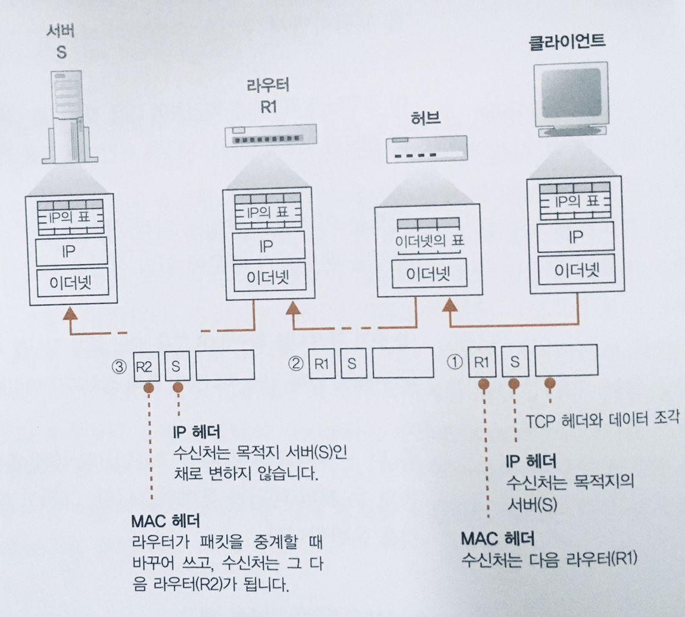
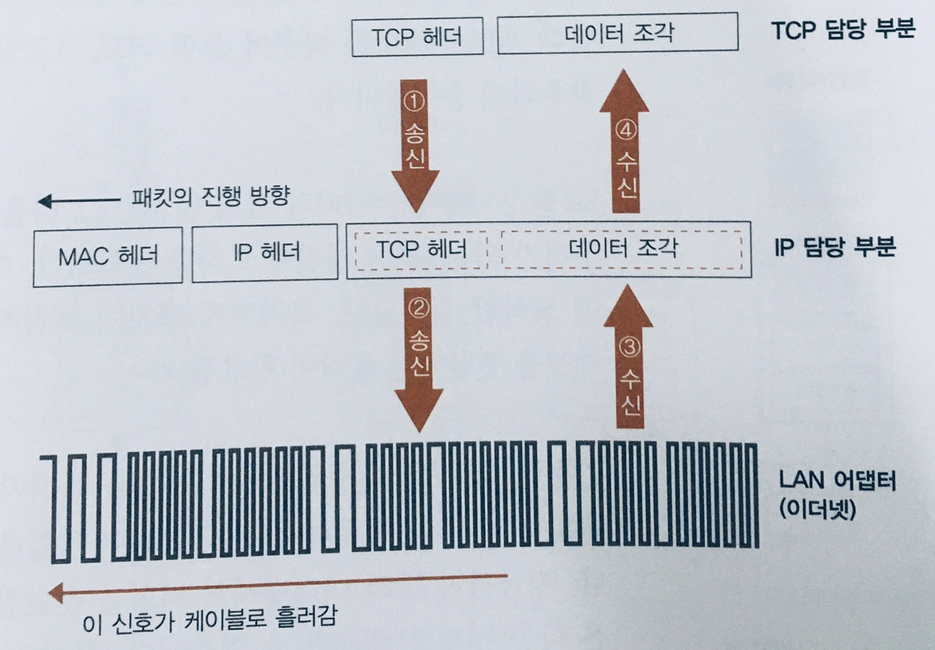
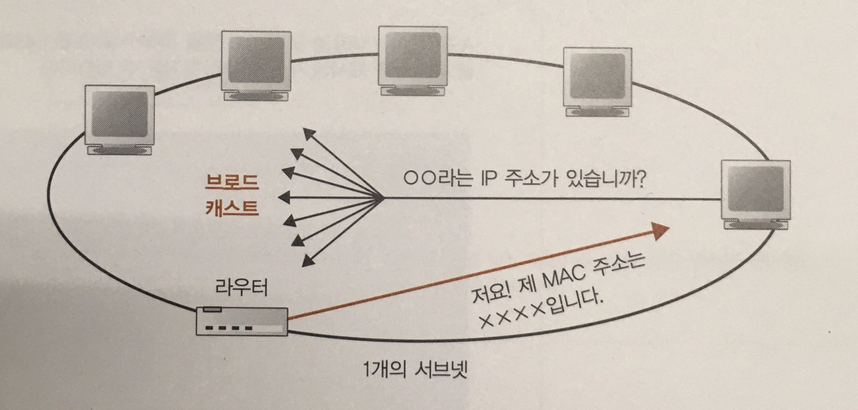

# IP와 이더넷의 패킷 송, 수신 동작

## 패킷(Packet)의 기본

패킷은 헤더(Header)와 데이터(Data)로 구성된다.
헤더에는 수신처를 나타내는 주소와 같은 제어 정보가 들어있으며, 데이터는 말그대로 데이터를 포함한다.

### 패킷의 이동

패킷이 만들어지고 어떤식으로 이동할까?
1. 먼저 가장 가까운 중계 장치로 패킷이 송신되고, 패킷의 헤더를 조사하여 목적지를 판단하게 된다.
2. 이때 어느 수신처가 어느 방향에 있는지에 대한 정보를 기록한 표를 이동해 목적지를 판단한다.
   - 즉, 패킷의 헤더 내 수신처와 표에 등록된 내용을 결합해 최종 목적지를 판단한다 
3. 다음 목적지를 향해 패킷이 전달되고, 여러차례 중계하면 최종적으로 수신처의 기기에 도달한다.
   - 회답을 보내는 것 역시 역방향으로 동일하며, 수신처와 송신처를 묶어 엔드노드(End-node)라 지칭한다.

### 패킷을 통한 TCP/IP 이해

Ch.1의 2장의 설명을 참조하면, 서브넷은 라우터(Router)와 허브(Hub)라는 패킷 중계 장치를 이용한다.
- 라우터는 **목적지를 확인**하여 다음 라우터를 가리킴.
- 허브가 **서브넷 안에서 패킷을 운반**하여 다음 라우터에 도착.

**허브는 이더넷 규칙에 따라** 패킷을 운반하고, **라우터는 IP의 규칙에 따라** 패킷을 운반하기에 다음과 같이 표현할 수 있음.
- IP가 목적지를 확인하여 다음 IP의 중계 장치를 가리킴.
- 서브넷 안에 있는 이더넷이 중계 장치까지 패킷을 운반.

구체적으로 말하면 TCP/IP의 패킷에는 두개의 헤더가 더 붙는데 그 역할이 다름.
   - MAC 헤더(이더넷용 헤더)
   - IP 헤더(IP용 헤더)

### TCP/IP와 패킷의 흐름
1. 먼저 패킷의 목적지가 되는 대상 서버의 IP주소를 IP헤더 내 수신처 정보에 기록한다.
2. 목적지가 정해졌으니, 수신처의 방향을 조사하고 그 방향의 라우터를 조사한다.
   - 아래 그림의 R1이 수신처 방향의 라우터로서, **이더넷을 통해 송신을 의뢰**한다.
   - 이때, 다음 라우터에 할당된 이더넷 주소(MAC 주소)를 조사하고, MAC헤더 내에 정보를 기록한다.
3. 패킷을 송신하면, 이더넷 원리에 따라 허브에 도착한다.
   - 허브에는 패킷의 목적지를 판단하는 **이더넷용 표**가 존재하며, 이를 통해 **MAC헤더의 수신처 정보와 결합**하여 패킷의 목적지로 중계한다.
   - 만약 복수개의 허브가 존재한다면, 순차적으로 경유하여 패킷이 진행된다.
4. 허브를 통해 다음 라우터에 도착하게 된다.
   - 라우터에는 **IP표**가 존재하고 **IP헤더의 수신처와 결합**하여 다음 라우터를 결정한다.
   - 다시 2번의 과정을 통해 MAC 주소를 조사하고 MAC 헤더에 정보를 기록하는 과정이 진행.
5. 위의 과정을 통해 최종 목적지에 도착한다

> IP와 이더넷의 역할을 분담하는 이유는 뭘까?
> 
> 이더넷 부분은 무선 LAN, ADSL, FTTH 등으로 대체할 수 있기 때문이다.
> 즉, IP의 의뢰를 받아 패킷을 운반하는 것이면 무엇으로든 대체가 가능하기에, 유연성이 증가되는 장점이 존재한다.

## 패킷 송, 수신동작의 개요

패킷을 송, 수신 동작을 TCP와 IP 담당 부분의 각 역할과 순서로 알아보자.

1. TCP를 담당하는 부분이 TCP 헤더와 데이터를 IP를 담당하는 부분으로 패킷 송신을 의뢰하는 것으로 시작된다.
2. IP 파트에서는 TCP로 부터 넘어온 정보를 단순한 디지털 데이터로 간주하고, 받은 정보 앞에 IP와 MAC 헤더 정보를 부가한다.
   - IP 헤더 : IP 프로토콜에 규정된 규칙에 따라 IP로 표현된 목적지까지 전달할 때 사용되는 제어 정보가 기록.
   - MAC 헤더: LAN을 사용하여 가장 가까운 라우터까지 사용하는 제어 정보 기록.
3. 만들어진 패킷을 네트워크용 하드웨어(무선 LAN, 이더넷)에 전달하며, 이때 LAN 어댑터에 전달될 때 패킷은 0과 1의 비트로 이루어진 **디지털 데이터**로서 전기나 빛의 신호로 송출, 중계 장치, 목적지까지 전달된다.
4. 목적지에 갔다가 회신되는 패킷은 다시 LAN 어댑터를 통해 IP 담당 부분으로 건네지고 MAC헤더와 IP헤더를 분리한다
5. 최종적으로 TCP 헤더와 데이터를 TCP 담당에게 전달하여 데이터를 수신한다.

> IP 파트에 전달되는 패킷은 제어 패킷이든, 데이터 패킷이든 역할에 상관없이, IP 담당은 단지 디지털 데이터로 간주하기에 송, 수신 동작의 모든 것에 공통으로 적용될 수 있다.

### 수신처 IP 주소를 기록한 IP헤더를 만든다

TCP 담당으로부터 패킷 송,수신을 의뢰받고 ***IP헤더***를 만들어 TCP 헤더에 붙이는 과정(개요 2번)을 살펴보자.
- 가장 중요한 부분은 패킷을 어디로 전달해야지를 나타내는 **수신처의 IP 주소**.
- 어디서부터 패킷이 전달되었는지를 알리기 위한 자기 자신, 즉 **송신처의 IP 주소** 또한 포함.
- 또한 어떤 프로토콜의 의뢰를 받았는지를 알리는 **프로토콜 번호**.
  - ex) TCP(06), UDP(17) 등
- 이외에 생존 기간, 오류 확인을 위한 체크섬, 옵션 등의 정보를 포함.

### 이더넷용 MAC 헤더를 만든다.

비록 IP 헤더에 수신처의 IP주소가 존재하지만, **이더넷은 TCP/IP개념이 아닌 MAC 주소 판단구조**를 사용하기에, MAC 헤더가 필요하기에,
- MAC 주소의 **송신처, 수신처 주소**.
- IP 헤더의 프토토콜 타입과 유사한 이더 타입(Ether Type).
  - 이더 타입은 MAC 헤더 뒤에 이어지는 내용물이 무엇인지를 가리키며, 사전에 정의된 값이 존재.
- 수신처 MAC 주소는 IP와 다르게 알고 있는 값이 아닌, IP주소를 통해 MAC주소를 알아내는 과정이 필요함.

### Address Resolution Protocol(ARP)을 통해 수신처 라우터의 MAC주소를 조사한다.

이더넷에는 연결되어 있는 전원에게 패킷을 전달하는 브로드캐스트라는 구조가 존재하고, 
- 브로드캐스트 구조를 이용해 특정 IP를 가진 기기를 찾는 요청을 하면, 해당 기기는 MAC 주소를 응답.
- _**응답받은 MAC 주소를 MAC 헤더에 수신처 MAC 주소로 설정**_.
- 이렇게 만들어진 MAC 헤더를 IP 헤더 앞에 붙이는 것으로 패킷이 완성되며, IP 담당부분의 역할.

> 패킷을 보낼 때마다 ARP의 패킷이 불어나기 때문에, ARP 캐시라는 메모리 영역에 보존하여,
> 패킷 송신 시, 우선적으로 ARP 캐시를 조사하여 사용하고, 없는 경우 ARP를 조회한다.