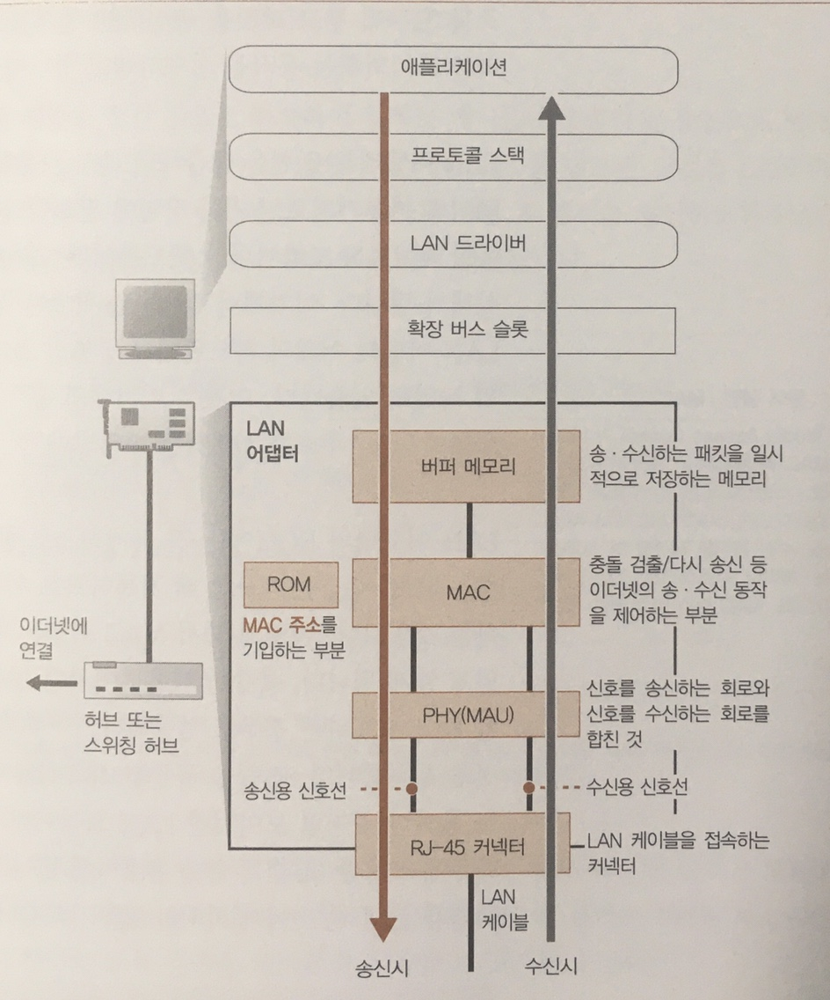
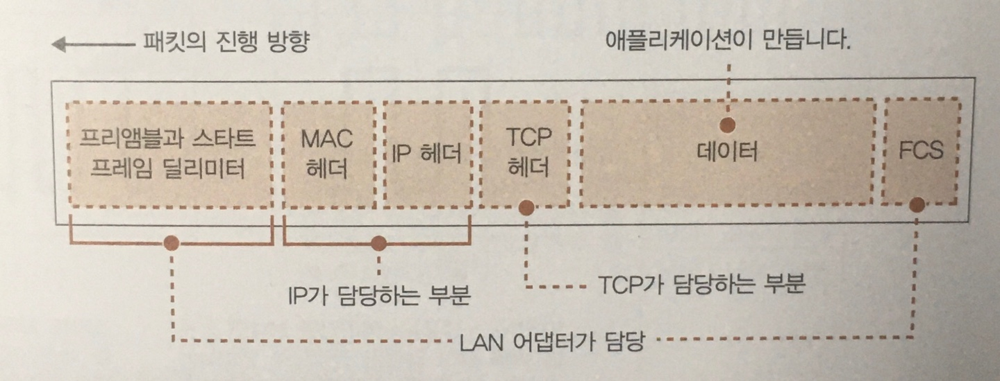
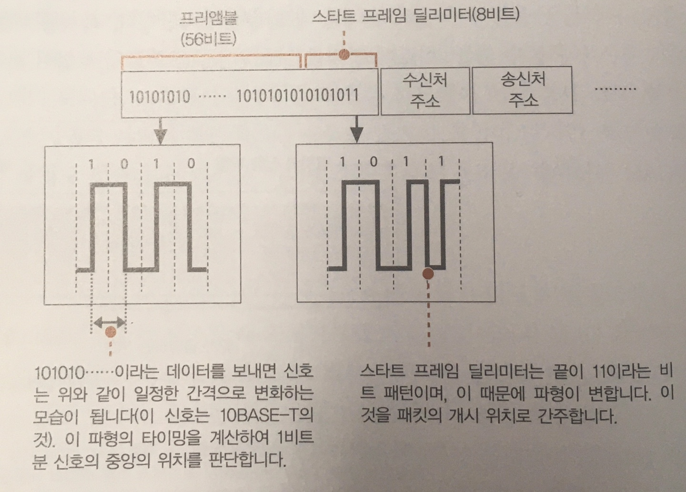
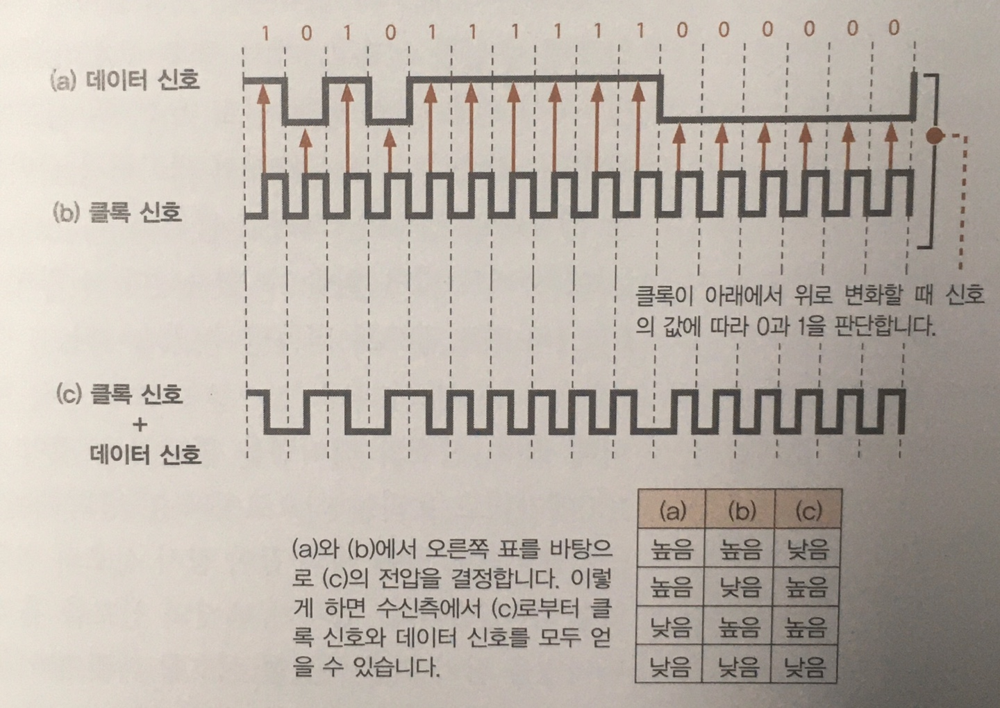

## 이더넷(Ethernet)의 기본

이더넷은 다수의 컴퓨터가 여러 상대와 자유롭게, 적은 비용으로 통신하기 위해 고안된 기술이다.  

이더넷 초기에는
- **케이블, 트랜시버**는 케이블 사이에 신호를 흘리는 역할을 담당했으며, 컴퓨터 신호를 송신하면 네트워크 전체에 신호가 전달되어 전체에 도착.
- 수신처 주소를 맨 앞부분에 적어, 해당하는 기기만 패킷을 수신하고 나머지는 패킷을 폐기.
- 이 동작을 제어하기위해 MAC 헤더를 사용.

이후에는,
- 트렁크 케이블은 **리피터 허브**로, 트랜시버는 **트위스트 페어 케이블**로 바뀌었지만, 이때까지는 신호가 전원에게 전달.
- 스위칭 허브를 사용한 형태가 보급되며, MAC 주소의 대상이 되는 부분에만 신호가 흐름.

이런 변화가 있었지만,
1. MAC 헤더의 **수신처 MAC 주소의 상대에게 패킷을 전달**하고
2. **송신처 MAC 주소**로 송신처를 나타내며
3. **이더 타입으로 패킷의 내용물**을 나타낸다

는 세가지 성질을 가진 것이 이더넷.

### IP 패킷을 전기나 빛의 신호로 변환하여 송신한다

패킷을 전기나 빛의 신호로 변환하는 작업은 LAN어댑터에서 실행되는데 LAN드라이버 소프트웨어와 함께 동작한다.
- LAN어댑터는 다른 하드웨어와 마찬가지로 **초기화 작업**이 필요하다.
  - 송, 수신 동작을 제어하는 Media Access Control(MAC)이라는 회로에 MAC주소를 설정하는 것
- LAN어댑터의 ROM에는 전 세계적으로 중복되지 않게 관리되는 MAC주소가 기록되어 있으며, 
LAN어댑터에 기록된 **MAC주소를 LAN드라이버가 MAC회로에 설정**한다.

### 패킷에 3개의 제어용 데이터를 추가한다

LAN드라이버는 IP 담당으로 부터 패킷을 받으면 LAN어댑터의 버퍼 메모리에 복사하게 되며, 
버퍼메모리의 맨 앞에는 **프리앰블과 스타트 프레임 딜리미터**(SFD)라는 두개의 데이터를, 맨끝에는 **프레임 체크 시퀀스**(FCS)라는
**오류 검출용 데이터**를 부가한다.

- 프리 앰블, 스타트 프레임 딜리미터: 송신 패킷을 읽을 때의 타이밍을 잡기 위한 것.
- 수신측은 프리앰블과, SFD를 표시하여 신호에서 데이터를 추출하기 시작하며, 이는 패킷의 시작점이라 볼 수 있다.
- 프레임 체크 시퀀스: 패킷을 운반하는 도중 잡음등의 영향으로 파형이 변한 경우 이를 확인하기 위해 패킷의 **맨 앞부터 끝까지의 내용을 
특정 계산식에 기초하여 계산**한 것이다.

> 프리앰블 Detail
> 
> 디지털 데이터를 전기 신호로 나타내는 경우 0과 1의 비트 값이 전압이나 전류에 대응된다.
> 하지만 신호의 변화가 없는 경우 비트 구분을 판단하기가 어렵기 때문에 데이터를 나타내는 신호와 별도로 비트 구분을
> 나타내는 신호가 필요한데, 그걸 클럭(Clock)이라고 한다.
> 
> 클럭 신호의 타이밍을 이용해 데이터를 추출하게 되므로, 클럭 신호의 타이밍이 중요할 수 밖에 없다.
> 그렇기에 프리앰블은 패킷 신호를 흘리기 전에 클럭 신호의 타이밍을 흘림으로써, 클럭과의 타이밍을 맞추게 된다. 

### 허브를 향해 패킷을 송신한다

신호를 송신하는 동작은 리피터 허브의 경우 반이중모드, 스위칭 허브의 경우 전이중모드를 사용한다.
- 반이중모드: 다른 기기가 송신한 신호가 흐르는지를 조사하고, 흐르고 있다면 충돌을 피하기 위해 신호가 끝날 때 까지 기다림.
- 전이중모드: 송, 수신을 동시에 실행하며 충돌이 일어나지 않는다.

송신 동작은 MAC회로가 프리앰블의 맨 앞에서부터 1비트씩 차례로 전기신호로 변환하고,
이것을 Physical Layer Device(PHY) 또는 Medium Attachment Unit(MAU)라는 송, 수신 신호 부분에 보내게 된다. 
우리가 흔히 **전송 속도**라고 부르는 것이 이때 **디지털 데이터를 변환하는 속도**이다.
PHY(MAU)는 어느 형식으로도 변환이 가능한 회로로서, MAC회로가 **송신한 신호의 형식을 변환**한다.

### 돌아온 패킷을 받는다

반이중 동작에서는 한 대가 송신한 신호가 리피터 허브에 접속된 케이블 전부에 흐르게되기에,
자신 뿐 아니라 누군가의 신호 또한 전부 수신 신호선으로 들어오게 되어있다. **수신 동작**은
이런 신호를 전부 받아들이는 것으로 시작된다.  
- 들어온 신호 맨 앞의 프리앰블을 이용해 파형에서 타이밍을 계산해 SFD를 구하고 다음 비트부터 디지털 데이터로 변환하여 수신을 한다.
- 이 때의 동작은 송신의 반대로 PHY(MAU)회로에서 MAC회로 쪽으로 진행된다
- PHY회로에서 신호를 공통형식으로 변환하여 MAC회로에 전달하고, MAC회로에서는 차례대로 디지털 데이터를
변환하여 버퍼 메모리에 저장하며, 비트 마지막에 있는 FCS를 검사한다.
- MAC헤더의 수신처 MAC주소를 조사하여 자신에게 오는 신호인지를 판단한다.
- 자신에게 오는 신호임을 판단하면 본체에 **인터럽트**를 통해 통지함으로써 수신 동작이 이뤄진다.

### 서버의 응답 패킷을 IP에서 TCP로 넘긴다

돌아온 패킷은 TCP/IP 프로토콜의 IP 담당부분에서 IP헤더를 조사하여, 패킷의 포맷과 수신처 IP주소를 확인한다.
이 때, 수신 기기의 LAN어댑터와 동일한 IP라면 패킷을 수신하고, 다르다면 오류가 있음을 나타낸다.
오류 발생 시에는 ICMP라는 메시지를 사용하여 송신 측에 오류를 통지하게 된다.