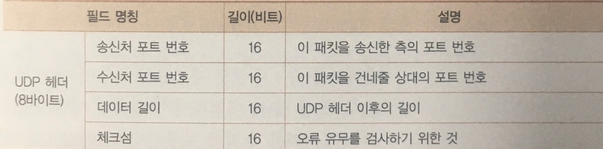

## UDP 프로토콜을 이용한 송, 수신 동작

### 수정 송신이 필요없는 데이터 송신은 UDP로

DNS 서버에서 IP 주소를 조회할 때 UDP 프로토콜을 사용된다.
- TCP의 동작은 복잡하지만, 확실하면서 효율적으로 데이터를 전달하기 위한 방법이다.
- 가장 확실한 방법이 바로 데이터를 전부 보내고 수신측에 응답을 받고, 도착하지 않으면 다시 보내는 방법으로 UDP에 해당한다.
- 패킷이 1개만 누락되도 전부를 보내는건 비효율적이므로, 누락된 패킷만 다시 보내는 구조가 필요한데 TCP가 복잡한 이유가 여기에 있다.

### 제어용 짧은 데이터

- DNS 서버에 대한 조회등 제어용으로 실행하는 정보 교환은 **한 개의 패킷**으로 끝나는 경우가 많은데,
UDP에는 TCP와 같은 수신 확인이나 윈도우가 없어, 제어 정보를 주고받을 필요가 없다.
- 따라서, 송신 데이터에 UDP헤더를 부가하여 IP에 의뢰하면 끝나기에 
- 수신처, 송신처 IP 주소와 UDP헤더의 수신처, 송신처 port, 이 네 항목과 소켓 정보를 결합하여 건네 준다.  
오류 발생 시에도 신경 쓸거 없이 회답이 오지 않을 것이므로 한번 더 보내며 오류 처리를 시행한다.

### 음성 및 동영상 데이터

- 음성이나 영상 데이터는 결정된 시간 안에 데이터를 건네주어야 데이터 도착시간이 지연되지 않는다.
- 만약 데이터 도착시간이 지연되면 재생하는 타이밍이 맞지 않아 음성이나 영상이 끊김 현상이 나타난다.
- 실제로 음성이나 영상에는 데이터가 다소 없어도 치명적인 문제가 되지 않기 때문에, UDP를 이용해 데이터를 보내게 된다.
