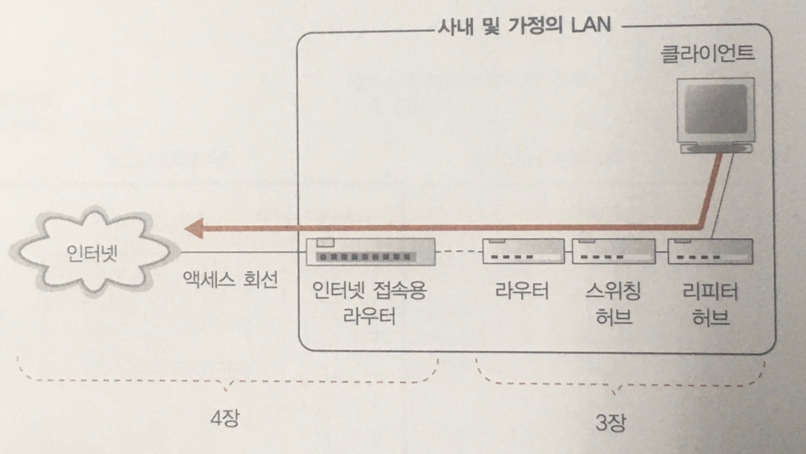
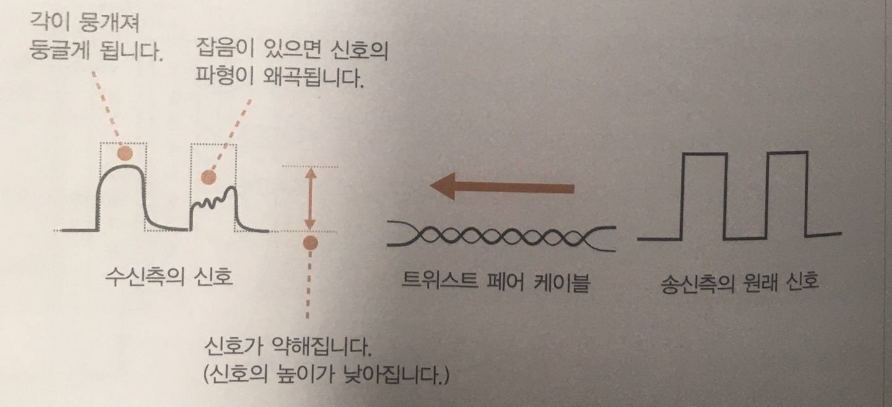
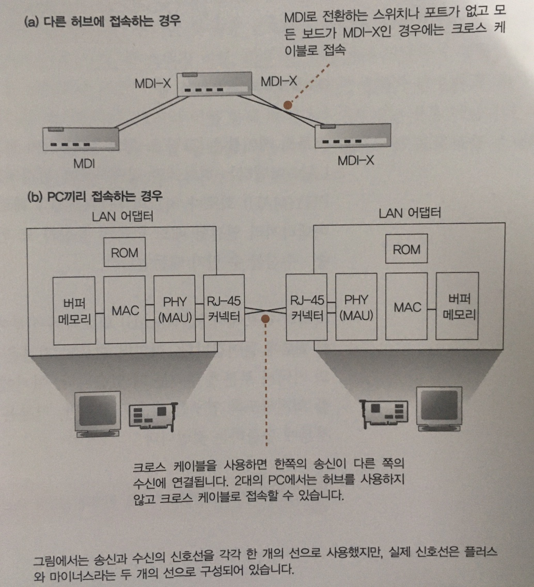

# 케이블과 리피터, 허브 속을 신호가 흘러간다

## 하나하나의 패킷이 독립도니 것으로 동작한다

　중계 동작은 패킷의 **헤더 제어정보**와 중계 장치 내부에 있는 **중계대상표**를 기반으로 목적지를 판단하며,
**목적지에 가까워 지도록** 패킷을 중계하는 형태를 띈다. 즉, 중계 장치는 데이터 부분은 신경쓰지 않고 패킷을 중계하는 것이다.  
　따라서 어플리케이션 데이터, TCP 프로토콜의 제어 정보의 내용이 중계 동작에 영향을 끼치지 않으며,
HTTP 메시지, 수신확인, 시퀀스 번호, 클라이언트, 서버 관계를 모두 무시한다.
> 이더넷이나 IP라는 패킷을 운반하는 구조에서는 TCP 프로토콜의 제어 정보는 헤더가 아니라 데이터이다.

## LAN 케이블은 신호를 약화시키지 않는 것이 핵심

　이더넷 신호의 실체는 **플러스와 마이너스의 전압**으로, LAN어댑터의 PHY(MAU)회로에서
전기 신호로 변환된 패캣은 RJ-45커넥터를 통해 Twist pair cable(꼰 선쌍)으로 들어가게 된다.
PHY회로는 RJ-45커넥터에 직접 연결되어 있으며, **커넥터 내 핀의 케이블을 통해 리피터 허브의 커넥터까지** 도달하게 된다.

　송출된 신호는 허브에 도착할즈음에는 신호가 약해져 있으며, 케이블의 길이가 길어질 수록 에너지가
감소하여 신호가 약해지게된다. 또한 0과 1의 각진 신호에서 에너지가 떨어짐에 따라 신호가 뭉개지며 잡음에 따라 변형이 가해진다.

## Twist pair cable(꼰 선쌍)의 핵심은 잡음을 방지하는 것이다
　잡음의 원인은 주로 케이블 주위에서 발생하는 전자파로, 신호와 잡음의 전류가 뒤섞여 신호의 파형이
변형되는데 이것이 우리가 말하는 잡음이라고 한다.
- 전자파는 신호선에 닿으면 진행 방향의 오른쪽으로 전류가 생기는 성질을 지니고 있다.
- 이때, 신호선을 마주 꼰 형태(꼰 선쌍)가 되면 나선형이 되어 전류가 흐르는 방향이 반대가되고 잡음에서 생긴 전류와 상쇄되어 잡음이 감소한다.
- 신호선 안에 신호로 생기는 잡음(Crosstalk) 또한 꼬는 간격을 달리하여 양극과 음극의 교차를 통해 잡음의 영향을 줄어들게 한다.

## 리피터 허브는 연결되어 있는 전체 케이블에 신호를 송신한다.

　신호는 리피터 허브에 도달하면 LAN 전체에 신호가 흩어지게된다.
리피터 허브의 내부는 LAN 어댑터의 내부에 있는 PHY(MAU)회로와 같은 역할을 하는 회로가 존재하며, 허브 끝의 커넥터에는
MDI/MDI-X와 같은 전환 스위치가 붙어있다.
> Media Dependent Interface(MDI)  
> 　RJ-45 커넥터와 신호 송, 수신 회로를 직접 결선한 것.  
> MDI-Crossover(MDI-X)  
> 　RJ-45 커넥터와 신호 송, 수신 회로를 교차하여 결선한 것.

　이후 신호는 모든 커넥터에서 나가면서 허브에 접속한 전체 기기에 도달하고, MAC헤더에 쓰인 수신처 MAC 주소를 조사한다.
MAC주소의 수신처에 해당하지 않으면 신호를 무시하고, 최종적으로 수신처에 해당하는 곳까지 도달하게 된다.

