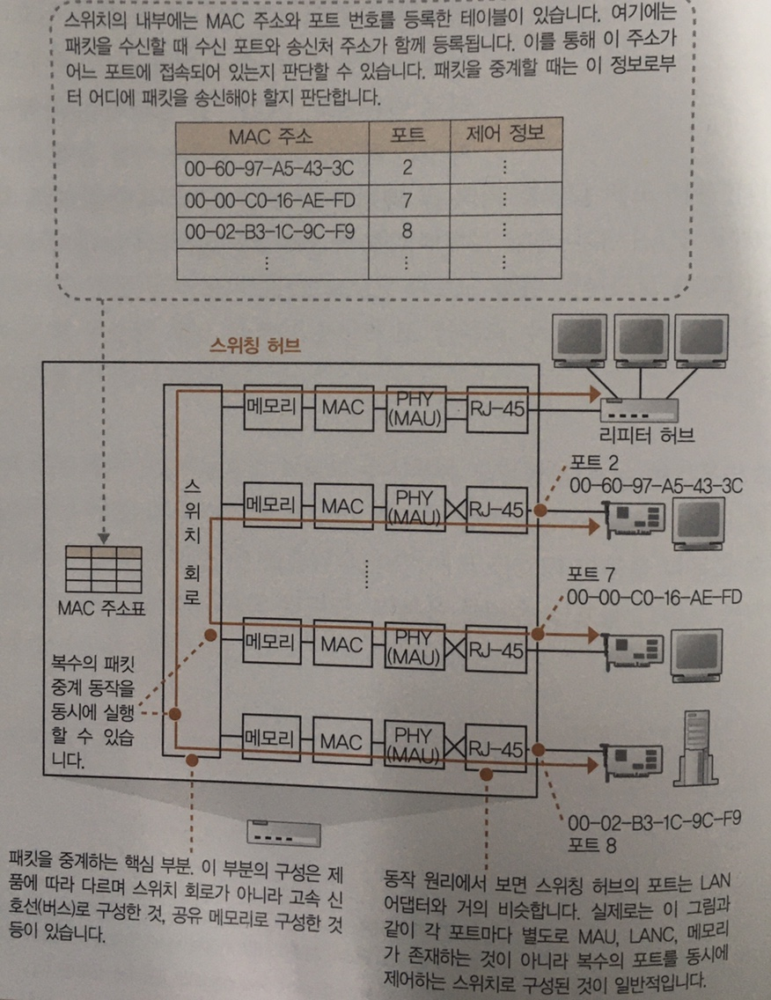
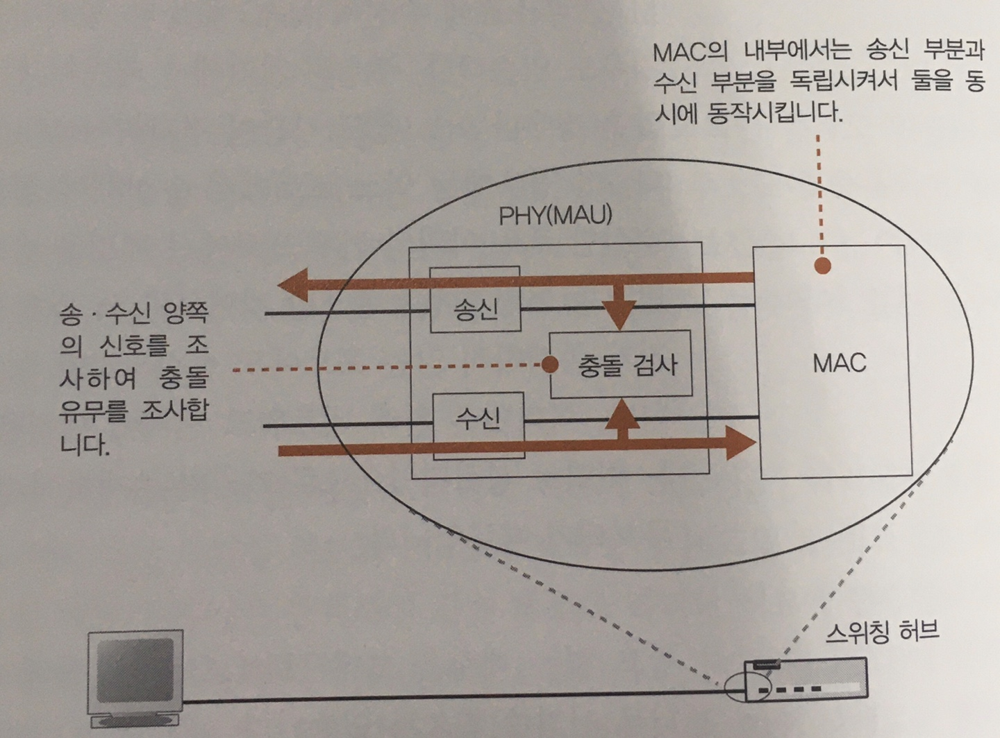

# 스위칭 허브의 패킷 중계 동작

## 스위칭 허브는 주소 테이블로 중계한다

　스위칭 허브는 이더넷의 패킷을 목적질르 향해 중계하는 역할을 한다.
따라서 신호가 커넥터 부분에 도달하여 PHY(MAU)회로에 수신되는 부분은 리피터 허브와 동일하며,
MAC회로에서 디지털 데이터로 변환 후, 오류 검사 및 버퍼메모리에 저장하는 일련의 과정을 거친다.

　LAN어댑터와 거의 비슷하므로 스위칭 허브의 커넥터 안쪽에는 LAN어댑터와 같은 회로가 존재하며, 이를 포트라고 부른다.
하지만, LAN 어댑터에는 MAC 주소가 할당되어 있는 것과 달리 포트에는 MAC 주소가 할당되어 있지 않기에 모든 패킷을 버퍼 메모리에 저장한다.
저장이 완료되면, MAC 주소에 해당하는 포트의 위치가 기록된 **MAC주소표**를 확인하고, 스위치 회로를 통해 일치하는 송신 포트로 패킷을 전송한다.
 
> MAC 주소표의 등록 및 갱신  
>　1. 패킷을 수신했을 때, 송신처 MAC주소를 조사하고 수신한 입력 포트 번호와 하나의 세트를 위러 MAC주소표에 등록.  
>　2. 사용하지 않고 일정 시간이 경과한 경우 이를 MAC 주소표에서 삭제하는 동작이 진행.

## 전이중 모드에서 송신과 수신을 동시에 실행한다

　송신과 수신을 동시에 실행할 수 있는 성질도 리피터 허브에는 없는 스위칭 허브의 특징이다. 
앞서 잡음 감소에서 설명한 Twist pair cable(꼰 선쌍)의 신호선은 송신용과 수신용으로 나눠져 있어, 신호가 충돌하지 않게된다.
즉, 스위칭 허브의 포트 부분이나 LAN어댑터의 PHY(MAU)회로, MAC회로의 내부도 송신과 수신이 나위어있어 충돌하지 않는다.
 
　하지만, 이더넷에 신호가 흐를 때에는 이를 기다렸다가 송신 동작을 실행하므로, 송,수신을 동시에 실행할 수는 없다.
따라서 이더넷의 규칙을 개정하여 상관없이 송신하도록 **동작 모드를 추가**하고, 신호 충돌을 검출하는 회로를 무효화 시켜야한다.
이것이 ***전이중 모드***로 반이중 모드보다 빠르고 데이터 양의 상한성도 높아 성능이 좋다.

## 최적의 전송 속도로 보내는 자동 조정

　이더넷은 데이터가 흐르지 않을 때, **링크 펄스라는** 펄스형 신호를 흘리는데, 
 이를 통해 상대가 올바르게 작동하는지, 단선이 없는지 등의 상황을 확인할 수 있다.
 초기에는 일정 간격으로 보낸다는 규정만 존재했지만, 현재는 특정 패턴으로 송신하여 자신의 상황을 상대에게 전달하여
 전이중 모드 지원 여부와 전송 속도를 서로에게 통지하여 최적의 전송 속도로 자동 조정할 수 있다.
 
## 스위칭 허브는 복수의 중계 동작을 동시에 실행한다.
　스위칭 허브는 MAC주소표에 등록된 포트 이외에는 송신 동작을 실행하지 않기 때문에, 등록되지 않은 포트들은 비어있는 상태가 된다.
여기에도 별도의 패킷을 흘릴 수 있으며, 이 방식을 통해 동시에 여러 개의 패킷을 중계 할수 있다.