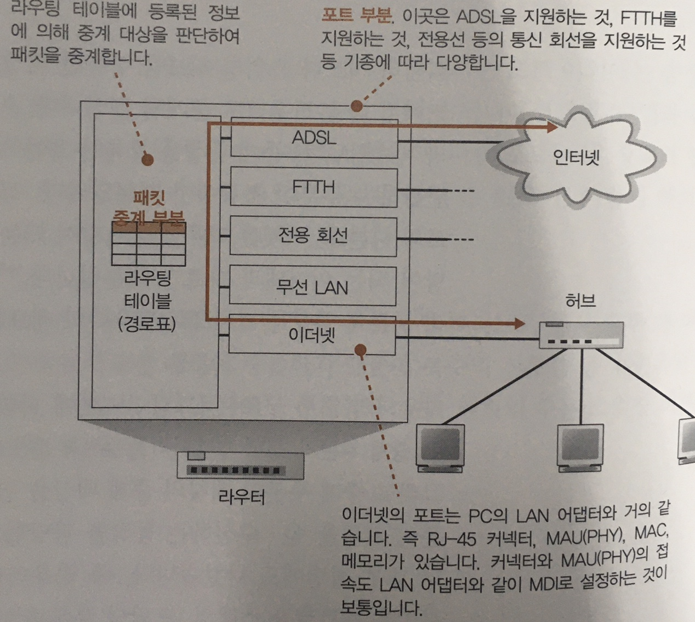
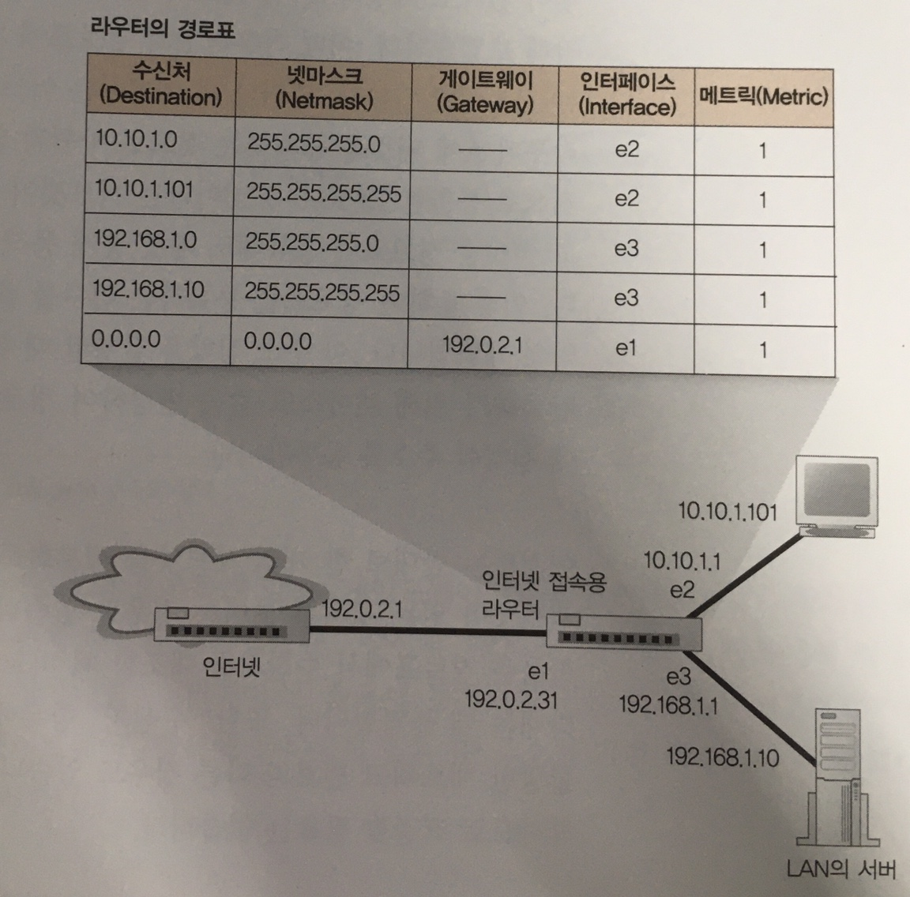
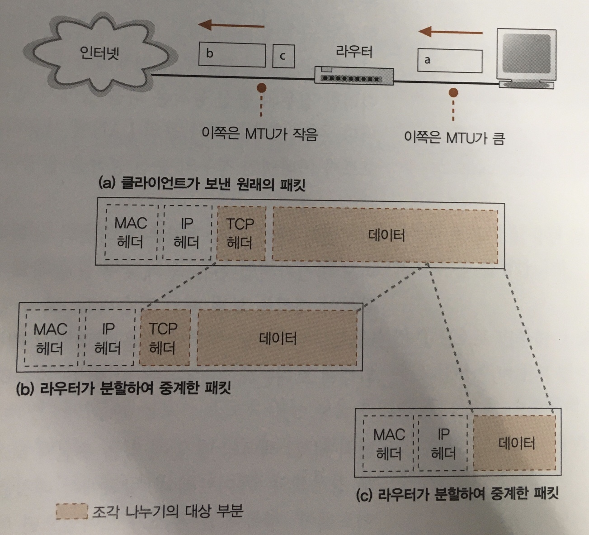
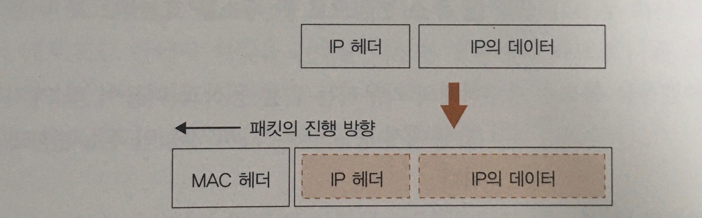
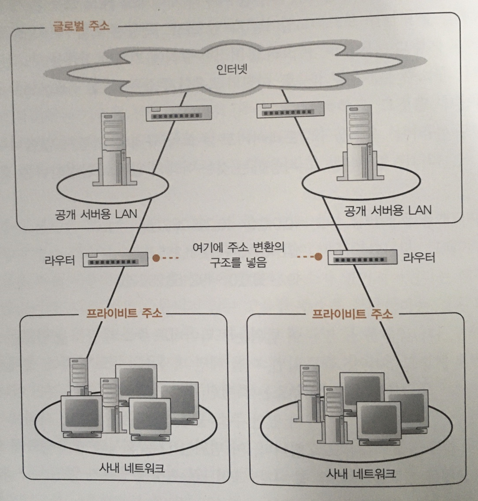

# 라우터의 패킷 중계 동작

## 라우터의 기본
　리피터 허브나 스위칭 허브를 경유한 패킷은 라우터에 도착하고 또다른 라우터로 중계될 수 있다.
중계의 원리는 스위칭 허브의 MAC주소표 처럼 중계 대상을 등록한 표를 이용하지만, 스위칭 허브와 달리 IP 라는 개념이 사용된다.

### 라우터의 내부구조

- 중계 부분
  - 패킷의 중계 대상을 판단하는 동작을 담당(프로토콜 스택의 IP 담당 부분의 역할)
  - 받은 패킷의 IP패킷에 기록된 수신처 IP 주소와 중계 대상을 등록한 표를 대조하여 중계 대상을 판단한다
- 포트 부분
  - 패킷을 송, 수신하는 동작을 담당(프로토콜 스택의 LAN어댑터의 역할)
  - 패킷 수신시 포트 부분의 통신 기술의 규칙을 따르기에 이더넷인 경우는 이더넷 규칙, 무선랜이라면 무선랜 규칙을 따른다
  - IP 주소가 할당되어 있어, 자신이 수신처가 되어 패킷을 수신하고 조사된 중계 대상에 다시 송신하는 역할을 담당한다
> 스위칭 허브는 들어온 패킷을 그대로 전송하고 자신이 송신처나 수신처가 되지는 않는다.

## 경로표에는 어떤 정보가 등록되어 있을까?

　테이블을 사용하여 중계 대상을 조사한다는 개념이 스위칭 허브와 비슷하지만, 라우터는 IP헤더에 기록된 IP주소로 대상을 판단하는 차이점이 있다.
 라우터 테이블은 라우팅 테이블 또는 경로표라고 부르며 다음 정보가 존재한다.
 - 수신처 항목
   - 네트워크 번호 부분의 비트에만 값이 있고 호스트 번호 부분의 비트 값은 0로 되어있다.
   - 서브넷을 나타내는 IP주소가 등록되어 있다.
   - 간혹 여러개의 서브넷을 모아 한개의 서브넷으로 묶은, 즉 주소집약된 하나의 서브넷이 경로표에 등록되는 경우 IP주소가 아닌 경우가 있다.
   - 반대로 한개의 서브넷을 세분화하여 복수의 서브넷처럼 보이게 한 경우도 있다.
 - 넷마스크
   - 비트 수 판단을 위해 존재
 - 게이트웨이, 인터페이스
   - 두 항목은 패킷의 중계 대상을 가리킨다.
   - 수신처와 넷마스크를 통해 대상을 찾아내면 인터페이스(포트)에서 게이트웨이의 IP를 가진 라우터로 패킷을 중계한다
 - 메트릭
   - 수신처 IP주소의 목적지가 가까운지, 먼지를 나타내며 가까울 수록 작은 값을 가진다

> 라우터 경로표에 경로 정보를 등록하는 방법
> 1. 사람이 수동으로 경로 정보를 등록 또는 갱신
> 2. 라우팅 프로토콜이라는 구조를 사용하여 라우터들끼리 경로 정보를 교환하고 라우터 자체가 경로표에 등록

## 라우터의 패킷 수신 동작

PC의 LAN어댑터와 구조가 거의 비슷하며, 패킷을 수신해 버퍼 메모리에 저장하는 부분까지 유사하다.
1. PHY(MAU)회로와 MAC회로에서 신호를 디지털 데이터로 변환한다
2. 패킷 끝부분의 FCS를 대조하고 오류를 점검한다
3. MAC헤더의 수신처 MAC주소가 자신에 해당하는지를 조사하고, 해당한다면 수신 버퍼 메모리에 저장한다
4. 아닐 경우 변환된 데이터는 폐기한다

## 경로표를 검색하여 출력 포트를 발견한다

　라우터는 패킷 수신 동작이 끝나면 MAC헤더를 폐기하고 그 뒤에 붙어있는 **IP헤더**의 내용을 토대로 
경로표의 수신처, 넷마스크, 메트릭 값을 통해 중계 대상을 선택하게된다.  
　만약 대상이 검색되지 않은 경우 패킷을 폐기하고, **ICMP**(Internet Control Message Protocol) 메시지로 송신처에 통지하게
되는데 이부분이 스위칭 허브와 다른 부분에 해당한다. 라우터가 가정하는 네트워크의 규모는 스위칭 허브와 비교할 수 없을정도로
큰 규모를 헤아리기 때문에 **전체를 대상으로 패킷을 보내기 어렵다**.
따라서, 해당 경로가 없는 경우 넷마스크 항목 중 0.0.0.0의 기본 게이트웨이로 중계를 하게된다.

## 패킷은 유효 기간이 존재한다

　중계 대상을 찾고나면 패킷을 출력 포트로 옮기게 되는데 이 과정에서 라우터의 또 다른 작업이 존재한다.
바로 Time To Live(TTL)이라는 **IP헤더의 필드를 갱신**하는 것이다. 이 TTL 필드는 라우터를 경유 할 때마다
1씩 줄여주고 0이 되면 폐기되는 형태로 초기에는 64 또는 128로 설정하게된다. 참고로 현재 인터넷은
지구 반대편까지 많아봐야 수십개면 가능하다.

## 큰 패킷은 조각 나누기 기능으로 분할한다

　LAN의 종류에 따라 패킷의 최대 길이가 다르기 때문에, 라우터의 출력 포토의 최대 길이가 입력보다 작은 경우가
발생할 수 있다. 이런 경우 IP 프로토콜에 규정된 **조각나누기** 방법을 통해 패킷을 분할하고, 길이를 짧게 만든 후
중계할 수 있다.

1. 출력쪽 MTU를 조사해 중계를 패킷 그대로 할 수 있는지 확인한다
2. 중계가 불가능하다면 패킷을 분할하는데, 그전에 IP헤더의 플래그 필드를 조사해 분할이 가능한지 확인해야한다.
3. 만약 분할이 불가능하다면 패킷은 그대로 폐기된다.
4. 분할이 가능하면, TCP헤더 이후 부분을 분할 대상으로 간주하여 분할하고 분할된 패킷들에 IP헤더를 붙여준다.
5. 이때 복사된 IP헤더를 사용하게 되지만, 일부 필드는 달라질 수 있다.

## 라우터의 송신 동작은 컴퓨터와 같다

　통신 회선의 규칙에 따라 패킷 송신 동작을 실행하며, 설명의 경우는 LAN에서 사용하는 라우터를 가정하고
출력 포트가 이더넷인 경우로 작성되었다.  

　기본적으로 프로토콜 스택의 IP 담당부분이 패킷을 보낼 때는 다음 순서로 진행된다.
1. MAC주소 필드의 값을 경로표의 게이트웨이 항목에서 판단한다
2. 게이트웨이 항목에 IP가 쓰여있으면 그대로 사용하고, 비어있다면 수신처 IP주소를 사용한다
3. IP주소가 결정되면 ARP를 통해 MAC주소를 주소하고, 결과를 수신처 MAC주소로 설정한다
4. 송신처 MAC주소는 출력 포트에 할당된 MAC주소로 설정한다
5. 전기신호로 변환하여 포트에서 송신한다
   - 반이중인 경우 신호가 흐르지 않을 때, 전이중의 경우 상관없이 그대로 송신

## 라우터와 스위칭 허브의 관계

　기존까진 맨 앞에 MAC헤더를 부가한다고 표현했지만 실제로는 **이더넷 패킷의 데이터 부분에 IP 패킷을 넣는다**는 표현이 정확한 표현이다.
라우터는 IP의 개념에 기초하여 만들어졌고 스위칭 허브는 이더넷에 기초하여 만들어졌기 때문에,
**IP와 이더넷의 관계가 라우터와 스위칭 허브의 관계**를 나타낸다고 볼 수 있다.  
　실제 라우터는 스위칭 허브를 내장한 기종도 있지만, 순수한 라우터와 스위칭 허브로 나눠서 생각해 볼 수 있다.
IP(라우터)가 이더넷(스위칭 허브)에 의뢰하는 것은 최종 목적지가 아닌 **다음 라우터**이다.
즉, 통신 상대까지 다음 라우터의 IP와 MAC주소를 변경하여, 다음 라우터까지의 동작은 IP(라우터)에서 담당하고,
패킷을 운반하는 부분은 이더넷(스위칭 허브)가 담당한다고 볼 수 있다.  
　무선 LAN 이나 인터넷의 통신회선을 이더넷이라고 생각하면 된다.

# 라우터의 부가 기능

## 주소 변환으로 IP주소를 효율적으로 이용한다

　주소는 각 기기를 식별하는 것이므로 중복되지 않는 것이 기본이다.
 하지만 인터넷 접속대수가 증가하면서 주소 고갈 문제가 대두되기 시작했고, 사내의 기기에 할당하는 주소 같은 경우는
다른 회사와 중복되어도 상관이 없기에 **특정 주소를 사내용으로 사용한다는 규칙**이 세워졌다.  

　이 규칙에 기초한 **사내용 주소는 private address**, 이전의 **고유한 주소는 global address**라 지칭하였다.
다만, 사내 네트워크 또한 인터넷으로 연결되므로, 사내와 인터넷을 직접적으로 왕래하면 IP 충돌의 문제가 있을 수 있다.
그래서 사내 네트워크를 **인터넷에 공개하는 서버를 접속하는 부분**과 **사내용 네트워크** 두 부분으로 나누게 된다.
공개용 서버쪽은 global address, 사내 네트워크는 private address를 할당되며 **인터넷과는 직접 패킷을 주고받지 않도록**
특별한 구조를 사용하여 접속하는데, 이것을 **주소 변환**이라고 한다.

## 주소 변환의 기본 동작

　사내 네트워크 같은 프라이빗 주소에서 인터넷에 패킷을 중계할 때, **주소 변환 장치**(여기에선 라우터)에 할당된
IP주소로 변환하고 포트번호는 남는 걸로 선택된다. 바꿔 쓰인 글로벌 주소와 포트번호 그리고 이에 **대응하는 원래 프라이빗 주소와 포트번호를
기록한 표**를 내부적으로 기록하게 된다. 그렇게 되면 회신되어 돌아오는 패킷에 대해 글로벌 주소를 프라이빗 주소로
변환 할 수 있고 요청한 송신처로 패킷이 전송되게 된다.

> 왜 포트까지 바꿔줘야 할까?  
> 
> 　프라이빗 주소와 글로벌 주소는 1:1로 매칭하게 되면, 인터넷에 접속할 당시에 필요한 장비의 갯수만큼 글로벌
> 주소가 필요하게 된다. 이를 개선하기 위해 비어있는 포트번호를 사용하며, 16비트 수치이기 때문에
> 수 만개의 값을 취할 수 있는 장점이 있다.

> 대응표는 왜 필요할까?  
> 
>　사실 사내에서 인터넷으로 패킷을 중계할 때는 라우터 주소에 할당된 글로벌 주소와 비어있는 포트번호를 이용하기 때문에
송신처의 프라이빗 주소와 포트번호가 등록되어 있지 않아도 패킷 중계가 가능하다.  
> 　하지만, 인터넷에서
사내로 패킷을 중계할때는 대응표에 기록이 없으면 수신처의 프라이빗 주소를 확인할 수 없기 때문에 중계가 불가능하다.  

## 라우터의 패킷 필터링 기능

　패킷을 중계할 때 MAC헤더, IP헤더, TCP헤더에 기록되어 있는 내용을 조사하여 사전에 설정된 조건과
일치하는 패킷만을 중계하는 기능이다. 우리가 흔히 말하는 방화벽이라는 기기나 소프트웨어는 이 원리를 이용한다.  
　하지만 잘 생각해봐야하는게, TCP는 양방향 통신이기 때문에, 부정침입을 막는다고 인터넷에서 
 들어오는 패킷을 전부 차단한다면 우리 또한 인터넷에 액세스할 수 없다.  
 　따라서 이 점을 고려하고 패킷 필터링을 할때 어떤 식으로 조건을 걸어야할지 생각해야한다.