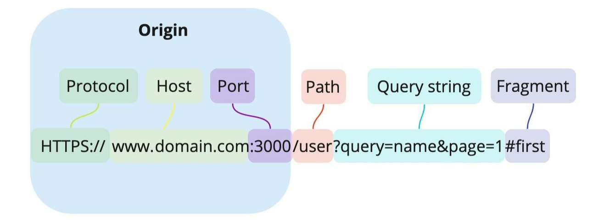
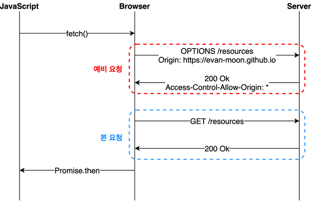
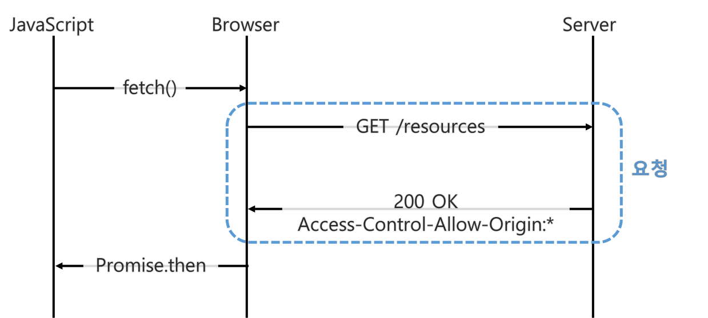

# Cross Origin Resource Sharing (CORS) 

## Intro

교차 출처 리소스 공유라는 이름으로 번역하며, 하나의 `출처(Origin)`에서 실행 중인 웹 어플리케이션이 `다른 출처의 선택한 자원에 접근할 수 있는 권한`을 
부여하도록 브라우저에 알려주는 체제이다. `CORS`라는 정책이 있기에 브라우저와 서버 간의 안전한 요청 및 데이터 전송을 지원할 수 있다.

## Origin

<p align="center"></p>

`CORS`의 `Origin`은 Protocol, Host, Port 를 모두 합친 것을 의미한다.
`HTTP`나 `HTTPS` 같이 기본 포트번호가 정해진 경우가 있기에 포트번호는 생략이 가능하지만,
만약 `Origin`에 포트번호가 명시되어 있다면, 명시된 포트번호까지 일치해야 같은 출처로 인정된다.

### Same Origin vs Different Origin

URL : `http://store.company.com/dir/page.html`

| URL                                             |   Outcome    |                     Reason                     |
|:------------------------------------------------|:------------:|:----------------------------------------------:|
| http://store.company.com/dir2/other.html        | Same origin  |             Only the path differs              |
| http://store.company.com/dir/inner/another.html | Same origin	 |             Only the path differs              |                
| https://store.company.com/page.html             |   Failure   |               Different protocol               |
| http://store.company.com:81/dir/page.html	      |   Failure	   | Different port (http:// is port 80 by default) |
| http://news.company.com/dir/page.html	          |   Failure	   |                 Different host                 |                                     

### Same Origin Policy (SOP)

같은 출처(Origin)에서만 리소스를 공유할 수 있다는 규칙이다.
앞서 말했듯이, 두개의 출처를 비교하는 방법은 URL의 구성요소 중 `Protocol`, `Host`, `Port` 세가지가 동일한지 확인하면 된다.
우리가 Postman이나 브라우저를 통해 서버간 통신을 할 때는 이 정책이 적용되지 않지만, 브라우저를 통해 통신하는 경우 이를 위반하는 오류가 발생한다.
그 이유는 출처를 비교한느 로직은 `브라우저에 구현`되어 있기 때문이다.  

`SOP`는 Cross-Site Request Forgery(CSRF)나 Cross-Site Scripting(XSS)등의 보안 취약점을 노린 공격을 방어할 수 있다.
하지만 현실적으로, 다른 출처에 있는 리소스를 가져오는 일은 굉장히 흔한 일이기 때문에, `SOP`만으로는 웹 어플리케이션을 구성하기는 불가능하다.
따라서, 예외 조항을 두고 이 조항에 해당하는 리소스 요청은 출처가 다르더라도 허용하기로 했는데 이것이 `CORS`이다.

```text
실무에서는 프론트엔드와 백엔드로 나눠서 서버가 존재하는 경우가 다수 존재한다.
따라서 백엔드 서버에 연동하여 API를 호출하게 되는데, 두 개의 서버가 다르기에 URL이 달라지게 되므로 `SOP`에 어긋나게된다.
```

## CORS

`CORS`는 기본적으로 HTTP 프로토콜의 `Origin`과 `Access-Control-Allow-Origin`헤더를 통해 동작하게된다. 순서를 보면 다음과 같다.

1. 클라이언트는 `Request Header`내 `Origin`에 요청을 보내는 곳의 주소를 담아 보내게 된다.
2. 서버에서는 `Response Header`내 `Access-Control-Allow-Origin`헤더에 허락하는 `Origin`을 담아 클라이언트로 보낸다
3. 클라이언트에서 자신이 보낸 `Origin`과 서버가 보내준 `Access-Control-Allow-Origin`을 비교한다
   - 유효하면 응답을 사용하고, 유효하지 않다면 응답을 사용하지 않고 버린다

기본적인 동작은 위와 같지만, 동작하는 방식에 따라 `Preflight`, `Simple`, `Credential`이라는 세가지 시나리오가 존재하고
사용자는 본인이 어떤 시나리오에 해당하는지 파악해 CORS 위반 사항을 적절하게 수정할 수 있다.

### Preflight Request

<p align="center"></p>

브라우저가 서버에 바로 요청하는 것이 아닌 `예비 요청`을 통해 안전한지 판단 후, `본 요청`을 보내는 두 가지 과정으로 나누어져있다.
본 요청 전 예비 요청을 `Preflight`라고 하며 이때 HTTP 메소드 중 `OPTION`이 사용된다.

1. javascript 의 fetch api 를 통해 서버로 리소스를 받아오라는 명령을 전달한다. 이때 `OPTIONS` 메서드를 사용한다.
2. 서버는 요청에 대한 응답으로, 허용되는 리소스에 대한 정보를 응답 헤더에 담아 브라우저로 전달한다
3. 브라우저는 서버로 보낸 요청 헤더의 `Origin`과 서버로 부터 받은 응답 헤더의 `Access-Control-Allow-Origin`을 비교한다
4. 해당 요청이 안전하다고 판단하면 본 요청을 보낸다
5. 리소스를 받아와 응답 데이터를 javascript 로 전달한다

`Preflight`에서 확인해야 할 것은 `Access-Control-Allow-Origin`으로 이를 `Origin`과 비교하여 CORS 위반을 확인할 수 있다.
이 때 주의할 점은 `Access-Control-Allow-Origin`와 `Origin`이 다르더라도 응답은 `200 OK`이 나온다는 것이다.
`Preflight`를 통한 요청과 응답은 성공적으로 진행됬기에 이는 `200 OK`이고, `CORS 위반`을 판단하는 것은 `Preflight`이 끝난 다음이기 때문이다.

```text
불필요한 HTTP Method 제거
우리는 일반적으로 GET, POST와 같은 HTTP 메서드를 사용하지만 PUT, DELETE 등의 메서드 또한 존재한다.
하지만 PUT, DELETE와 같이 실제 파일을 삭제 및 변조가 가능한 메서드들은 웹 취약점으로 연결될 가능성이 높다.
따라서, 사용하지 않는 HTTP METHOD는 막아두는 것을 권장한다!
```

### Simple Request

<p align="center"></p>

`Preflight`요청 없이 바로 본 요청을 서버에 보내고 서버로 부터 `Access-Control-Allow-Origin`을 포함한 응답을 받는다.
응답을 받은 브라우저는 `Access-Control-Allow-Origin` 헤더를 확인해서 CORS 동작을 수행할지를 판단한다.
`Simple Request`의 경우 특정 조건을 만족하는 경우에만 `Preflight`를 생략할 수 있으나, 일반적인 방법으로는 모든 조건을 충족시키는 쉽지 않다

- Simple Request 조건
  - 요청 메서드는 `GET`, `HEAD`, `POST` 중 하나여야 한다
  - 헤더는 `CORS-safelisted request-header`에 정의된 것만 사용 가능하다
    - `Accept`, `Accept-Language`, `Content-Language`, `Content-Type`, `DPR`, `Downlink`, `Save-Data`, `Viewport-Width`, `Width`
  - `Content-Type`을 사용하는 경우 다음 값들만 허용한다
    - `application/x-www-form-urlencoded`, `multipart/form-data`, `text/plain`

인증과 관련된 `Authorization`이나 HTTP API에서 사용하는 `application/json`은 상기 조건에 포함되지 않으므로 사용이 쉽지 않다.

### Credential Request

기존 `Preflight`에서 인증을 강화하는 목적으로 사용하는 방법이다.
일반적인 `비동기 리소스 요청 API`인 `XMLHttpRequest`객체나 `fetch API`는 별도 옵션 없이는 쿠키 정보나 인증과 관련된 헤더를 요청 헤더에 담지 않는다.
하지만 인증과 관련된 요청을 담을 수 있는 옵션 `credentials`이 존재한다.
- `credentials`의 옵션
  - same-origin: 같은 출처 간 요청에만 인증 정보를 담을 수 있다
  - include: 모든 요청에 인증 정보를 담을 수 있다
  - omit: 모든 요청에 인증 정보를 담지 않는다. 

`credentials` 옵션을 사용하여 인증 정보가 담긴 상태로 리소스를 요청하게 되면, 브라우저는 CORS 정책 위반 여부를 검사하는 룰에 두가지를 추가하게 된다.
- `Access-Control-Allow-Origin`에 모든 요청을 허용하는 `*`를 사용 불가, 반드시 명시적인 URL이여야 한다
- 응답 헤더는 `Access-Control-Allow-Credentials: true`가 존재해야 한다

## Reference

- https://developer.mozilla.org/ko/docs/Web/HTTP/CORS 
- https://inpa.tistory.com/entry/WEB-%F0%9F%93%9A-CORS-%F0%9F%92%AF-%EC%A0%95%EB%A6%AC-%ED%95%B4%EA%B2%B0-%EB%B0%A9%EB%B2%95-%F0%9F%91%8F
- https://velog.io/@hoo00nn/CORSCross-Origin-Resource-Sharing-%EB%9E%80
- https://evan-moon.github.io/2020/05/21/about-cors/
- https://juneyr.dev/2018-12-23/cors