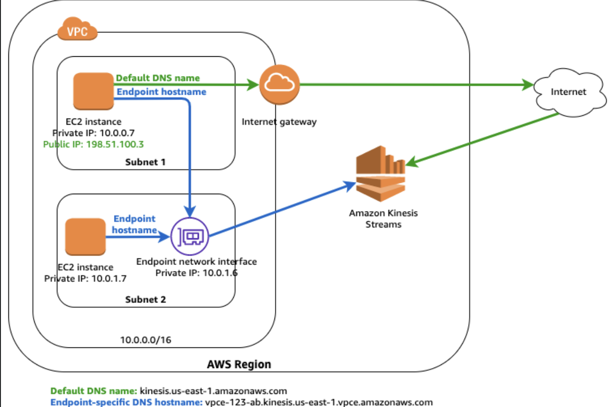

# Amazon VPC (Virtual Private Cloud)

사용자가 사용하는 AWS 리소스를 논리적으로 격리하여 프로비저닝하는 방법이다. 격리된 공간에 대해  IP 주소 범위 선택, 서브넷 생성, 라우팅 테이블 및 네트워크 게이트웨이 구성 등 가상 네트워킹 환경을 제어 가능하다.
이 VPC 위에서 EC2나 RDS 같은 데이터베이스를 생성하여 사용가능하다. 기본적으로 AWS 는 네트워크를 통해 서비스하기 때문에, 격리된 네트워크 환경을 통해 특정 리소스에 접근할 수 있는 환경을 만들어 주는 것이 VPC 의 목적이다.

## 기본 VPC 구성 요소

- VPC
- Subnet
- Route Table
- Network ACL / Security Group
- Internet Gateway
- DHCP options set

## VPC

프라이빗 클라우드를 만드는데 가장 기본이 되는 리소스이며, 논리적인 네트워크를 구성하는 리소스이다.
즉, `private network`를 활용하여 네트워크망을 구성하고, 내부에 AWS 의 각종 자원(EC2, RDS, ELB 등)을 탑재하는 서비스이다.
VPC 의 이름과 IPv4 CIDR 블록이 필수 요소이다.

### CIDR 블록

CIDR 블록은 IP의 범위를 지정하는 방식으로 IP주소 + `/` + 넷마스크 숫자로 구성되어있다.  넷마스크는 IP의 범위를 나타내며, 범위는 2^(32-n)개가 지정된다.
- 192.168.0.0/32
    - 정확히 지정된 IP를 명시
- 192.168.0.0/24
    - 192.168.0.0 ~ 192.168.0.255 까지를 지정
- 넷마스크가 8의 배수가 아닌 경우
    - 8의 배수는 255, 즉 `.`으로 구분된 부분 전체를 나타내는 것을 기본으로 2의 배수로 생각해봐야한다
    - 192.168.0.0/23 or /22
        - 23의 경우 24보다 2배 많은 수를 표현하므로 192.168.0.0 ~ 192.168.1.255 까지 범위가 된다
        - 22의 경우 24보다 4배 많은 수를 표현하므로 192.168.0.0 ~ 192.168.3.255 까지 범위가 된다
        - 밤대로 25의 경우 1/2 범위가 되므로, 192.168.0.128 ~ 192.168.0.255 가 범위가 된다
          VPC 하나에 최대 크기는 16이며,  즉, 65536개의 IP가 할당가능하며 적절한 크기의 VPC 를 만들어야한다.  또한 인터넷 연결이 필요한 경우, 사설망 대역을 사용해야하기 때문에 이에 해당하는 대역을 사용하는 것을 권장한다.

```text
VPC를 생성하는 경우, RFC:1918 규격에 따라 다음 CIDR 범위에 속하는 걸 권장한다.
10.0.0.0 ~ 10.255.255.255 (10/8)
172.16.0.0 ~ 172.31.255.255 (172.16/12)
192.168.0.0 ~ 192.168.255.255 (192.168/16)

VPC 생성 시, 허용되는 블록 크기는 /28 ~ /16 넷마스크 
```

## Subnet

VPC는 CIDR 블록으로 나뉘어진 논리적인 공간으로, 실제 리소스가 생성되는 곳은 가용존(Available Zone)으로 서브넷과 연결된다.
즉, `실제 리소스가 생성되는 네트워크`이며, VPC 내에서 `용도와 크기에 맞게 쪼갠 공간`이라고 볼 수 있다.
하나의 Subnet 은 반드시 하나의 `Availability Zone(AZ)`과 할당된다.

- 서브넷의 최대 크기는 VPC 의 크기와 같다
- 일반적으로 AZ의 갯수만큼 서브넷을 만들어 리소스를 분산시켜 재해 대응을 한다.
  - 하나의 서브넷은 하나의 AZ과 연결되며 리전에 따라 사용 가능한 AZ의 갯수가 달라진다
- 기본 VPC 에서는 AZ 갯수만큼 넷마스크 20의 서브넷을 자동으로 생성한다
- `같은 VPC 내의 서브넷들 간의 통신에는 별도의 라우팅 테이블이 필요하지 않다`

## Route Table

서브넷에서 네트워크를 이용할 때 라우트 테이블을 사용해서 목적지를 찾게된다. 앞에 설명한 서브넷은 각기 다른 네트워크 대역을 가지고 있기 때문에 원래는 서로간의
통신을 위해서는 라우팅이 필요하다. 하지만 `모든 라우팅 테이블에는 VPC 내부통신을 위한 로컬 라우팅이 포함`되어있다.
이렇게 기본적으로 지정된 라우팅 테이블 때문에 별도의 설정없이 서브넷 내 자원들은 다른 서브넷으로 통신을 하는 경우 `VPC 라우터` 거쳐 통신이 가능하다.

- 주의점
  - 라우트 테이블 하나는 VPC 내 여러 서브넷에서 사용 가능한데, 이렇게 자동 생성되는 라우트 테이블에는 하나의 룰만이 지정되어 있다.
  - 바로 같은 CIDR 블럭을 목적지로 하는 네트워크의 경우 로컬 즉, VPC 내에서 리소스를 찾는 규칙이다.
  - 따라서, 인터넷을 연결하거나 다른 VPC 와 통신하기 위해서는 규칙을 추가적으로 정의 해줘야한다.

## Internet Gateway

VPC 는 기본적으로 격리된 네트워크 환경이기 때문에, 인터넷에 연결하기 위해서는 인터넷 게이트웨이와 연결해줘야한다.
즉, 서브넷 내 자원이 인터넷에 연결하기 위한 단순히 인터넷 게이트웨이를 생성하는 것이 아닌, 다음과 같은 조건이 필요하다

1. 인터넷과 통신하기 위한 자원은 반드시 `Public IP`를 가져야 한다
2. 자원이 소속된 서브넷의 `라우팅 테이블`에 `0.0.0.0/0`의 목적지를 가지는 `인터넷 게이트웨이가 존재`해야한다
3. Network ACL 과 Security Group 에서 규칙을 허용해야한다

이렇게 인터넷 게이트웨이가 라우팅 테이블에 등록된 서브넷을 `Public Subnet`, 인터넷과 연결되지 않은 서브넷을 `Private Subnet`이라고 한다.

## DHCP options set

DHCP 옵션셋은 TCP/IP 상의 호스트로 설정 정보를 전달하는 DHCP 표준이다. 보통 VPC 생성 시, 생성되는 그대로를 사용한다.

## Network ACL / Security Group

두 개 모두 Inbound(외부 -> 내부) 와 Outbound(내부 -> 외부) 트래픽을 제어하는 가상 방화벽이다. 다만 시큐리티 그룹은 `인스턴스의 앞에서 트래픽을 제어`한다면,
네트워크 ACL 은 `서브넷 앞단에서 트랙픽을 제어하는 방화벽`이라고 볼 수 있다. 또한, `시큐리티 그룹은 stateful`하게 동작하기에, 인바운드에
성공한다면 아웃바운드 설정을 안하더라도 동작이 가능하지만, `ACL 은 stateless`하기 때문에 인바운드 아웃바운드 모두 설정해줘야 정상적으로
동작한다. 두 개가 독립적으로 동작하기 때문에, ACL 에서 통과하더라도 시큐리티 그룹에서 실패하면 통신이 되지 않는다.

### Network ACL

1개 이상의 서브넷 내부와 외부로 나아가는 트래픽을 제어하기 위한 선택적 보안 계층이다. 즉, Network ACL 은 접근제어목록(Access List)를 가지고 서브넷을 통해
주고 받는 모든 트래픽에 대해 규칙을 적용한다. 특징은 다음과 같다

- 인바운드 규칙과 아웃바운드 규칙으로 나뉨
- 허용 + 거부 규칙 존재
- 규칙에 우선 순위 값이 존재하고, 값이 낮은 것부터 우선적으로 적용
- Stateless

### Security Group

시큐리티 그룹은 인스턴스의 가상 방화벽 역할을 담당한다. 시큐리티 그룹은 `ENI(Elastic Network Interface)`에 적용되기 때문에, ENI를 갖는 VPC 내 모든 자원에 적용될 수 있다.
다음과 같은 특징을 가진다

- 인바운드 규칙과 아웃바운드 규칙으로 나뉨
- 허용 규칙만 생성 가능
- 아웃바운드의 기본규칙은 모든 아웃바운드 트래픽 허용
- 하나의 인스턴스에 최대 5개까지 시큐리티 그룹 적용가능
- Stateful

## Network Address Translation(NAT, 네트워크 주소 변환)

NAT 는 용어 그대로 네트워크 주소 변환이라는 뜻이다. NAT는 주로 사설 네트워크에 속한 여러 개의 private ip 가 하나의 public ip를 통해 인터넷을 접속하기 위함이다.
즉, IPv4 주소의 낭비를 막기 위해 private ip 가 할당되었는데, 이 private ip는 어떻게 변환시켜서 외부와 통신할 것인가를 말하는 것이라 볼 수 있다.
하지만, NAT 여러 호스트간 통신의 복잡도를 증가시키게 되어 네트워크 성능에 영향을 줄 수 있다는 점도 인지해야한다.

### NAT Gateway

보통 인터넷 게이트웨이를 서브넷의 라우팅 테이블에 등록하지 않는 private 서브넷은 외부 인터넷을 차단하고 내부에서 사용할 용도로 생성된다. 하지만, 내부의 자원이
외부와의 통신이 필요한 상황이 발생한다면 어떻게 처리해야할까? 이런 경우 사용되는게 NAT 게이트웨이이다.  

- Public 서브넷 내 NAT 게이트웨이를 생성
- Private 서브넷이 외부 인터넷으로 나아가야할 상황에 사용하도록 라우팅
- NAT 게이트웨이는 내부에서 외부로의 접속만 가능하며, 외부에서 NAT 게이트웨이로의 접속은 불가능
- Private 서브넷 내 라우팅 테이블에 반드시 NAT 게이트웨이를 설정해줘야 외부로 나가는 인터넷이 허용된다

## VPC Endpoint

<p align="center"></p>

VPC는 사용자 정의 네트워크로 VPC 내 자원은 사설 또는 공인 IP가 할당되어 동작하게 된다. 하지만 S3나 CloudFront 등과 같은 서비스는 AWS Region 내에는 존재하지만,
VPC 내부에 존재하는 서비스가 아니다. 따라서 VPC 내 통신이 아니기 때문에, `S3에 접속하기 위해선 인터넷 게이트웨이나 NAT 게이트웨이를 통해 인터넷을 통해 접근`해야한다.
하지만, 이렇게 동작할 시 인터넷이 외부에 연결되어 트래픽이 노출되어 보안상으로 좋지 않을 수 있다.  
이를 해결하기 위한 방법이 `VPC EndPoint`이다.

- VPC의 내부 리소스가 외부 AWS 리소스 통신할 때 외부 인터넷을 거치지 않고 `AWS 백본 네트워크`를 통해 접근하게 하는 것
  - 즉 접근에 퍼블릭 ip가 필요하지 않다는 것
- VPC 내부에 VPC Endpoint 를 생성하고, 이 엔드포인트를 통해 AWS 외부서비스에 도달하는 방법
- Interface Endpoint
  - 서브넷에 `Endpoint Network Interface`를 생성하고 Private IP 를 할당 후 이를 통해 AWS 서비스에 접근
  - 위의 그림에서 파란색 선에 해당하며, AWS PrivateLink 를 이용하여 이루어진다
- Gateway Endpoint
  - 게이트웨이 엔드포인트를 생성 후, 서브넷의 라우팅 테이블에 엔드포인트를 추가한다
  - S3, DynamoDB 두 개 서비스에 적용 가능 
