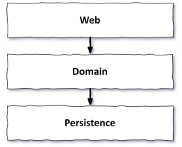
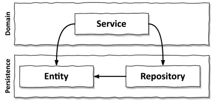
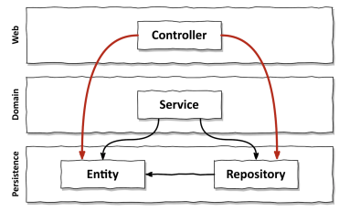

# 1장. 계층형 아키텍쳐의 문제는 무엇일까?

위 그림은 웹, 도메인, 영속성 계층으로 구성된 전통적인 웹 어플리케이션 구조이다.
이 구조에서는 다음 순서로 요청이 처리된다.

- `웹 계층`에서 요청을 받아 `도메인이나 비지니스 계층으로 서비스 요청`을 보낸다.
- 서비스에서 필요한 `비지니스 로직을 수행`한다.
- `영속성 계층`의 컴포넌트를 호출해 도메인 엔티티의 상태를 조회하거나 변경한다.

계층을 잘 이해하고 구성한다면 각 계층에 독립적으로 도메인 로직을 작성할 수 있기에,
`계층형 아키텍쳐는 견고한 아키텍쳐`이다. 잘 만들어진 계층형 아키텍쳐는 요구사항을
빠르게 반영할 수 있다.

하지만, 코드에 나쁜 습관이 스며들기 쉽고, 시간이 지날 수록 점점 더 변경하기 어렵게 만드는
허점들을 노출하게 된다.

## 계층형 아키텍쳐는 데이터베이스 주도 설계를 유도한다.

전통적인 계층형 아키텍쳐의 토대는 데이터베이스이다.
위쪽 그림에서 보듯이, 웹은 도메인을, 도메인은 영속성 계층을 의존하기에 자연스럽게 데이터베이스에 의존하게 된다.
즉, 모든 것이 `영속성 계층을 토대로` 만들어진다.

어플리케이션의 목적은 `비지니스 로직이나 정책`을 사용자가 편리하게 활용할 수 있게하는 것이다.
이런 목적은 `상태(state)가 아닌 행동(behavior)을 중심`으로 모델링 되어야한다.
하지만 계층형 아키텍쳐는 도메인이 아닌 데이터베이스를 토대로 아키텍쳐를 만든다.

그 동안 프로젝트를 진행하며 유스케이스를 구현할 때, 도메인 로직을 먼저 생각했을까
아니면 영속성 계층(JPA의 엔티티)를 먼저 생각했을까?

전통적인 계층형 아키텍쳐에서 영속성 계층, 즉 데이터베이스를 먼저 생각하는 것은 합리적인 방법이다.
`의존성의 방향에 따라 자연스럽게 구현`되는 것이기 때문이다. 다만, 비지니스 관점에서는 전혀 맞지 않을 뿐이다.

데이터베이스 중심적인 아키텍쳐가 만들어진 가장 큰 원인은 ORM 프레임워크를 사용하기 때문이다.
ORM은 계층형 아키텍쳐와 결합하면 비지니스 규칙을 영속성 관점과 섞고 싶게 만든다.

ORM을 사용하면 엔티티들은 일반적으로 영속성 계층에 위치하게 된다. 의존성의 방향에 따라
서비스는 엔티티에 접근할 수 있게되고, 이렇게되면 반드시 사용되게 된다.

이렇게되면 `영속성 계층과 도메인 계층 사이에 강한 결합`이 생긴다.
영속성 코드가 사실상 도메인 코드에 녹아 들어가기에 둘 중 하나만 바꾸기 어려워진다.

이는, 유연하고 선택의 폭을 넓혀주기 위한 계층형 아키텍쳐의 목표와 반대된다.

## 지름길을 택하기 쉬워진다

전통형 아키텍쳐의 유일한 규칙은 `특정한 계층에서는 같은 계층이나 아래에 있는 계층에만 접근`이 가능하다는 것이다.
따라서, 상위 계층에 위치한 컴포넌트에 접근해야 한다면 간단히 컴포넌트를 계층 아래로 내려버리면 된다.

한 두번 이런 상황이 발생하는 것은 괜찮을 수 있지만, 시간이 지나면서 어떤 계층에도 속하지 않아야할 것 같은
헬퍼 컴포넌트나 유틸리티가 아래 계층으로 내려질 수 있다.

이런 지름길을 만들지 않으려면 아키텍쳐 규칙을 강제해야하며, 규칙이 꺠졌을 때 빌드가 실패하는 규칙이 필요하다.

## 테스트하기 어려워진다

계층형 아키텍쳐를 사용할 때 일반적으로 나타나는 변화는 계층을 건너뛰는 것이다.
이는 두가지 문제점을 발생시킨다.

1. 도메인 로직을 웹 계층에서 구현하게 된다
   - 유스케이스가 확장된다면, 컨트롤러에 여러 도메인 로직이 추가되고 `어플리케이션 전반에 핵심 도메인 로직`이 퍼져나가게 된다
2. 웹 계층 테스트에서 도메인 계층뿐만 아니라 영속성 계층도 mocking 해야한다
   - `단위 테스트의 복잡도`가 올라간다
   - 실제 테스트를 작성하는 것보다 종속성을 이해하고 mocking을 만드는 시간이 더 걸리게 된다.

## 유스케이스를 숨긴다

실무에서는 기능을 추가하거나 변경할 위치를 찾는 일이 많기에 아키텍쳐는 `코드를 빠르게 찾을 수 있도록` 해야한다.
하지만, 계층형 아키텍쳐는 `도메인 로직이 여러 계층에 걸쳐 흩어지기 쉽다`.

무엇보다 큰 문제는 계층형 아키텍쳐는 도메인 서비스의 `너비에 관한 규칙`을 강제하지 않는다.
즉, 여러 개의 유스케이스를 담당하는 아주 넓은 서비스가 만들어질 수 있다.
이런 넓은 서비스는 `영속성 계층에 많은 의존성`을 갖게하고 `서비스를 테스트`하기도 어려워지며, 유스케이스를
`책임지는 서비스를 찾기`도 어려워진다.

## 동시 작업이 어려워진다

마감이 존재한다는 것은 여러 작업을 동시에 해야한다는 것이다. 그러기 위해선 아키텍쳐가
동시작업을 지원해야하지만 계층형 아키텍쳐는 이런 측면에서 도움이 되지 않는다.

모든 것이 영속성 계층위에 만들어지기에, 영속성 계층을 먼저 만든 후 도메인 계층을 만들고
마지막으로 웹 계층을 만들게 된다. 그렇기에 특정 기능은 동시에 한명밖에 개발할 수 없다.

인터페이스를 정의하고 작업하면 된다고 하지만, 이는 데이터베이스 주도 설계를 하지 않았다는 전제를 가져야한다.
데이터베이스 주도 설계에서는 `영속성 로직과 도메인 로직이 섞여`있기에 개별적으로 작업할수 없기 때문이다.

추가적으로 `넓은 서비스`가 존재한다면 서로 다른 기능을 동시에 작업하는 것은 더욱 어려워진다.

## 결론

- 견고한 계층형 아키텍쳐는 유지보수하기 쉽고 코드를 쉽게 변경하거나 추가할 수 있게해줌
- 하지만 계층형 아키텍쳐는 잘못된 방향으로 흘러가는 것을 용인
- 어떤 아키텍쳐를 선택하든 이런 함정을 염두에 두자