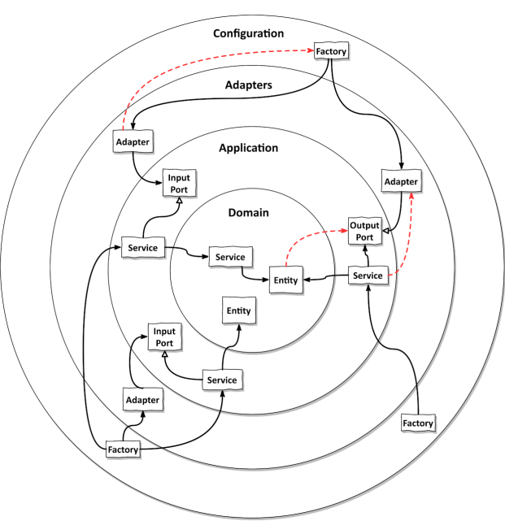
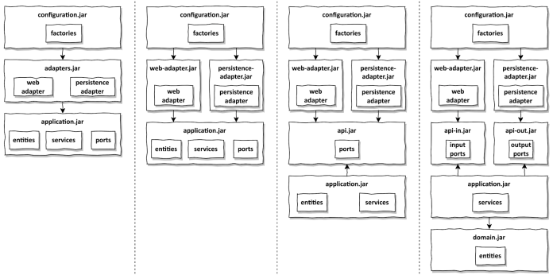

# 10장. 아키텍쳐 경계 강제하기

## 경계와 의존성

아키텍쳐의 어디에 경계가 있고, 경계를 강제한다는 것이 어떤의미가 있을까?

- 가장 안쪽에는 도메인 엔티티
- 어플리케이션 계층에는 어플리케이션 서비스
  - 유스케이스 구현을 위해 도메인 엔티티에 접근
- 어댑터는 인커밍 포트를 통해 서비스에 접근
- 반대로, 서비스는 아웃고잉 포트를 통해 어댑터에 접근

의존성 규칙에 따르면 계층 경계를 넘는 의존성은 항상 안쪽 방향으로 향해야 한다.

## 접근 제한자

경계를 강화하기 위한 가장 기본적인 도구는 접근 제한자이다.

자바의 package-private 접근자는 자바 패키지를 통해 클래스들을 `응집적인 모듈`로 만들어준다.
모듈의 진입점으로 활용될 클래스는 public으로 만들고, 패키지 바깥에서 접근할 수 없는 클래스는
package-private으로 만들어주는 방법으로 경계를 강화할 수 있다.

package-private 제한자는 몇 개 정도의 클래스로만 이루어진 작은 모듈에서 가장 효과적이다.
하지만, 패키지 내 클래스가 많아질 수록 하위패키지를 만드는 방법이 선호된다.
하위 패지키는 다른 패키지로 취급되기에 package-private 멤버에 접근이 불가능해진다는 단점이 존재한다.

## 컴파일 후 체크

public 제한자를 쓰면 의존성 방향이 잘못되더라도 클래스 사용에 문제가 없다.

이를 해결하는 한가지 방법이 `컴파일 후 체크(post-compile check)`이다.
즉, 컴파일이 된 후 런타임에 체크하는 것으로 `자동화된 테스트 과정`에서 가장 잘 동작한다.

이를 도와주는 도구로는 ArchUnit이 존재하며 JUnit과 같은 단위 테스트 프레임워크
기반으로 잘 동작하며 의ㅗㄴ성 규칙을 위반할 경우 테스트를 실패시킨다.

하지만, 컴파일후 체크는 fail-safe하지는 않다. 왜냐면, 패키지명을 String 형태로
입력하는데 오타가 발생하게 되면 의존성 규칙 위반 사례를 발견할 수 없기 때문이다. 또한
패키지를 변경하는 리팩터링에 취약하여, 이 경우 테스트 또한 변경해야되는 문제가 존재한다.

## 빌드 아티팩트

지금까지 다룬 내용에서 경계를 강화하는 방법은 패키지였고, 이는 모놀리식 빌드 아티팩트의 일부이다.
즉, 하나의 jar 파일을 생성하는 것을 전제하였다.

하지만 우리가 사용하는 Gradle 같은 빌드 도구를 이용해 모듈과 아키텍쳐의 계층 간의 의존성을 강제할 수 있다.
빌드 도구의 주요한 기능 중 하나는 의존성 해결로, 코드를 빌드 아티팩트로 변환하기 위해
코드가 의존하고 있는 모든 아티팩트가 사용가능한지를 검사하기에 이를 이용할 수 있다.

각 모듈 또는 계층으로 분리된 빌드 모듈(jar)을 만들 수 있고, 각 모듈의 빌드 스크립트에서는
아키텍쳐에서 허용하는 의존성만을 지정하는 방식을 사용한다.

위 그림의 왼쪽부터 살펴보자.

맨 왼쪽은 설정, 어댑터, 어플리케이션 계층으로 분리된 빌드 아티팩트로 만든 것이다.
- 설정 모듈은 암시적이고 전이적인 의존성 때문에 어플리케이션 모듈에도 접근이 가능하다.
- 어댑터 모듈은 영속성 어댑터와 웹 어댑터 모두를 포함하여 두 어댑터 간의 의존성을 막지 않는다.

어댑터 모듈을 여러 개의 빌드 모듈로 쪼개서 어댑터당 하나의 모듈이 되게만든 것이 다음 그림이다.
- 이 경우, 실수로 어댑터 간 의존성이 추가되어 의존성이 다른 어댑터로 번지는 걸 막을 수 있다.

어플리케이션 모듈을 쪼개는 것도 또 다른 방법이다.
- 도메인 엔티티가 포트에서 전송 객체(DTO)로 사용되지 않는 다면 포트 인터페이스만 포함하는 API 모듈을 분리할 수 있다.
- 어댑터 모듈과 어플리케이션 모듈은 API 모듈에 접근 가능하지만, 어댑터는 엔티티와 서비스에 직접 접근이 불가능하다.
- API 모듈을 인커밍 포트와 아웃고잉 포트 각각만 가지는 모듈로 쪼갤 수 도있다.

어플리케이션 모듈 또한 더 쪼갤 수 있다.
- 서비스만 가지고 있는 모듈과 도메인 엔티티만 가지고 있는 모듈로 쪼갤 수 있다.

이처럼 빌드 모듈을 나누는 방법은 다양하며 모듈을` 더 세분화 할수록 모듈 간 의존성을 더 잘 제어`할 수 있다.
하지만, 작게 분리할수록 모듈간의 매핑을 더 많이 수행해야한다.

이런 모듈을 구분하는 것은 다음과 같은 장점이 존재한다.

- 하나의 모듈에서 일어나는 변경이 순환 고리에 포함되어 모든 모듈을 변경하게 만드는 순환의존성을 막을 수 있다
  - 빌드 도구는 순환 의존성을 허용하지 않는다.
  - 빌드 모듈 간 순환 의존성이 없음을 확신할 수 있다.
- 특정 모듈의 코드를 격리한 채로 변경 가능하다
- 모듈 간 의존성이 빌드 스크립트에 선언되어 있기에 새로 의존성을 추가하는 일을 우연이 아닌 인지하고 작업하게 된다

## 결론

- 소프트웨어 아키텍쳐는 아키텍쳐 요소 간의 의존성을 관리하는 것이다.
- package-private은 패키지 바깥에 접근하면 안되는 클래스에 대한 의존성을 막을 수 있다.
- 패키지 구조가 허용되지 않는 상황에서는 컴파일 후 체크 도구를 사용해야한다.
- 마지막으로 아키텍쳐거 안정적이라고 느껴지면 아키텍쳐 요소를 독립적인 빌드 모듈로 추출해야한다.