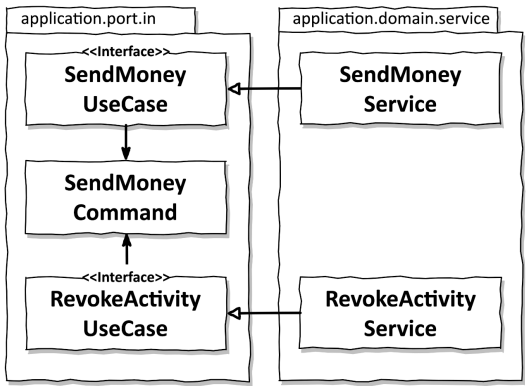
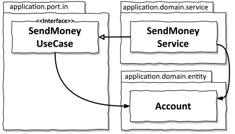
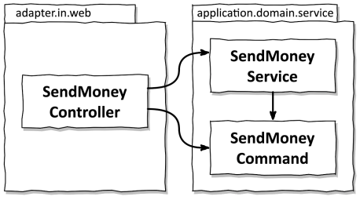
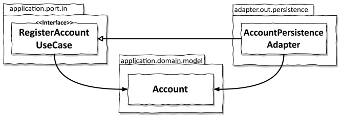

# 11장. 의식적으로 지름길 이용하기

기술 부채라는 건 쌓아두기 시작하면 절대 갚지 않게된다.
지름길을 사용하게 되면 이런 기술 부채를 쌓게되는데, 지름길 자체를 파악하는 것이 중요하다.
그래야 우발적으로 사용되는 지름길과, 정당한 지름길을 구분할 수 있기 때문이다.

## 왜 지름길은 깨진 창문 같을까?

- 품질이 떨어진 코드에서 작업할 때 더 낮은 품질의 코드를 추가하기 쉽다
- 코딩 규칙을 많이 어긴 코드에서 작업할 때 또 다른 규칙을 어기기 쉽다
- 지름길을 많이 사용한 코드에서 작업할 때 또 다른 지름길을 추가하기 쉽다.

## 유스케이스 간 모델 공유하기

유스케이스 간 다른 입출력 모델을 사용해야하지만, 입출력 모델을 공유하는 지름길이 존재한다.
위 그림에서 입력 모델을 공유함에 따라 SendMoneyUseCase와 RevokeActivityUseCase가 결합되게된다.
SendMoneyCommand가 변경되면 두 유스케이스가 모두 영향을 받는 것이다.
이는 단일 책임 원칙에서 말하는 변경할 이유를 공유하는 것이다.

하지만, 유스케이스 간 입출력 모델을 공유하는 것은 `유스케이스들이 기능적으로 묶여있을 때는 유용`하다.
특정 세부사항을 변경할 경우 실제로 두 유스케이스 모두에 영향을 주고 싶을 때 사용해야한다.
만약, 독립적으로 진화해야한다면 입출력 모델을 공유하는 방식은 지름길이되고 기술부채가 될 수 있다.

항상 유스케이스를 독립적으로 진화할 필요가 있는지 질문해야한다.

## 도메인 엔티티를 입출력 모델로 사용하기

엔티티를 인커밍 포트의 입출력 모델로 사용하고 싶을 수 있지만, 이런 경우 인커밍 포트는 도메인 엔티티에 의존성을 가지게된다.
분명, Account 엔티티는 UseCase에 의존하지 않으니 UseCase가 변한다고 변경되지 않을 것이라 생각하지만, 실상은 그렇지 않다.
만약 Account 엔티티에 존재하지 않지만 유스케이스에 필요로한 정보가 존재한다면 Account에 필드를 추가하고 싶다는 생각이 들 수 있다.

간단한 생성이나 업데이트 유스케이스의 경우 DB에 저장해야하는 상태 정보가 엔티티에 있기 때문에 괜찮을 수 있다.
하지만 더 복잡한 도메인 로직을 구현해야한다면 유스케이스 인터페이스에 전용 입출력 모델을 만들어야한다.

초기에 도메인 엔티티를 입력 모델로 사용했더라도 `독립적인 전용 입력 모델로 교체해야하는 시점`을 잘 파악해야한다.

## 인커밍 포트 건너뛰기

아웃고잉 포트는 어플리케이션 계층과 아웃고잉 어댑터 사이의 의존성 역전을 위해 필수적이다.
반면, 인커밍 포트는 의존성 역전에 필수적인 요소가 아니기에 이를 건너뛰고 싶을 수 있다.

하지만 인커밍 포트가 가진 장점이 존재한다.
- 특정 유스케이스를 구현하기 위해 서비스 메서드를 호출해야하는 경우, 진입점을 파악하기 쉽다
  - 개발자가 코드를 파악할 때 도움이 된다
- 아키텍쳐를 쉽게 강제할 수 있다.
  - 인커밍 어댑터에서 호출할 의도가 없던 서비스 메서드를 실수로 호출하는 일이 발생할 수 없다.

## 어플리케이션 서비스 건너뛰기

인커밍 포트를 구현하는 어플리케이션 서비스를 대체하기 위해 아웃고잉 어댑터에서 직접 인커밍 포트를 구현할 수 있다.
간단한 CRUD 유스케이스에서는 서비스가 특별한 도메인 로직없이 영속성 어댑터에 전달하기에 그런 지름길을 사용할 수 있다.

하지만, 인커밍 어댑터와 아웃고잉 어댑터 사이에 모델을 공유해야하기에 도메인 모델을 공유하는 것과 같은 상황이된다.
간단한 CRUD 유스케이스는 점점 발전하여 복잡해지게되면, 도메인 로직 자체를 아웃고잉 어댑터에 추가할 위험이 존재한다.
이렇게 되면, 도메인 로직이 흩어지고 도메인 로직을 찾거나 유지보수하기 어려워진다.

## 결론

- 모든 어플리케이션은 작게 시작하기에 지름길을 사용할 수 있다.
- 하지만 점점 어플리케이션이 발전하게 되면서 이를 제거하고 올바른 방향으로 나가야한다
- 단순한 CRUD 상태에서 벗어나지 않는 유스케이스의 경우 지름길을 그대로 유지하는 것이 경제적이다