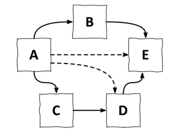
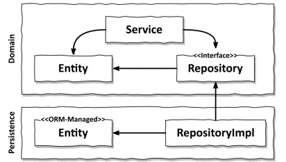
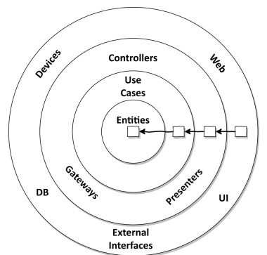
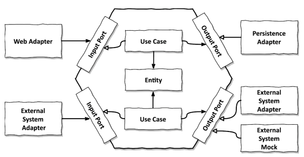

# 2장. 의존성 역전하기

## 단일 책임 원칙(Single Responsibility Principle, SRP)

> 하나의 컴포넌트는 오로지 한가지 일만 해야하고, 그것을 올바르게 수행해야한다

일반적인 해석은 위와 같지만 실제의도는 다음과 같다

> 컴포넌트를 변경하는 이유는 오로지 하나뿐이어야 한다

처음 `언급한 한가지 일만하는 것`은 `변경할 이유`로 변경되었다.
`변경할 이유가 한 가지`라면 우리가 다른 이유로 소프트웨어를 변경하더라도 이 컴포넌트에 대해서는
전혀 신경쓸 필요가 없다.

하지만, 변경할 이유라는 것은 컴포넌트 간의 의존성을 통해 너무 쉽게 전파된다.

위 그림은 직,간접 적인 의존성을 나타내고 있다. A를 살펴보면 직접적인 의존성외에도
`간접적인 의존성으로 인해` 어떤 컴포넌트가 바뀌든 같이 바뀌어야 한다.

이렇듯 많은 코드는 단일 책임 원칙을 위반하기에 시간이 갈수록 변경하기 어려워진다.

## 의존성 역전 원칙(Dependency Inversion Principle, DIP)

앞서 보았듯 계층형 아키텍쳐의 의존성 방향을 아래를 향한다. `상위 계층이 하위 계층에 비해 변경할 이유가
더 많다`는 것을 알 수있다.

그러므로 영속성 계층의 변화는 도메인 계층의 변화를 야기시킨다. 이런 의존성을 어떻게 제거해야할까?
정답은 의존성 역전 원칙에 있다.

`도메인과 영속성 간의 의존성을 역전`시켜서 영속성 코드가 도메인 코드에 의존하고,
`도메인을 변경할 이유의 갯수`를 줄일 수 있다.

엔티티를 도메인 객체로 올리고 도메인은 엔티티의 상태를 변경하는 일을 한다.
하지만 Repository가 도메인 계층의 엔티티에 의존하기에 두 계층 사이에 `순환 의존성`이 생기게 된다.
이 부분이 의존성 역전 원칙을 적용해야 될 부분이며, Repository에 대한 인터페이스를 만들고
실제 구현은 영속성 계층에서 구현하게 하는 것으로 문제를 해결할 수 있다.

## 클린 아키텍쳐

비지니스 규칙은 프레임워크, 데이터베이스, UI 등의 외부 기술이나 인터페이스로부터 독립적이여야한다.
이 말은 `도메인 계층이 바깥으로 향하는 의존성이 존재하면 안된다`는 것이다. 의존성 역전 원칙을 통해
모든 의존성을 도메인 계층으로 향하게 할 수 있다.

클린 아키텍쳐에서 가장 중요한 규칙은 `의존성 규칙`으로` 계층 간의 모든 의존성은 안쪽`으로 향해야 한다.
이렇게 함으로써 비지니스 규칙에 집중할 수 있고 도메인 코드를 자유롭게 모델링 할 수 있게된다.

하지만 이런 클린 아키텍쳐에도 대가가 따른다. 외부와 내부를 분리해야하므로 엔`티티에 대한
모델을 각 계층에서 따로 관리 및 유지보수` 해야한다.

- ORM 기술을 사용하면 DB와 매핑되는 엔티티가 존재한다.
- 하지만, 도메인 계층과 영속성 계층은 서로 분리되었기에 `각 계층에서 사용하는 엔티티 클래스 또한 분리`되어야한다.
- 도메인 계층과 영속성 계층간 데이터 송수신 시, 각 엔티티를 변환하여 전달해야한다
- 도메인 계층과 다른 계층간의 모든 작업 또한 동일하다

이런작업이 번거로워 보일 수 있으나 올바른 방향으로 나아가는 것이다.
JPA를 사용하면 엔티티 클래스에 `기본 생성자를 추가가 강제`되며, 이런 것이 바로
`도메인 모델에 포함되서는 안되는 프레임워크 특화 결합`이다.

## 육각형 아키텍쳐(Hexagonal Architecture)

육각형 아키텍쳐는 클린 아키텍쳐를 좀 더 일반적인 용어로 설명한 것이다.

육각형 내부에는 도메인과 이와 상호작용하는 유스케이스가 존재한다.
육각형에서 `외부로 향하는 의존성이 없기에 클린아키텍쳐의 의존성 규칙이 적용`된다.
반대로 모든 의존성은 육각형으로 향한다.

육각형의 외부에는 어플리케이션과 상호작용하는 어댑터들이 존재한다.

- 왼쪽 어댑터는 `어플리케이션 코어를 호출`하기에 `주도하는 어댑터(in)`
- 오론쪽 어댑터는 `어플리케이션 코어에 의해 호출`되기에 `주도되는 어댑터(out)`

코어와 어댑터들간의 통신을 위해선 코어가 각각의 포트를 제공해야한다.

- 주도하는 어댑터(in)의 포트는 `코어의 유스케이스 클래스 중 하나에 의해 구현`
- 주도되는 어댑터(out)의 포트는 `어댑터에 의해 구현되며 코어는 호출되는 인터페이스를 제공`

## 결론

- 의존성을 역전시켜 도메인 계층이 바깥쪽 계층에 의존하지 않게하여, 도메인 로직의 결합을 제거
- 이를 통해 변경할 이유를 줄임으로써 유지보수성이 좋아짐