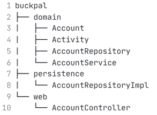
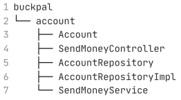
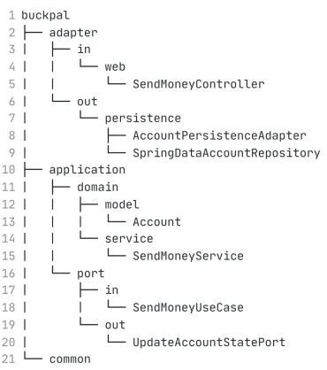
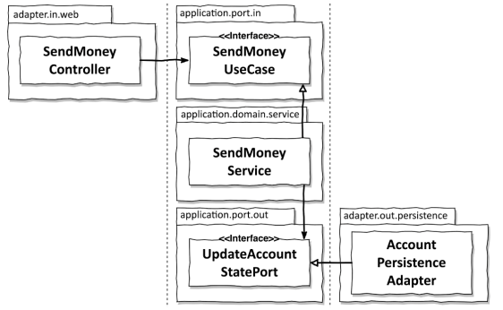

# 3장. 코드 구성하기 (실습)

코드를 보는 것만으로 어떤 아키텍쳐인지 파악할 수 있다면 좋지 않을까?

프로젝트를 진행하다보면 클래스들이 import 하지 말아야할 다른 패키지에 있는 클래스를 불러오기 시작한다.
어떻게 이런 상황을 개선할 수 있을까?

## 계층으로 구성하기

첫 번째 접근법은 계층을 이용하여 코드를 구조화 하는 것이다.

DIP를 적용해서 의존성이 domain 패키지에 있는 도메인 코드만을 향하게 한다.
domain 패키지 내에 AccountRepository를 두고 persistence 패키지에 해당
인터페이스의 구현체를 두어 의존성을 역전시킨다.

하지만 이 구조는 몇가지 문제가 존재한다.

첫째로, 기능 조각이나 특성을 구분 짓는 패키지 경계가 없다. User와 관련된 기능이 추가된다고 하더라도
domain, persistence, web에 관련된 클래스들이 추가되게 된다.
이처럼 추가적인 구조가 존재하지 않는다면, 새로운 기능이 추가될 때마다 연관되지 않은 기능들도 함께 묶이게된다.

둘째로, 어떤 유스케이스를 제공하는지를 파악할 수 없다.
특정 기능을 찾기위해서 개발자는 서비스 내의 어떤 메서드가 그 책임을 수행하는지를 일일히 찾아야한다.

이처럼 계층형 구조는 패키지 구조를 통해서는 우리가 목표로하는 아키테겿를 파악할 수 없다.
인커밍 포트와 아웃고잉 포트가 코드속에 숨겨져 있기 때문이다.

## 기능으로 구성하기

다음은 기능별로 패키지를 구성하는 것이다. Account와 관련된 모든 코드를 최상위 account 패키지에
넣었고 계층 패키지들도 없앴다.

이렇게 함으로써 account에 대한 기능들은 같은 레벨의 패키지에 들어가고,
외부에서 접근되면 안되는 클래스들에 대한 `package-private 접근 수준`을 이용해 
`패키지간 경계를 강화`할 수 있다. 이렇게 함으로써, `각 기능 사이의 불필요한 의존성`을 방지할 수 있다.

하지만 이 방식은 계층에 의한 패키징 방식보다 아키텍쳐의 가시성을 더 떨어뜨린다.
어떤게 인커밍 포트이고 아웃고잉 포트인지, 어떻게 의존성역전을 시켰는지에 대해 알 수가 없어진다.

## 아키텍쳐적으로 표현력있는 패키지 구조

`buckpal 하위에 account 패키지가 그림에서 누락.`

육각형 아키텍쳐에서 구조적으로 핵심적인 요소는 다음과 같다.

- 엔티티
- 유스케이스
- 인커밍, 아웃고잉 포트
- 인커밍, 아웃고잉 어댑터

위 요소를 포함하여 buckpal 패키지를 구성하면 다음과 같은 구조를 가지게 된다

- account
  - account와 관련된 기능임을 표현하는 최상위 패키지
- domain
  - 도메인 모델
- application
  - 도메인을 둘러싼 서비스 계층
  - SendMoneyService는 `인커밍 포트의 유스케이스를 구현`
  - SendMoneyService는 아웃고잉 포트 인터페이스인 LoadAccountPort와 UpdateAccountStatePort를 사용
    - 해당 인터페이스는 영속성 어댑터(adpater -> out -> persistence)에 의해 구현
- adpater
  - 어플리케이션 계층의 `인커밍 포트를 호출`하는 인커밍 어댑터
  - 어플리케이션 계층의 `아웃고잉 포트에 대한 구현`을 제공하는 아웃고잉 어댑터

이런 구조는 어떤 장점이 있을까?

- 필요에 따라 하나의 어댑터를 다른 구현으로 쉽게 교체 가능
- DDD 개념에 직접 대응 가능
- 아키텍쳐-코드 갭(architecture-code gap)을 효과적으로 다룰 수 있는 구조이다.

### 육각형 아키텍쳐의 패키지 구조의 패키지 간 접근

패키지가 많다는 건 모든 것을 public으로 만들어 각 패키지간 접근을 허용해야 된다는 것인가?

`adapter 패키지`에 대해서는 그렇지 않다. 해당 패키지 내의 클래스들은 application 패키지 내에 있는
`포트 인터페이스를 통하지 않고는 바깥으로 호출되지 않기에` package-private 접근 수준을 유지해도된다.
즉, 어플리케이션 계층에서 어댑터 클래스로 향하는 `우발적인 의존성은 존재할 수 없다`.

application과 domain 패키지의 경우 의도적으로 어댑터에 접근 가능해야하는 포트들은 public이어야 한다.
Service는 인커밍 포트 인터페이스 뒤에 숨겨지기에 public일 필요가 없다.

## 의존성 주입의 역할

클린 아키텍쳐의 본질적인 요건은 `어플리케이션 계층이 인커밍, 아웃고잉 어댑터에 대한 의존성을 갖지 않는 것`이다.

`어플리케이션 계층에 인터페이스`를 만들고 `어댑터에서 해당 인터페이스를 구현`하면 된다.
`인터페이스는 포트이고 구현하는 것은 어댑터`이다. 영속성 어댑터와 같은 아웃고잉 어댑터에 대해
제어 흐름을 반대로 돌리기위해 DIP를 이용해야한다.

## 결론

- 육각형 아키텍쳐 패키지 구조를 통해 실제 코드 구조를 최대한 클린 아키텍쳐에 가깝게 만들 수 있다
- 이를 통해 의사소통, 개발, 유지보수 모두가 더 수월해질 수 있다.