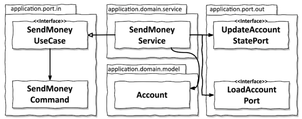

# 4장. 유스케이스 구현하기(실습)

육각형 아키텍쳐는 도메인 중심의 아키텍쳐에 적합하다. 따라서 도메인 엔티티를 만드는 것을 시작으로
도메인 엔티티 중심으로 유스케이스를 구현한다.

## 도메인 모델 구현하기

객체지향적인 방식으로 모델링 하기위해 가장 처음 하는 것은 도메인 모델인 Account 엔티티를 만드는 것이다.
이 모델 덕분에 `비지니스 규칙을 검사`할 수 있고, 이를 중심으로 `유스케이스를 구현`하기 위해
바깥 방향으로 나아갈 수 있다.

## 유스케이스 둘러보기

유스케이스는 실제로 다음과 같은 일을 한다.

1. 입력을 받는다
2. 비지니스 규칙을 검증한다
3. 모델 상태를 조작한다
4. 출력을 반환한다

유스케이스는 인커밍 어댑터로 부터 입력을 받는다.
이 단계에서는 `입력 유효성 검증`을 하지 않는데, 유스케이스가 도메인 로직 자체에만 신경써야하기 때문이다.
하지만, `유스케이스는 비지니스 규칙을 검증할 책임`은 존재한다.

비지니스 규칙을 충족한다면, `도메인 객체의 상태`를 바꾸고 `영속성 어탭터를 통해 상태를 전달`해서 저장될 수 있게한다.
또는, 다른 아웃고잉 어탭터를 호출할 수 도 있다.

마지막으로 아웃고잉 어댑터에서 온 출력값을 유스케이스를 호출한 어탭터로 반환하는 `출력 객체로 변환`한다.
넓은 서비스 문제를 피하기 위해 각 유스케이스 별로 분리된 각각의 서비스를 만들자.

- 인커밍 어댑터는 `인커밍 포트 유스케이스 인터페이스를 호출`한다
- 서비스는 `인커밍 포트 인터페이스를 구현`하고 정보를 불러오기 위해 `아웃고잉 포트 인터페이스를 호출`한다
- 추가적으로 상태를 업데이트 하기 위해 위해 `아웃고잉 포트 인터페이스를 호출`한다

## 입력 유효성 검증

만약 어탭터가 유스케이스 입력 유효성을 검증하면 어떨까?

- 유스케이스에서는 호출자가 유스케이스에 필요한 모든 검증을 완료했다고 믿을 수 있을까?
- 유스케이스는 하나 이상의 어댑터에서 호출되는데, 그럼 각 어댑터는 모든 입력 유효성 검증을 해야하나?

그렇다면 어디에서 `입력 유효성을 검증`해야 할까?

입력 모델(input model)을 통해 생성자 내에서 입력 유효성을 검증할 수 있다.
입력 모델은 유스케이스 API의 일부이기에 `유스케이스 패키지와 같은 레벨`을 가진다.
그러므로, 유효성 검증은 `육각형 아키텍쳐의 내부`에 존재하기에 유스케이스를 오염시키지 않는다.

또한, 입력 유효성 검증은 Bean Validation API를 통해 어노테이션 형태로 구현 가능하다.

## 생성자의 힘

입력모델에서 입력 유효성 검증을 하기 때문에 생성자에 많은 책임을 지우는 것일 수 있다.
하지만, 생성자가 파라미터의 유효성 검증하기에 `유효하지 않은 상태의 객체를 만드는 것 자체가 불가능`하다.

파라미터가 많다면 빌더 패턴을 통해 극복할 수 있다. 비록 빌더패턴은 유효하지 않은 상태의 불변 객체를 만드는 시도에 대해서
경고하지는 못한다. 하지만, 유효성 검증 로직을 통해 누락된 파라미터에 대해 에러를 던질 수 있다.

최근 IDE 성능이 올라가면서 긴 파라미터에 대한 포맷팅을 지원하기에 굳이 빌더를 사용하지 않아도 될 수 있다.

## 유스케이스마다 다른 입력 모델

가끔 유스케이스에 동일한 입력 모델을 사용하고자 하는 생각이 들 수 있다.
비슷하지만 한 두개정도 다른 필드 값이 존재하여, 상황에 따라 null로 전달하게끔 할 수도 있다.

하지만 `불변 커맨드 객체의 필드에 대한 null을 유효한 상태로 받아들이는 것 자체가 code smell` 이다.
더 큰 문제는 서로 다른 유효성 검증 로직을 어떻게 처리하냐이다.

`유스케이스 전용 입력모델`은 유스케이스를 명확하게 만들고 다른 유스케이스와의 결합도를 제거해 불필요한
side-effect를 줄일 수 있다.

## 비지니스 규칙 검증하기

입력 유효성 검증은 유스케이스의 일부가 아니지만, `비지니스 규칙은 유스케이스 로직의 일부`이다.
이를 구분하는 실용적인 구분점은 `도메인 모델의 현재 상태에 접근`하냐 아니냐이다.

- 입력 유효성은 구문상(syntactical)의 유효성을 검증
  - 송금되는 금액은 0보다 커야한다
  - 모델에 접근하지 않고도 검증 가능
- 비지니스 규칙은 유스케이스의 맥락 속에서 의미적인(semantical) 유효성을 검증
  - 출금 계좌는 초과 출금되어서는 안된다
  - 현재 모델의 상태에 접근해서 상태를 확인해야 검증 가능

`비지니스 규칙은 도메인 엔티티 안에` 넣는 것이 위치를 정하는 것도 쉽고 추론하기도 쉽다.
만약, 도메인 엔티티에서 검증이 어렵다면 `유스케이스 코드에서 도메인 엔티티를 사용하기 전`에 진행해도 된다.

## 풍부한 도메인 모델 vs 빈약한 도메인 모델

아키텍쳐의 스타일은 도메인 모델은 구현하는 방법에 대해서는 열려있다.
따라서 문맥에 적합한 방식으로 선택하면 된다.

`풍부한 도메인 모델`에서는 `코어에 있는 엔티티에 가능한 많은 도메인 로직이 구현`된다.
이 상황에서 `유스케이스는 도메인 모델의 진입점`으로 동작하며, 많은 비지니스 규칙이
유스케이스 구현체 대신 엔티티에 위치하게 된다.

`빈약한 도메인 모델`에서는 엔티티 자체가 얇아서 `어떤 도메인 로직도 가지고 있지 않는다`.
즉, `도메인 로직이 유스케이스 클래스에 구현`되는 것이다. 비지니스 규칙 검증, 
엔티티 상태 변환, DB 저장을 담당하는 아웃고잉 포트에 엔티티 전달 모두 유스케이스 클래스에 존재하게 된다.
`풍부한 도메인 모델에서의 풍부함이 엔티티 대신 유스케이스에 존재`하는 것이다.

각자 필요에 맞는 스타일을 자유롭게 선택하면 된다.

## 유스케이스마다 다른 출력 모델 

입력과 비슷하게 출력또한 `각 유스케이스에 맞게 구체적이고 꼭 필요한 데이터만` 들고 있는 것이 좋다.

유스케이스들 간에 같은 출력 모델을 공유하게 되면 유스케이스들도 강하게 결합된다.
`단일 책임 원칙을 적용하고 모델을 분리`해서 유지하는 것이 유스케이스 결합을 제거하는데 도움이 된다.

## 읽기 전용 유스케이스는 어떨까?

상태를 변경하는 유스케이스가 아닌 단순히 읽기전용 유스케이스는 어떻게 구현할까?

이런 작업이 유스케이스로 분류된다면 다른 유스케이스와 비슷한 방식으로 구현하면된다.
하지만, 간단한 데이터쿼리로 유스케이스로 간주되지 않는다면 `실제 유스케이스와 구분하기 위한 쿼리로 구현`할 수 있다.
`쿼리를 위한 인커밍 전용 포트`를 만들고 쿼리 서비스(query service)로 구현하는 것이다.

읽기 전용 쿼리는 `쓰기 가능한 유스케이스(Command)`와 코드상에서 명확하게 구분된다.
CQRS(Command-Query Responsibility Segregation)와 개념이 잘 맞는다.
여러 계층에 걸쳐 같은 모델을 사용한다면 지름길을 써서 클라이언트가 아웃고잉 포트를 직접 호출하게할 수 도 있다.

## 결론

- 입력 유효성 검증은 인커밍 포트의 유스케이스 쪽으로
- 비지니스 로직 규칙 검증은 도메인 엔티티 쪽으로
- 입출력 모델을 독립적으로 모델링한다면 side-effect를 피할 수 있다
  - 물론 이렇게 하기엔 더 많은 작업이 필요하다
  - 하지만 유스케이스를 명확히 이해할 수 있고 유지보수하기 더 쉬워진다