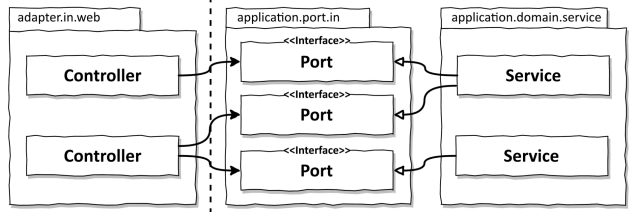
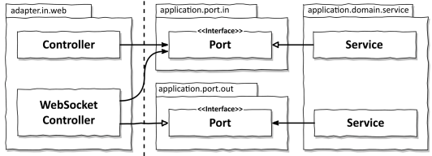

# 5장. 웹 어댑터 구현하기

## 의존성 역전하기

웹 어댑터는 외부로부터 요청을 받아 이를 코어에 전달하기에 `주도하는 또는 인커밍` 어댑터이다.
제어 흐름은 웹 어댑터에 있는 컨트롤러에서 어플리케이션 계층에 있는 서비스로 흐르게 된다.

이때 어플리케이션 계층은 웹 어댑터가 통신할 수 있는 포트를 제공하여 `호출하게하고 서비스는 이 포트를 구현`한다.
여기에 `의존성 역전 원칙`이 적용된다.

왜 어댑터와 유스케이스 사이에 인터페이스를 두는 것일까?
이는 포트가 외부와 통신하기 위한 명세이며, 외부와 어떤 통신이 일어나는지를 정확히 보여주기 때문이다.

예를 들어, 웹 소켓을 통해 실시간 데이터를 사용자 브라우저로 보낸다고 가정해보자.
실시간 데이터를 어떻게 웹 어댑터로 보내고, 웹 어댑터는 어떻게 사용자의 브라우저로 전송할까?
이 경우 반드시 포트라는 간접 계층이 필요하게 된다.
엄밀히 말하면 위 사진과 같이 아웃고잉 포트이지만, 포트의 역할이 나뉘어 동작하는 것을 볼 수 있다.

## 웹 어댑터의 책임

웹 어댑터는 다음과 같은 일을 한다.

1. HTTP 요청을 자바 객체로 매핑
   - URL 경로, HTTp 메서드, 컨텐츠 타입과 같은 기준을 만족하는 요청을 수신하고,
     HTTp 요청의 파라미터와 콘텐츠를 객체로 역직렬화
2. 권한 검사
   - 인증과 권한 부여를 수행하고 실패할 경우 에러를 반환
3. 입력 유효성 검증
   - 객체의 상태 유효성 검증
   - 유스케이스의 입력 모델의 구조와 의미가 웹 어댑터의 입력 모델과 다를 수 있기에 이를 검증
4. 입력을 유스케이스의 입력 모델로 매핑
   - 웹 어댑터의 입력모델을 유스케이스의 입력 모델로 변환함을 검증
5. 유스케이스 호출
   - 변환된 입력 모델로 유스케이스를 호출
6. 유스케이스의 결과를 HTTP 응답으로 매핑
7. HTTP 응답을 반환

이처럼 웹 어댑터에서 벌어지는 일들은 어플리케이션 계층이 신경쓰면 안되는 것 들이다.
어플리케이션 계층이 이를 알게되면 `HTTP를 사용하지 않는 다른 어댑터의 요청에 대해서
동일한 도메인 로직을 수행할 수 있는 선택지`를 잃게 된다.

도메인과 어플리케이션 계층부터 개발하기 시작하면 자연스럽게 계층이 생기게 된다.

## 컨트롤러 나누기

모든 요청에 응답할 수 있는 하나의 컨트롤러면 충분할까? 사실 웹 어댑터는 한 개이상의 클래스로 구성해도 된다.
물론, 같은 소속임을 표현하기 위해 가튼 패키지 수준에 두어야한다.

가능한 한 좁고 다른 컨트롤러와 적게 공유하는 웹 어댑터를 만드는 것이 좋다.
클래스마다 코드가 적을 수록 좋으며, 하나의 컨트롤러에서 많은 요청을 담당한다면 그만큼 테스트코드도 비대해지기 때문이다.
또한 단일 컨트롤러를 사용하면 출력 모델을 재활용할 확률이 높아지는 점도 생각해 봐야한다.

컨트롤러를 분리하게되면 전용 모델 클래스들은 package-private로 선언이 가능하기에 공유해서 사용하기전에
다시 한번 생각해볼 수 있는 기회가 생긴다.

## 결론

- 웹 어댑터는 오ㅠ스케이스에 대한 메서드 호출과 반환 외에 어떠한 도메인 로직도 수행하지 않게
만들어야한다.
- 어플리케이션 계층은 입력 포트에 대한 상세정보를 노출시키지 않고 도메인 로직에 집중해야한다.
- 웹 컨트롤러를 모델을 공유하지 않는 작은 클래스로 나누는 것에 대해서도 고려하자