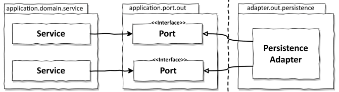
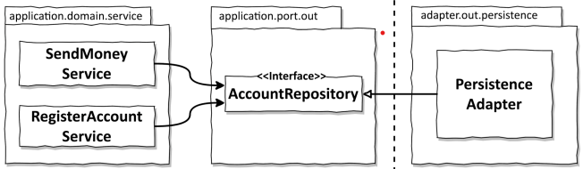
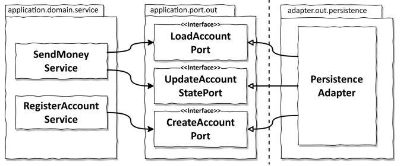
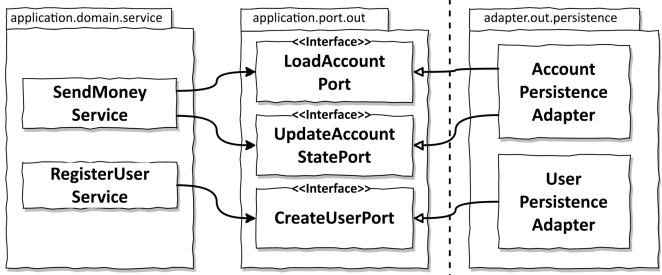

# 6장. 영속성 어댑터 구현하기

## 의존성 역전

영속성 계층 대신 어플리케이션 서비스에 `영속성 기능을 제공하는 영속성 어댑터를 제공`하는 부분이 의존성 역전의 부분이다.
서비스에서는 영속성을 사용하기 위해 포트 인터페이스를 호출한다.
이 포트에서는 실제로 영속성 작업을 수행하고 `실제 DB와의 통신은 영속성 어댑터 클래스에 의해 구현`된다.

영속성 어댑터는 어플리케이션 계층에 의해 `호출될 뿐`이기에 `주도되는 또는 아웃고잉 어댑터`이다.
영속성 계층에 대한 코드 의존성을 없애기 위해 이러한 간접 계층을 추가하게 된다.

## 영속성 어댑터의 책임

영속성 어댑터는 다음과 같은 일을 한다.

1. 입력을 받음
   - 입력 모델은 인터페이스가 지정한 도메인 엔티티나 연산 전용 객체가 될 것이다.
2. 입력을 DB 포맷으로 매핑
   - Java에서는 입력 모델을 DB 테이블 구조를 반영한 엔티티 객체로 매핑
   - `영속성 어댑터의 입력 모델은 어플리케이션 계층에 존재`하기에 영속성 어댑터 내부의 변경이 어플리케이션 코어에 영향을 미치지 않는다.
3. 입력을 DB로 보냄
4. DB 출력을 어플리케이션 포맷으로 매핑
5. 출력을 반환
   - 출력 모델 또한 영속성 계층이 아닌 어플리케이션 코어에 위치한다

웹 어댑터와 다르지 않게 영속성 어댑터도 `어플리케이션 계층이 신경쓰면 안되는 일`들을 수행한다.

## 포트 인터페이스 나누기

그럼 어떻게 포트 인터페이스를 나눌까?

위 처럼 모든 데이터베이스 연산을 하나의 리포지토리 인터페이스에 넣는다면,
해당 연산에 의존하는 서비스는 인터페이스 내 하나의 메서드만 사용하더라도, `넓은 포트 인터페이스 의존성`을 갖게 된다.

> 필요없는 화물을 운반하는 무언가에 의존하고 있으면 예상하지 못했던 문제가 생길 수 있다.

인터페이스 분리원칙은 이 문제의 답을 제시한다.
각 서비스는 실제로 필요한 메서드에만 의존하고 이를 호출하는 것이다.
매우 좁은 포트를 만드는 것은 코딩을 plug-and-play로 만들어 준다.

## 영속성 어댑터 나누기

영속성 어댑터 자체를 나누는 방법은 영속성 연산이 필요한 도메인 클래스(DDD의 Aggregate)하나 당
하나의 영속성 어댑터를 구현하는 방식을 선택 가능하다.
이렇게하면, 영속성 어댑터들은 각 영속성 기능을 이용하는 도메인 경계를 따라 자동으로 나뉘게 된다.
Aggregate 하나당 하나의 영속성 어댑터를 나누는 방식은 나중에 바운디드 컨텍스트의 영속성 요구사항을 분리하기에 좋은 기반이 될 수 있다.

## 데이터베이스 트랜잭션은 어떻게 해야할까?

트랜잭션은하나의특정한 유스케이스에 대해서 일어나는 모든 쓰기 작업에 걸쳐 있어야한다.
영속성 어댑터는 `어떤 데이터베이스 연산이 같은 유스케이스에 포함되는지`는 알지 못하기에
영속성 어댑터를 `호출하는 서비스에 이를 위임`해야한다.

## 결론

- 플러그인 처럼 동작하는 영속성 어댑터를 만들면 도메인 코드가 영속성과 관련된 것들로 부터 분리되어 풍부한 도메인 모델을 만들 수 있다.
- 좁은 포트 인터페이스를 사용하면 포트마다 다른 방식으로 구현할 수 있는 유연함이 생긴다.

