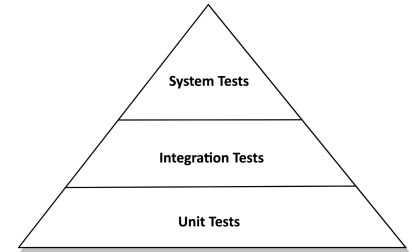

# 7장. 아키텍쳐 요소 테스트하기(실습)

테스트의 기본 전제는 만드는 비용이 적고, 유지보수하기 쉽고, 빨리 실행되고, 안정적인 작은 단위 테스트 들에 대해
높은 커버리지를 유지해야 한다는 것이다. `하나의 단위가 제대로 동작하는지`를 확인할 수 있기 떄문이다.

여러개의 단위와 단위를 넘는 경계를 결합하는 테스트는 만드는 비용이 높아지고 실행이 느러지며,
기능에러가 아닌 설정에러로 인해 테스트가 깨지기 쉬워진다. 테스트가 비싸질 수록 커버리지는 낮게 잡아야한다.

단위 테스트는 피라미드의 토대로, 하나의 클래스를 인스턴스화하고 인터페이스를 통해 해당 기능을 테스트한다.
만약 다른 클래스에 의존한다면 이를 mocking 하여 이를 대체한다.

통합 테스트는 여러 클래스르 인스턴스화하고 순서에 따라 기대대로 동작하는지를 검증한다.
경계를 걸쳐서 동작이 제대로 동작하는지를 테스트하는 것이다.

시스템 테스트는 어플리케이션을 구성하는 모든 객체 네트워크를 가동시켜 전 계층에서 잘 동작하는지를 살펴본다.

## 단위 테스트로 도메인 엔티티 테스트

단위테스트가 도메인 엔티티 내의 비지니스 규칙을 검증하기에 가장 적절하다.
도메인 엔티티는 `다른 클래스에 거의 의존하지 않기에` 다른 종류의 테스트는 필요하지 않다.

## 단위 테스트로 유스케이스 테스트

테스트는 서비스가 모킹된 의존 대상의 특정 메서드와 상호작용 했는지를 검증한다.
이는, 테스트가 코드의 행동 변경뿐 아니라, `코드의 구조 변경에도 취약`해 질 수 있다는 점을 명시한다.

이 테스트는 단위 테스트이지만 의존성의 상호작용을 테스트하고 있기에 통합 테스트에 가깝기는 하지만,
완전한 통합 테스트에 비해 만들고 유지보수하기 쉽다.

## 통합 테스트로 웹 어댑터 테스트

웹 컨트롤러가 스프링 프레임워크에 강결합되어 있기에 격리된 테스트하기 보다는
프레임워크와 통합된 상태로 테스트하는 것이 합리적이다.

## 통합 테스트로 영속성 어댑터 테스트

영속성 어댑터의 테스트에는 단위 테스트보다는 통합테스트가 합리적이다.
스프링에서는 기본적으로 in-memory DB를 지원하기에 실제 운영환경에서 문제가 생길 수 있다.
따라서, `영속성 어댑터 테스트는 실제 DB를 대상으로 진행`해야한다.
Testcontainers와 같은 라이브러리는 필요한 DB를 도커로 띄울 수 있기에 유용할 수 있다.

## 시스템 테스트로 주요 경로 테스트

웹 어댑터 테스트처럼 MockMvc가 아닌 TestRestTemplate를 이용해 실제 운영환경과 더 가깝게 통신을 진행할 수 있다.
시스템 테스트는 `여러 개의 유스케이스를 결합해 시나리오`를 만들 때 더 유용하다.
시나리오는 사용자가 어플리케이션을 사용하면서 거쳐갈 경로를 의미한다.

## 얼마만큼의 테스트가 충분할까?

테스트 커버리지는 중요한 지표가 아닐 수 있다.
중요한건 실제 프로덕션의 버그를 수정하고 이를 배우는 것을 우선순위로 삼아야한다.
`테스트가 왜 이버그를 잡지 못했을까`에 대한 답변을 기록하고 `이 케이스를 커버할 수 있는 테스트를 추가`해야한다.

시작점은 헥사고날 아키텍쳐에서 사용하는 전략을 사용하는 것도 좋다.
- 도메인 엔티티를 구현할 때는 단위테스트로
- 유스케이스를 구현할 때는 단위테스트로
- 어댑터를 구현할 때는 통합 테스트로
- 사용자가 사용하는 시나리오는 시스템 테스트로

## 결론

- 헥사고날 아키텍쳐는 도메인과 외부를 분리하기에 명확한 테스트 전략을 정의할 수 있다.
- 입출력 포트는 테스트에서 뚜렷한 모킹 지점이 된다.
- `모킹하는 것이 버거워지거나 테스트가 어려워지면 이는 아키텍쳐에 대한 경고`이다.