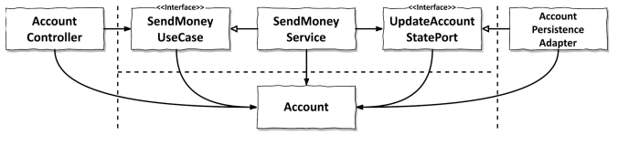
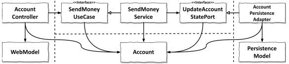
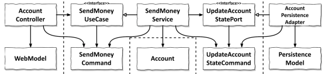
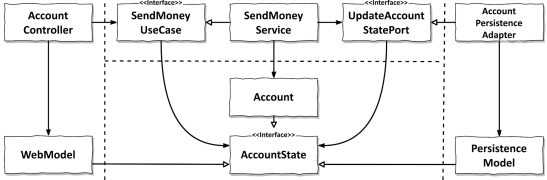

# 8장. 경계 간 매핑하기

각 계층의 모델을 매핑하는 것에 대한 논쟁이 존재할 수 있다.
매퍼 구현을 피하기 위해 두 계층을 같은 모델에서 사용하는 것에 대해서 말이다.
논쟁은 다음과 같다

- 매핑에 찬성
  - 매핑을 하지 않으면 양 계층에서 같은 모델을 사용하게 되는데 이는 두 계층이 강결합된다
- 매핑에 반대
  - 너무 많은 보일러플레이트 코드가 생산된다
  - 많은 유스케이스들은 CRUD만 수행하고 계층에 걸쳐 같은 모델을 사용하기에 계층간 매핑은 과하다

이 논쟁은 무엇이 맞는지에 대한 것이 아니라 어떤 것이 더 나은지에 대한 것이다.

## 매핑하지 않기 전략

<p align="center"></p>

위 그림에서보면, 웹 계층과 어플리케이션 계층 모두 Account 클래스에 접근해야 한다.
즉, 같은 모델을 사용하는 것이다.

이렇게 되면 계층 간 매핑을 전혀 사용할 필요가 없다는 장점이 존재한다.

하지만, JPA와 같은 ORM 프레임워크를 사용한다면 DB 매핑을 위해 특정 어노테이션이 필요하다.
도메인과 어플리케이션 계층은 `특정 요구사항에 관심이 없음`에도, 이런 모든 요구사항을 다뤄야한다.
Account 클래스는 웹, 어플리케이션, 영속성 계층과 관련된 이유로 인해 변경되야하기에 `단일 책임 원칙을 위반`한다.

과연 매핑하지 않기 전략은 틀린것일까? 실제로는 그렇지 않다.

간단한 CRUD 유스케이스의 경우 같은 필드를 가진 웹 모델을 다른 모델로 변환해야할 이유가 존재할까?
`모든 계층이 정확히 같은 구조와 정보를 필요`로 한다면 매핑하지 않기 전략은 완벽한 선택지이다.

> 우리는 어떤 매핑전략을 선택하더라도 나중에 언제든 바꿀수 있다는 점을 명심하자

많은 유스케이스들이 간단한 CRUD 유스케이스로 시작되며 시간이 지남에 따라 값비싼 매핑전략이 필요한 유스케이스로 변환되어간다.
매핑 전략에 시간을 들이지 않기 때문에 이는 틀린 것이 아니다.

## 양방향 매핑 전략

<p align="center"></p>

위 그림은 웹 계층에서는 `웹 모델을 인커밍 포트에 필요한 도메인 모델로 매핑`하고,
인커밍 포트에 의해 반환된 `도메인 객체를 다시 웹 모델로 매핑`한다.

또한 `영속성 계층은 아웃고잉 포트가 사용하는 도메인 모델과 영속성 모델간의 매핑`과 유사한 매핑을 담당한다.
두 계층 모두 양방향으로 매핑하기에 양방향 매핑이다.

각 계층이 전용 모델을 변경하더라도 다른 계층에 영향이 없다는 장점이 존재한다.
이 전략은 웹이나 영속성에 오염되지 않는 `깨끗한 도메인 모델`로 이어진다.
즉, `단일 책임 원칙을 만족`하는 것이다.

히지만, 이 전략은 `보일러플레이트 코드`를 만들게 되며, `도메인 모델이 계층을 넘어서 통신`하는데 사용된다는 단점을 지닌다.
인커밍 포트와 아웃고잉 포트는 `도메인 객체를 입력 파라미터와 반환 값`으로 사용한다.
도메인 모델은 도메인 모델의 필요에 의해서 변경되어야하지만, `바깥쪽 계층의 요구에 따라 변경이 되는 취약점`이 발생한다.

또한 간단한 CRUD 유스케이스에서 또한 이를 준수해야하기에, 개발에 불필요한 시간을 투자하게 된다.

## 완전 매핑 전략

<p align="center"></p>

이 전략은 각 연산마다 별도의 특화된 입출력 모델을 사용하는 것이다.
이런 모델을 가리켜 커맨드(command) 또는 요청(request)라고 표현한다.

웹 계층은 입력을 `어플리케이션 계층의 커맨드 객체로 매핑할 책임`을 가지게 된다.
이런 커맨드 객체는 어플리케이션 계층의 인터페이스를 해석할 필요없이 `명확하게 만들어준다`는 장점을 지닌다.
각 유스케이스는 전용 필드와 유효성 검증 로직을 가진 전용 커맨드를 지니게 되는 것이다.

어플리케이션 계층에서는 커맨드 객체를 `유스케이스에 따라 도메인 모델로 변경하기 위한 매핑`을 책임진다.

이 전략은 여러 유스케이스의 요구사항을 함께 다뤄야하는 매핑에 비해 구현하고 유지보수하기 쉽지만, 더 많은 코드가 필요하게된다.

절대적으로 `전역 패턴으로 추천하지 않으며`, `웹 계층과 어플리케이션 계층 사이에 상태 변경 유스케이스의 경계를
명확하게 해야할 때` 추천한다. `영속성 계층 사이에서는 매핑 오버헤드`때문에 사용하지 않는게 좋다.
어떤 경웽는 입력 모델만 이 매핑을 진행하고, 도메인 객체를 출력 모델로 사용할 수 도 있다.

`매핑전략은 여러가지를 섞어 쓸 수 있고, 그래야만 한다`.

## 단방향 매핑 전략

<p align="center"></p>

이 전략은 `모든 게층의 모델들이 공통된 인터페이스를 구현`하며 `도메인 모델의 상태를 캡슐화` 한다.
도메인 모델은 풍부한 행동을 구현하고, 어플리케이션 계층 내의 서비스에서 이런 행동에 접근이 가능하다.
도메인 객체가 인커밍, 아웃고팅 포트가 기대하는대로 상태 인터페이스를 구현하고 있기에 다른 계층에 매핑없이 전달이 가능하다.
`행동을 변경하는 것은 인터페이스에 의해 노출되어 있지 않기에` 도메인 객체의 상태를 변경하는일은 발생하지 않는다.

바깥 계층에서 어플리케이션 계층으로 전달하는 객체들도 이 `상태 인터페이스를 구현`한다.
`DDD의 factory`라는 개념과 잘 맞으며, `특정한 상태로부터 도메인 객체를 재구성할 책임`을 가지게 된다.
이 전략은 한 계층이 `다른 계층으로부터 객체를 받으면 해당 객체에서 이용할 수 있는 다른 무언가로 매핑`하는 전략이다.

하지만 매핑이 계층을 넘나들어 퍼져있고 다른 전략에 비해 개념적으로 어렵다는 단점이 있다.
`계층 간의 모델이 비슷`할 때 가장 효과적이다.

## 언제 어떤 매핑 전략을 사용할 것인가?

> 그때그때 다르다.

각 매핑 전략은 장단점을 가지고 있기에, 하나의 매핑 전략을 전역 규칙으로 설정해서는 안된다.
하나의 매핑 전략을 그저 일관성과 깔끔함이라는 이유로 선택해서는 안된다는 말이다.

초기에는 `간단한 전략으로 시작`해서 계층 간 결합을 떼어내는 `복잡한 전략으로 갈아타는 것`이 좋은 방법이다.

이를 위해 필요한 것은 `어떤 상황에 어떤 매핑 전략을 사용할 것인지에 대한 가이드라인`이다.
또한 해당 전략을 최우선으로 두는지도 설명해야 추후에 여전히 이 전략이 유효한지도 평가할 수 있다.
가이드 라인의 예시는 다음과 같다.
```text
변경 유스케이스를 작업한다면 웹 계층과 어플리케이션 계층 사이에는
유스케이스 간 결합을 제거하기 위해 완전 매핑 전략을 최우선으로 한다.
이렇게 하면 유스케이스별 유효성 검증이 명확해지고 유스케이스에서 필요하지 않은
필드는 다루지 않을 수 있기 때문이다.

변경 유스케이스를 작업한다면 어플리케이션과 웹 계층 사이에는 매핑 오버헤드를
줄이고 작업 속도를 위해 매핑하지 않기 전략을 첫 번째 선택지로 둔다.
하지만 어플리케이션 계층에서 영속성 문제를 다뤄야한다면, 양방향 매핑 전략으로
바꿔서 영속성 문제를 영속성 계층에 가둘 수 있게 한다.

쿼리 작업을 한다면 매핑 오버헤드를 줄이고 작업 속도를 위해 매핑하지 않기 전략이
웹과 어플리케이션 계층, 어플리케이션과 영속성 계층 사이에 첫 번째 선택지가 되야한다.
하지만 어플리케이션 계층에서 웹 문제나 영속성 문제를 다뤄야한다면 각각 양방향
매핑 전략으로 바꿔야한다.
```

## 결론

- 인커밍 포트와 아웃고잉 포트는 서로 다른 계층이 어떻게 통신해야 하는지를 정의한다.
  - 이 때 계층 사이에 매핑을 수행할지 여부와 어떤 매핑 전략을 선택할지가 포함된다.
- 상황별 매핑 전략을 선택하는 것은 모든 상황에 같은 매핑 전략을 사용하는 것보다
어렵고 시간이 많이 걸리지만 더 나은 선택이다.
