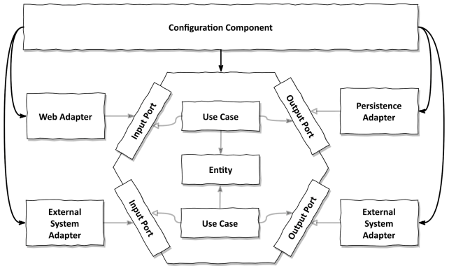

# 9장. 어플리케이션 조립하기

## 왜 조립까지 신경써야 할까?

모든 의존성이 안쪽 도메인 코드 쪽으로 향하게해야 바깥 계층의 변경으로 부터
안전하기 때문에 올바른 의존성 방향을 가리키는 것이 중요하다.

유스케이스가 영속성 어댑터를 직접 호출하지 않고, `아웃고잉 포트 인터페이스`를 생성한 이유다.
유스케이스는 인터페이스만 알아야하고, 런타임에 인터페이스의 구현을 제공 받아야 한다.

한 클래스가 필요로 하는 모든 객체를 생성자로 전달 가능하다면, mock 객체를 전달하고
격리된 단위 테스트를 생성하기 쉬워진다.

### 객체 인스턴스를 생성할 책임

의존성 규칙을 어기지 않고 객체 인스턴스를 생성하기 위해서는
위와 같이 중립적이고 인스턴스 생성을 위해 `모든 클래스에 대한 의존성을 가지는 설정 컴포넌트`가 필요하다.
이 설정 컴포넌트는 의존성 규칙에 정의된 대로 모든 내부 계층에 접근할 수 있는 가장 바깥쪽에 위치한다.
설정 컴포넌트는 다음과 같은 역할을 수행한다.

- 웹 어댑터 인스턴스 생성
- HTTP 요청이 실제로 웹 어댑터로 전달되도록 보장
- 유스케이스 인스턴스 생성
- 웹 어댑터에 유스케이스 인스턴스 제공
- 영속성 어댑터 인스턴스 생성
- 유스케이스에 영속성 어댑터 인스턴스 제공
- 영속성 어댑터가 실제로 데이터베이스에 접근할 수 있도록 보장

## 평범한 코드로 조립하기

의존성 주입 프레임워크 없이 설정 컴포넌트를 구현하라면 main 함수에 
웹 컨트롤러부터 영속성 어댑터까지 모든 클래스의 인스턴스를 생성한 후 연결해야한다.

하지만, 프로젝트가 커질수록 생성하고 연결해야 할 클래스들이 계속 늘어나게되는 단점이 존재한다.
또한 각 클래스가 속한 패키지 외부에서 인스턴스를 생성하기 위해선 이 클래스들이 모두 public이어야한다.
이렇게 되면 원치않는 직접 접근을 막을 수 없다.

## 스프링의 클래스패스 스캐닝으로 조립하기

스프링에서 어플리케이션을 조립한 결과물을 어플리케이션 컨텍스트(Application Context)라고 하며,
어플리케이션을 구성하는 모든 객체(Bean)을 포함한다.

가장 간단한 방법은 클래스패스 스캐닝(classpath scanning)으로 @Component 어노테이션을 이용한다.
이 어노테이션이 붙은 클래스를 찾아 객체를 생성하는 것이다.

하지만, 이 방법은 클래스에 프레임워크에 특화된 어노테이션을 여러 곳에 사용해야하기에 침투적이다.
또한, 실제로는 올라가지 않았으면 하는 클래스가 올라가게되어 추적하기 어려운 에러를 일으킬 수 있다.

## 스프링의 자바 컨피그로 조립하기

이 방식은 @Configuration 어노테이션을 활용해 어플리케이션 컨텍스트에 추가할 빈을 직접 생성하는 것이다.
모든 빈을 가져오는 대신 설정 클래스에 설정된 클래스만 가져오기에 클래스패스 스캐닝보다 더 안전하다.
빈 자체는 설정 클래스 내의 @Bean 어노테이션이 붙은 팩터리 메서드를 통해 생성된다.
각 계층 내 특정 모듈을 위해서도 만들 수 있으며, 클래스패스 스캐닝에 비해 비침습적이다. 

하지만, 설정 클래스가 생성하는 빈이 설정 클래스와 같은 패키지에 존재하지 않는다면,
이 빈들 또한 public 으로 만들어야 한다. 패키지를 모듈 경계로 사용하고 각 패키지 마다 전용 설정 클래스를
만드는 방법이 존재하기는 하지만, 하위 패키지에는 사용할 수 없다.

## 결론

- 스프링이나 부트등의 의존성 주입 프레임워크의 기능 중 하나는 우리가 제공하는 클래스들을 이용해 어플리케이션을 조립하는 것이다.
- 클래스패스 스캐닝은 편리하지만, 규모가 커짐에 따라 투명성이 낮아지게 된다.
- 전용 설정 컴포넌트는 응집도가 매우 높은 모듈을 만들 수 있긴하지만, 유지보수하는데 좀 더 많은 시간이 필요하다.
