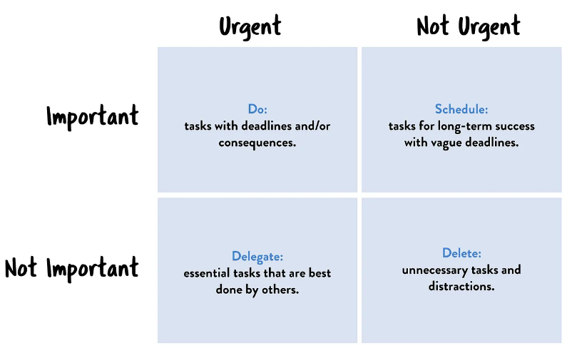

# 두 가지 가치에 대한 이야기

모든 소프트웨어 시스템은 이해관계자에게 서로 다른 두가지 가치를 제공한다.
이는 `행위(behavior)와 구조(structure)`이다.

## 행위

개발자는 이해관계자의 기능 명세나 요구사항을 만족하도록 코드를 작성한다.
요구사항이 만족되지 않으면 이를 유지보수하고 새로운 기능을 추가한다.
이것이 개발자가 해야하는 전부는 아니다.

## 구조

소프트웨어는 말그대로 soft 한 ware, 즉 부드러운 제품이라고 볼 수 있다. 두 번째 가치는 이 단어에 존재한다.
소프트웨어를 만드는 이유는 쉽게 변경할 수 있도록 하기 위해서이다. 본연의 목적을 위해서라면 반드시 부드러워야한다.
  
소프트웨어 개발 비용의 증가를 결정짓는 주된 요소가 바로 이 변경사항의 범위와 형태의 차이에 있다.
새로운 요청사항이 발생할 때마다 조금씩 더 힘들어진다면 형태와 요구사항의 형태가 서로 맞지 않는 것이다.

## 더 높은 가치

시스템이 동작하도록 만드는 것이 중요한가? 소프트웨어 시스템을 더 쉽게 변경할 수 있도록 하는 것이 중요한가?

- 완벽하게 동작하지만 수정이 아예 불가능하다면, 요구사항이 변경 될 때마다 동작하지 않게되어 쓸모가 없다
- 동작은 하지않지만 변경이 쉽다면, 프로그램을 돌아가게 수정할 수 있다. 변경이 발생하더라도 마찬가지.

물론 완벽하게 수정 불가능한 프로그램은 존재하지 않지만, `변경에 드는 비용이 변경으로 창출되는 수익보다 많아진다면` 어떻게 될까?

## 아이젠하워 매트릭스(Eisenhower matrix)

> 내겐 두가지 유형의 문제가 있습니다. 하나는 긴급하며, 다른 하나는 중요합니다.
> 긴급한 문제는 중요하지 않으며, 중요한 문제는 절대 긴급하지 않습니다

- 소프트웨어의 첫 번째 가치인 행위는 긴급하지만 매번 높은 중요도를 가지는 것은 아니다
- 두 번째 가치인 아키텍쳐는 중요하지만 즉각적인 긴급성을 필요로하는 경우는 절대 없다
- 우선 순위는 다음과 같다
  1. 긴급하고 중요한
  2. 긴급하지는 않지만 중요한
  3. 긴급하지만 중요하지 않은
  4. 긴급하지도 중요하지도 않음

우리가 흔하게 저지르는 실수는 행위를 첫 번째로 격상시키는 일이다. 즉, 진짜 중요한 일을 무시한 채
중요도가 떨어지는 기능을 선택할 수 있다. 보통 업무 관리자는 아키텍쳐의 중요성을 평가할만한 능력이 없을 수 있다.
그런 경우 개발자는 딜레마에 빠지지만, 개발자는 이 딜레마를 해결하기 위해 고용된 사람이라는 걸 명심하자.

> 기억하자. 아키텍쳐가 후순위가 되면 시스템을 개발하는 비용이 더 많이 들고, 시스템을 변경하는 일이 현실적으로 불가능해 진다는 점을