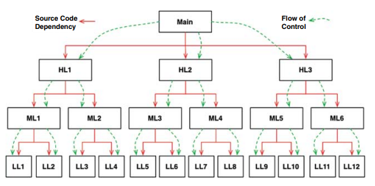

# 객체 지향 프로그래밍

## Object Oriented 란 무엇일까?

- 데이터와 함수의 조합?
  - 하지만, 객체지향이 등장하기 전부터 프로그래머는 데이터 구조를 함수에 전달해 왔다.
- 실제 세계를 모델링하는 새로운 방법?
  - 객체지향은 현실세계와 의미적으로 가깝기 때문에 소프트웨어를 좀더 쉽게 이해할 수 있기 때문
  - 하지만 의도가 불분명하며 정의가 모호 
  
캡슐화, 상속, 다형성이 객체지향의 본질일까?

## 캡슐화

객체지향은 데이터와 함수를 쉽고 효과적으로 캡슐화 할 수 있는 방법을 제공한다.
이런 캡슐화를 통해 데이터와 함수가 응집력을 높이고 각각의 집단을 구분을 명확하게 해준다.
이는 객체지향 언어에서 public 과 private 으로 대표되지만 이러한 개념은 객체지향에만 국한된것은 아니다.

객체지향이 아닌 C 언어에서 오히려 완벽에 가까운 캡슐화가 가능하고 자바와 C#에서부터는 헤더와 구현체를
분리하는 방식을 모두 버림으로써 오히려 캡슐화는 더욱 심하게 훼손되었다. 많은 객체지향 언어는 캡슐화를 강제하지 않는다.

## 상속

객체지향 언어는 상속에 대해서는 확실히 제공하게 되었다. 하지만, 상속이라는 개념은 `어떤 변수와 함수를 하나의
유효범위로 묶어서 재정의하는 일`에 불과하다. C 언어에서도 같은 struct 로 선언된 변수의 순서를 동일하게 함으로써,
상속과 비슷하게 동작 시킬 수 있다. 실제로도 C++에서는 이 방법을 이용해 단일 상속을 구현했다.

물론 객체지향 언어전에 비슷한 기능이 있었으나, 현재의 상속만큼 편리하진 않았다.
즉, 새로운 개념을 만들지는 못했지만 객체지향 언어는 상속에 대해 편리한 방식을 제공했다고는 볼 수 있다.

## 다형성

객체지향 이전에도 다형성을 표현하는 언어가 존재했으며, C 에서 getchar() 과 putchar() 또한 이에 해당한다.
유닉스 운영체제의 경우 모든 입출력 장치 드라이버가 다섯가지 표준 함수를 제공할 것을 요구한다
- open, close, read, write, seek
getchar()는 STDIN 으로 참조되는 FILE 데이터 구조의 read 포인터가 가리키는 함수를 단순히 호출하는 것에 불과하다.

즉, 함수를 가리키는 포인터를 응용한 것이 다형성이다. 하지만 함수를 가리키는 포인터의 사용은 위험하며
객체지향 언어는 함수포인터를 사용할 때 필요한 관례를 없애주어서 실수할 위험을 없애준다.
이렇게 함으로써, 객체지향언어는 다형성을 대수롭지 않게 사용할 수 있게된다.

### 다형성이 가지는 힘

다형성이 가지는 힘은 사전에 정의된 표준함수를 구현한다면, 기존에 동작하던 기능을 대체할 수 있게 해준다.
이런 `플러그인 아키텍쳐`는 입출력 장치 독립성을 지원하기 위해 등장했지만, 포인터의 잘못된 사용으로 인한 위험때문에
사용이 어려웠다. 하지만, 객체지향의 등장으로 언제 어디서든 플러그인 아키텍쳐를 적용할 수 있게 되었다.

### 의존성 역전

다형성을 안전하고 편리하게 적용하기전에는 main 을 시작으로 고수준에서 저수준 함수로의 호출로 이뤄진다.
이런 호출 트리에서 `소스 코드 의존성의 방향은 반드시 제어흐름을 따르게 된다`.

하지만 다형성이 적용됨으로써, 인터페이스에 대한 `소스 코드 의존성과 실제 제어 흐름이 반대`가 되게 된다.
- 소스코드에는 F()라는 함수는 인터페이스를 통해 호출하지만 실제 호출은 ML1 이라는 인터페이스를 상속한 구체 클래스로 제어의 흐름이 넘어간다.

객체지향 언어는 이런 다형성을 안전하고 편리하게 제공함으로써, 언제든지 소스코드의 `의존성을 역전`시킬 수 있게된다.
즉, 아키텍트는 의존성에 대한 방향을 결정할 수 있게 되었고 소스코드 의존성이 제어흐름의 방향과 일치되도록 제한되지 않게 되었다.

## 결론

다형성을 이용하면 시스템의 모든 소스코드 의존성에 대한 제어 권한을 획득할 수 있게 되었다.
객체지향은 이를 편리하게 사용할 수 있게하여 플러그인 아키텍쳐를 구성할 수 있게 되었고 이는
`배포 독립성`과 `개발 독립성`을 보장할 수 있게된다.