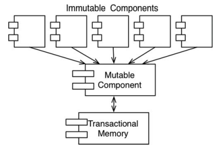

# 6장. 함수형 프로그래밍

자바는 가변 변수(mutable variable)를 사용하며 프로그램 실행 중에 상태가 변할 수 있다.
반면, 함수형 프로그램 언어는 가변변수가 존재하지 않으며 한번 초기화되면 절대로 변하지 않는다.
즉, 변수는 변경되지 않는 값으로 존재하게 된다.

## 불변성과 아키텍쳐

불변성으로 인해 `race condition`, `deadlock`, `concurrent update` 문제가 발생하지 않는다.
우리가 동시성을 다루면서 직면하는 쓰레드와 프로세스의 문제들은 가변 변수가 없다면 발생하지 않게된다.
하지만, 불변성을 지원하기 위해선 무한한 자원이 필요하기 이에 대한 타협이 필요하다.

## 가변성의 분리

먼저 가장 주요한 타협은 가변 컴포넌트와 불변 컴포넌트를 분리하는 것이다.
어플리케이션을 제대로 구조화하기 위해선 변수를 변경하는 컴포넌트와 변경하지 않는 컴포넌트로 분리해야한다.
그리고 변수 변경으로 인해 발생할 수 있는 문제를 보호하기위해 적절한 수단을 지원해야한다.

## 이벤트 소싱

만약 자원에 한계가 없다면 가변 상태가 존재하지 않아도 된다. 예시로, 은행의 입출금을 하게되면 잔고를 변경해야 된다.
이때 잔고를 변경하는게 아닌 입출금 트랜잭션 자체를 모두 저장하게 되면, 계좌 개설 시점부터의 모든
입출금을 더하는 걸로 잔고를 구할 수 있게된다. 이렇게되면 가변 변수가 하나도 필요하지 않다.

하지만 자원은 제한되어 있기에 어플리케이션 수명 주기 동안에만 문제없을 정도의 능력만 있으면 충분할 수 있다.
이벤트 소싱에 깔려있는 기본 발상으로 이는 상태가 아닌 트랜잭션을 저장하는 것이다. 상태가 필요할 때면 시작점부터 모든 트랜잭션을 처리한다.
이를 좀더 쉽게 구현하기 위해 자정을 기준으로 상태를 계산하는하는 방식도 유효할 수 있다.
현재는 저장공간을 충분히 확보 할 수 있기에 이런 전략이 가능하다.

이렇게되면 어플리케이션은 CRUD 가 아닌 CR 로만 동작하게 되며 동시 업데이트 문제가 발생하지도 않는다.
저장 공간과 처리 능력만 충분하다면 불변성을 갖도록 할 수 있다. 소스 코드 버전관리 시스템이 이 방식으로 동작한다.

## 결론

- 구조적 프로그래밍은 제어 흐름의 직접적인 전환에 부과되는 규율이다.
- 객체 지향 프로그래밍은 제어흐름의 간접적인 전환에 부과되는 규율이다.
- 함수형 프로그래밍은 변수 할당에 부과되는 규율이다.

각 패러다임은 코드를 작성하는 방식의 형태를 한정시킨다. 즉 해서는 안될 것들에 대한 패러다임이다.
