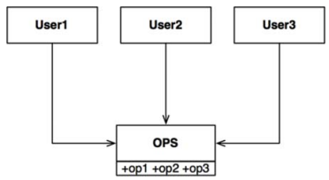
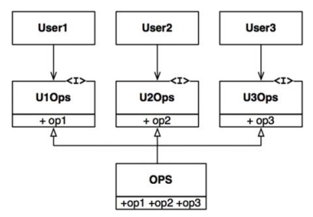

# 인터페이스 분리 원칙(Interface Segregation Principle, ISP)

ISP 는 위의 그림으로 설명 가능하다. User1은 op1 만, User2는 op2 만, User3는 op3 만 사용한다.
User1 입장에서는 전혀 사용하지 않더라도 다른 두 메서드에 의존하게 된다. 이렇게 되면 사용하지
않는 코드가 수정되더라도 새로 컴파일 후 배포를 진행해야한다.

하지만, 인터페이스를 분리하여 다음과 같은 형태로 구성하게되면 의존성이 사라지며, 서로 영향을 끼치지 않게 된다

## ISP 와 언어

정적 타입 언어를 사용하면 import 나 include 같은 선언문을 통해 소스 코드 의존성이 발생하게된다.
동적 타입 언어의 경우 선언문이 존재하지 않고, 런타임 추론이 발생하기에 결합도가 낮은 시스템을 만들 수 있다.
그렇기에 ISP 는 아키텍쳐가 아닌 언어와 관련된 부분이라고 생각할 수 있다.

## ISP 와 아키텍쳐

ISP 는 근본적으로 필요 이상으로 많은 걸 포함하고 의존하는 것에 대한 우려이다. 이로 인해 불필요한 컴파일과 재배포가 강제되기 때문이다.
이는 고수준 아키텍쳐에서도 동일하며, 의존성 체이닝으로 인해 의존하지 않아 보이더라도 이런 상황이 발생할 수 있다.