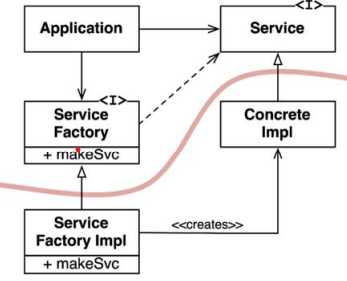

# 의존성 역전 원칙(Dependency Inversion Principle, DIP)

> 유연성이 극대화된 시스템이란, 소스 코드 의존성이 추상, 인터페이스에 의존하고 구체에 의존하지 않는 시스템이다.

이 말은 자바같은 정적 타입 언어에서 import 를 통해 오직 인터페이스나 추상 클래스의 선언만을 참조해야된다는 말이다.
하지만 실제로 운영체제나 플랫폼 같이 안정성이 보장된 환경, 즉, 변동성이 작은 환경에서는 이를 무시할 수 있다.
우리가 의존을 피해야하는 대상은 `변동성이 큰 구체적인 요소`이다.

## 안정된 추상화

추상 클래스에서 변경이 이뤄지면 구체 클래스에도 수정이 필요하다. 하지만 구체클래스에서
수정이 생기더라도 인터페이스는 변경될 가능성이 낮다. 이 말은 `인터페이스는 구현체보다 변동성이 낮다`.

실제로 인터페이스를 변경하지 않고 구현체에 기능을 추가하기 위한 방법을 찾기 위해 애쓰며, 안정적인 소프트웨어 아키텍쳐를 위해
변동성이 큰 구현체에 의존하지 않고 안정된 인터페이스를 선호한다. 

이 원칙의 실천법은 다음과 같다.

- 변동성이 큰 구체 클래스를 참조하지 마라
  - 대신 추상 인터페이스를 참조하라
  - 객체 생성 방식을 제약하며, 추상 팩토리를 사용하도록 강제한다
- 변동성이 큰 구체 클래스로부터 파생하지 마라
  - 상속은 강력한 동시에 변경이 어렵기에 신중해야 한다
- 구체 함수를 오버라이드 하지 마라
  - 대부분의 구체함수는 소스 코드 의존성을 필요로 한다
  - 그렇기에 이 함수를 오버라이딩하면 의존성을 제거할 수 없으며 의존성 또한 상속하게 된다

## 팩토리

위 규칙들을 준수하려면 변동성이 큰 구체 객체(Concrete Object)의 생성에 주의해야한다. 객체를 생성하면,
해당 객체를 정의한 코드에 대해 소스 코드 의존성이 발생하기 때문이다.

이런 문제에 대해 객체 지향 언어에서는 추상 팩토리를 사용하곤 한다.

Application 에서 Service 를 사용하기 위해선 ConcreteImpl 인스턴스를 생성해야한다.
이 역할을 ServiceFactory 를 통해 진행하며 실제 구현은 ServiceFactoryImpl 이 ConcreteImpl 인스턴스를 생성해
Service 타입으로 반환한다.

그림에서의 곡선은 아키텍쳐의 경계이며, 구체적인 것과 추상적인 것을 분리한다. 

- 소스 코드의 의존성은 구체적인 것에서 추상적인 쪽으로 단방향으로 향한다.
- 반대로 제어의 흐름은 소스 코드 의존성과 반대로 향하게 된다.
- 의존성 역전

## 구체 컴포넌트

`DIP 를 완전히 제거할 수는 없으며`, DIP 를 위반하는 클래스들을 구체 컴포넌트 내부로 모을 수 있다.
이를 통해 시스템의 나머지 부분과 분리할 수 있다.