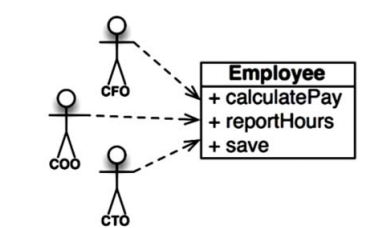
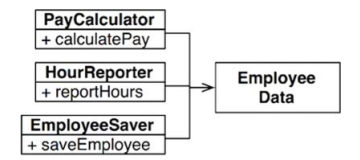
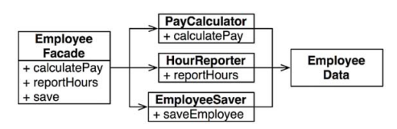
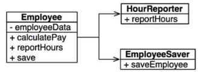

# 단일 책임 원칙(Single Responsibility Principle, SRP)

단순히 이름만 보았을 땐, 각 모듈이 단 하나의 일만 해야한다는 의미로 받아들이기 쉽다.

> 단일 모듈은 변경의 이유가 하나, 오직 하나 뿐이어야 한다.

위의 말은 `하나의 모듈은 하나의 액터(변경을 요청하는 사람)에 대해서만 책임져야한다`로 바꿔말할 수 있다.
모듈은 단순하게는 소스코드의 응집된 집합으로, 이 응집성이야 말로 SRP 를 암시한다.
단일 액터를 책임지는 코드를 함께 묶어주는 것은 바로 응집성(cohesion)이다.

## 징후 1. 우발적 중복

위 그림의 Employee 클래스는 SRP 를 위반하는데, 이유는 `세가지 메서드가 다른 세명의 액터를 책임`지기 때문이다.

- calculatePay는 회계팀에서 기능을 정의하고 CFO 보고를 위해 사용
- reportHours는 인사팀에서 기능을 정의하고 COO 보고를 위해 사용
- save는 DBA가 기능을 정의하고 CTO 보고를 위해 사용

이 세가지 메서드를 하나의 클래스에 배치했을 때 세 액터가 결합되어 버린다.
이렇게되면 서로 다른 액터가 어떤` 알고리즘을 공유할 때 문제가 발생`할 수 있다. 공유되는 알고리즘을
한 액터에 의해 변경되었을 때 다른 액터의 동작에도 영향을 미칠 수 있다.

서로 다른 액터가 의존하는 코드를 너무 가까이 배치했기에 발생하며, SRP는 `서로 다른 액터가 의존하는 코드를 서로 분리`하자는 것이다.

## 징후 2. 병합

프로젝트가 커질 수록 많은 메서드를 정의하게 되고 이 경우 병합이 발생하게 된다.
- 형상관리에서 두 개발자가 하나의 브랜치에 대해 작업을 하다가 merge 를 하는 상황에서 conflict 가 발생할 수 있다.

하나의 클래스에 다수의 액터가 존재하고, 서로 다른 개발자가 다른 목적으로 코드를 수정하게 되면 어떻게 될까?
이 경우 `각자의 액터의 목적을 수정하기 위해 하나의 소스파일을 수정하게되는 경우`에 해당한다.
이 문제를 벗어나기 위해서는 서로 다른 액터를 뒷받침하는 코드는 서로 분리해야한다. 

## 해결책

가장 확실한 해결책은 데이터와 메서드를 분리하는 것이다. 공통이 사용하는 데이터를 정의하고
서로 다른 클래스를 만들어 이를 공유하는 것이다. 이때 각 클래스는 서로의 존재를 몰라야 `우연한 중복`을 피할 수 있다.
이 경우 각 클래스를 인스턴스화하고 추적해야하는 단점이 있다.

파사드 패턴을 이용하여 각 클래스의 객체를 생성하고 요청된 메서드를 가지는 객체로 위임하는 역할을 하는 방법도 존재한다.

아니면 현재의 클래스에서 중요한 메서드를 남기고, 중요도가 낮은 메서드들에 대한 파사드로 사용도 가능하다.

## 결론

> 단일 책임 원칙은 `메서드와 클래스 수준`의 원칙

컴포넌트 수준에서는 `OCP`, 아키텍쳐 수준에서는 `아키텍쳐의 생성을 책임지는 변경의 축`이라는 형태로 다시 등장한다.