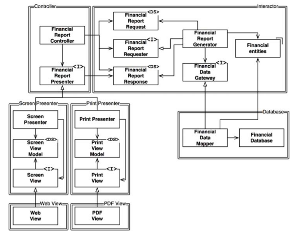
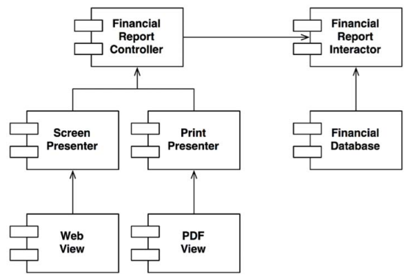

# 8장. 개방 폐쇄 원칙(Open Close Principle, OCP)

> 소프트웨어 개체는 확장에는 열려 있어야하고, 변경에는 닫혀 있어야한다

- 소프트웨어 아키텍쳐를 공부하는 가장 근본적인 이유
- 클래스와 모듈을 설계할 때 도움이 되는 원칙이라고 알고있지만, 컴포넌트수준에서 고려할 때 훨씬 중요한 의미를 가진다

## 사고 실험

어떤 변경사항에 있어 변경되는 코드량이 가능한한 최소로 되는 것이 훌륭한 아키텍쳐이다.

- 어떻게 해야 그럴 수 있을까?
  - 서로 다른 목적으로 변경되는 요소를 적절하게 분리(SRP)
  - 요소 사이의 의존성을 체계화(DIP, 의존성 역전 원칙)

서로 다른 목적, 즉 책임으로 분리하면 하나의 책임에서 변경이 발생하더라도 다른 책임들에 대해서는 변경이 되지 않도록,
소스 코드 의존성도 조직화해야한다. 여기에 추가적으로 행위가 확장될 때 변경이 발생하지 않음을 보장해야한다.

이런 목적을 달성하기 위해선 `처리과정을 클래스 단위로 분할`하고 이를 이중선으로 표시한 `컴포넌트 단위`로 구분해야 한다.
여기서 주목할건 `모든 의존성이 소스 코드 의존성`을 나타낸다. 즉, 화살표가 A 에서 B 클래스로 향한다면(A -> B)
A 클래스에서는 B를 호출하지만 `B는 A를 전혀 호출하지 않는다`는 점이다.

또한, 컴포넌트의 구분인 이중선을 지나는 화살표는 오직 한 방향으로만 교차한다. `모든 컴포넌트 관계는
단방향`으로 이루어진다는 뜻이다. 앞서 언급했듯 화살표는 의존성을 나타내며, 화살표가 가리키는 컴포넌트는
`보호하려는 컴포넌트`라고 볼 수 있다. 여기서 말하는 보호란, 변경으로부터의 보호이며 `Interactor`는 여기서 어떤 변경에도 영향을 받지 않는다.

이렇게 소스 코드의 의존성에 따라 `보호의 계층 구조`가 `수준`이라는 개념을 바탕으로 구성된다.
Interactor 가 가장 높은 수준의 개념이고 최고의 보호를 받는다고 볼 수 있다.

이것이 `아키텍쳐 수준에서의 OCP`가 동작하는 방식이며, 저수준 컴포넌트에서 발생한 변경으로부터 
`고수준 컴포넌트를 보호`할 수 있다.

## 방향성 제어

그림에서 `FinancialDataGateway` 인터페이스는 왜 필요했을까?

- FinancialReportGenerator 와 FinancialDataMapper 사이의 `의존성 역전`을 위해
- 만약 인터페이스가 없었다면 우리가 보호하고자하는 Interactor 컴포넌트의 의존성이 Database 로 향하게되어 보호할 수 없게 된다.

## 정보은닉

`FinancialReportRequester` 또한 방향성 제어를 위해서 존재했을까?

- 여기서는 Controller 가 Interactor 내부에 대해 알지 못하게하는 `정보은닉`의 기능도 포함한다.
- 인터페이스가 없었다면 `FinancialEntities`에 대한 추이 종속성을 가지게된다
  - `엔티티는 자신이 직접 사용하지 않는 요소에는 절대로 의존해서는 안된다`를 위반
  - 인터페이스 분리 원칙(ISP)과 재사용 원칙(CRP)
- Controller 로 부터 Interactor를 보호함과 더불어 반대의 변경에서도 보호를 위해 내부를 은닉한다.

## 결론

- OCP 의 목표는 시스템을 확장하기 쉬운 동시에 변경으로 인한 영향을 줄이기 위해 존재한다.
- 이러한 목표를 위해서 시스템을 컴포넌트 단위로 분리하고 `의존성 계층 구조를 통해 고수준 컴포넌트를 보호`해야 한다.