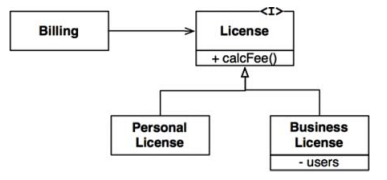
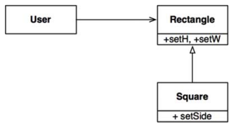

# 리스코프 치환 원칙(Liskov Substitution Principle, LSP)

> 하위 타입의 객체를 상위 객체로 치환하더라도 행위가 변하면 안된다

## 상속을 사용하도록 가이드하기

위 설계는 LSP를 준수한다

- Billing이 License 하위 타입 중 `무엇을 사용하든 전혀 의존하지 않기 때문`
- License 하위 타입들은 모두 License로 치환할 수 있다

## 정사각형, 직사각형 문제

위 설계는 LSP를 위반한다

- Rectangle 의 높이와 너비는 독립적이나, Square 의 높이와 너비는 반드시 함께 변경되기 때문에
- 이를 막기위해선 User가 Rectangle 이 실제로는 Square 인지 검사해야한다
  - 하지만 이렇게 하면 `User의 행위는 특정 타입에 의존`하게 된다

## LSP 와 아키텍쳐

- 초기 LSP 는 상속을 사용하도록 가이드하는 방법 정도로 간주
- 하지만, 시간이 지나면서 인터페이스와 구현체에도 적용되는 광범위한 설계원칙으로 변모
- 잘 정의된 인터페이스와 인ㅌ터페이스의 구현체끼리 상화 치환 가능성

## 결론

- LSP 는 `아키텍쳐 수준까지 확장할 수 있고 반드시 확장`해야만 한다.
- 치환 가능성이 조금이라도 위배되면 아키텍쳐가 오염되어 별도의 메커니즘이 추가되야 하기 때문