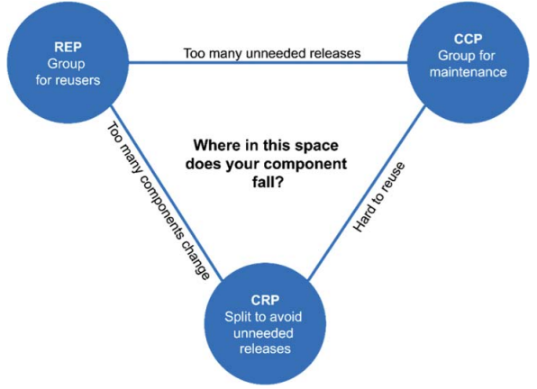

# 13장. 컴포넌트 응집도

응집도와 관련된 세가지 원칙

- 재사용, 릴리즈 등가 원칙(Reuse Release Equivalence Principle, REP)
- 공통 폐쇄 원칙(Common Closure Principle, CCP)
- 공통 재사용 원칙(Common Reuse Principle, CRP)

## REP, 재사용 릴리즈 등가 원칙

> 재사용 단위는 릴리즈 단위와 같다

우리는 현재 소프트웨어 재사용의 시대에 살고 있으며, 객체 지향 모델의 오랜 약속 중 하나가 실현되었다.
그런점에서 REP 는 너무나 당연할 수 있다. 만약 컴포넌트가 릴리즈 절차를 통해 추적되지 않는다면,
컴포넌트들이 서로 호환되는지 확인할 방법이 없다. 또한 새로운 버전이 언제 출시되고 무엇이 변경되었는지 알아야하기에 중요하다.

설계와 아키텍쳐 관점에서 보면 단일 컴포넌트는 응집성 높은 클래스와 모듈들로 구성되어야 함을 뜻한다.
즉, 컴포넌트를 구성하는 모든 모듈은 서로 공유하는 중요한 테마나 목적이 있어야한다.

다른 시각으로 보자면, 컴포넌트로 묶인 클래스와 모듈은 `반드시 함께 릴리즈 할 수 있어야` 한다.
즉, 동일한 릴리즈로 추적 관리되고 문서에 포함되어야 한다는 말이다.

## CCP, 공통 폐쇄 원칙

> 동일한 이유로 동일한 시점에 변경되는 클래스를 같은 컴포넌트로 묶어라.
> 서로 다른 시점에 다른 이류로 변경되는 클래스는 다른 컴포넌트로 분리하라.

이 원칙은 단일 책임 원칙(SRP)를 컴포넌트 관점에서 다시 쓴 것이다.

대다수의 어플리케이션에서 유지보수성은 재사용성보다 훨씬 중요하다. 그렇기에 변경이 여러 컴포넌트에서 일어나는게 아닌
단일 컴포넌트에서 발생하는 편이 낫다. 만약 변경이 단일 컴포넌트로 제한할 수 있다면 변경된 컴포넌트만 배포하면 된다.
CCP 는 같은 이유로 변경될 가능성이 있는 클래스는 모두 한곳에 묶을 것을 권장한다.이를 통해 소프트웨어를 
릴리즈, 배포, 검증하는 작업량을 최소화 할 수 있다.

개방 폐쇄 원칙(OCP)와 밀접하게 관련되어 있다. 변경이 발생할 가능성이 있거나 과거에 발생했던 
대다수의 공통적인 변경에 대해서 클래스가 닫혀있도록 설계해야한다.

### SRP 와의 유사성

동일한 시점에 동일한 이유로 변경되는 것들은 한데 묶어라. 서로 다른 시점에 다른 이유로 변경되는 것들은 서로 분리하라.

## CRP, 공통 재사용 원칙

> 컴포넌트 사용자들을 필요하지 않는 것에 의존하게 강요하지 말라

이 원칙 또한 클래스와 모듈을 어느 컴포넌트에 위치시킬지 결정할 때 도움이 된다.
CRP 에서는 같이 재사용되는 경향이 있는 클래스와 모듈들은 같은 컴포넌트에 포함해야 한다고 말한다.

재사용 가능한 클래스는 재사용 모듈의 일부로 해당 모듈의 다른 클래스와 상호작용하게 된다. 이런 경우
같은 컴포넌트에 포함되어야 하며 컴포넌트 내부에선느 클래스들 사이에 많은 의존성이 존재함을 예상할 수 있다.

또한 CRP 는 동일한 컴포넌트로 묶어서는 안되는 클래스가 무엇인지도 말해준다. 어떤 컴포넌트가 다른 컴포넌트를
사용한다면 단하나의 클래스만 사용하더라도 의존성이 발생하게 된다. 이런 의존성으로 인해
사용되는(used) 컴포넌트가 변경된다면 사용하는(using) 컴포넌트가 변경될 가능성이 높아진다.

한 컴포넌트 내에 `일부 클래스만 의존하고 다른 클래스와 독립적일 수 없음`을 확실히 인지해야한다.
CRP 는 강하게 결합되지 않은 클래스들을 동일한 컴포넌트에 위치시켜서는 안된다고 말한다.

### ISP 와의 관계

CRP 는 인터페이스 분리 원칙(ISP)의 포괄적인 버젼이다.
- ISP 는 사용하지 않는 메서드가 존재하는 클래스에 의존하지 말라한다
- CRP 는 사용하지 않는 클래스를 가진 컴포넌트에 의존하지 말라한다

> 필요하지 않는 것에 의존하지 말라

## 컴포넌트 응집도에 대한 균형 다이어 그램

`REP와 CCP는 포함(inclusive) 원칙`이며 `CRP는 배제(exclusive)의 원칙`이다.
세 원칙이 어떻게 상호작용하는지 보여주며 꼭지점 반대편에 있는 edge 는 감수해야할 비용을 나타낸다.
즉, CCP 를 포기하게 되면 컴포넌트 변경이 빈번해지며, CRP 를 포기하면 불필요한 릴리즈가 많아 진다.

우리는 현재 관심을 기울이는 부분을 충족시키는 위치를 찾아야하며, `시간이 흐르면서 이 역시 변동`될 수 있음을 인지해야한다.
예를 들어 초기에는 CCP 가 REP 보다 훨씬 중요하다. 즉, 개발 가능성이 재사용성보다 초기에는 중요할 수 있다.

일반적으로 프로젝트는 삼각형의 오른쪽에서 시작되어 점점 왼쪽으로 이동해간다. 즉, 시간과 성숙도에 따라
컴포넌트 구조가 변경될 수 있으며 `시간이 지남에 따라 실제 수행하는 일보다는 프로젝트가 발전되고 사용되는 방법`과 관련이 깊다

## 결론

어느 클래스들을 묶어서 컴포넌트로 만들지 고민할 때, 재사용성과 개발 가능성이라는 상충하는 힘을 반드시 고려해야한다.