# 컴포넌트 결합

컴포넌트 사이의 관계를 설명하는 세가지 원칙

## Acyclic Dependencies Principle(ADP, 의존성 비순환 원칙)

> 컴포넌트 의존성 그래프에 순환(cycle)이 있어서는 안된다

개발팀이 커지게되면 다수의 개발자가 동일한 소스 파일을 수정하게되고 누군가가 마지막으로 수정한
코드 떄문에 또다른 수정을 하게되는 현상이 지속적으로 발생하게 된다. 이 문제의 해결책으로 두 가지 방법이 발전되어 왔다.

### 주단위 빌드(Weekly Build)

중간 규모의 프로젝트에서 흔하게 사용되는 방법이다.
첫 4일은 서로 신경쓰지 않고 개발하며, 금요일에 변경된 코드를 모두 통합하여 시스템을 빌드하는 것이다.
이 방법은 4일 동안 개별적인 환경에서 개발할 수 있는 자유가 존재하지만, 금요일에 통합과 관련된 막대한 업무가 발생하는 단점 또한 존재한다.

프로젝트가 커질수록 하루만에 통합을 하기 어려워지는 상황이 오게되며, 점차 통합시간이 늘어나고
결과적으로 개발보다 통합에 드는 시간이 늘어나며 효율성이 떨어지게 된다.

### 순환 의존성 제거하기

이 방법은 개발 환경을 릴리즈 가능한 컴포넌트 단위로 분리하는 것이다. 여기서의 컴포넌트 단위는 개발자 혹은 팀이 책임질 수 있는 작업 단위가 된다.
개발자나 팀은 해당 컴포넌트를 동작하게 만든 후, 릴리즈 번호를 부여하고 다른 개발자가 사용할 수 있도록 릴리즈한다.
이후, 다시 개발자는 개발과 수정을 진행하지만 다른 개발자들은 이미 릴리즈된 컴포넌트를 사용하게 된다.

이렇게 되면 다른 개발에 영향을 받지 않고 특정 컴포넌트에 변경이 있더라도 다른 개발자에게 즉각 영향을 주지 않게된다.
다른 컴포넌트가 릴리즈되면, 본인의 컴포넌트를 기존 릴리즈에서 새로운 컴포넌트 릴리즈에 맞게 수정할 시기를 `스스로 결정`할 수 있다.
이때, 통합은 `작고 점진적`으로 이뤄지게 된다.

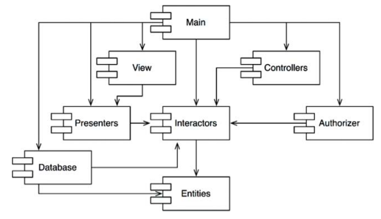

이 방법이 성공하기 위해서는 `컴포넌트 사이의 의존성 구조`를 반드시 관리해야한다.
위 그림처럼 의존성의 관계를 단방향 그래프로 표현했을 때, 순환이 없는 구조(비순환 방향 그래프, Directed Acyclic Graph)가 되어야한다.

### 순환 끊기

#### 의존성 역전 원칙(DIP)를 이용한다

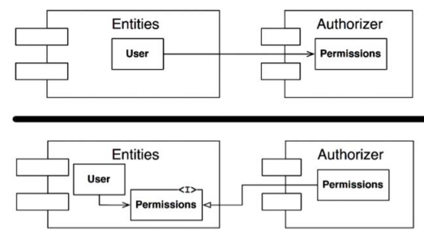

#### 순환이 존재하는 컴포넌트가 모두 의존하는 클래스들을 새로운 컴포넌트로 이동

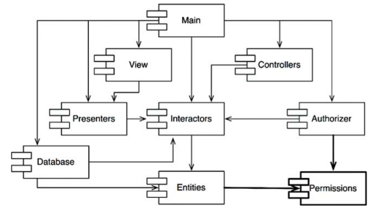

### 흐트러짐(Jitter)

요구사항이 변경됨에 따라 컴포넌트 구조도 변경될 수 있다. 즉, 새로운 컴포넌트가 추가됨에 따라
의존성 구조가 흐트러질 수 있고 이때마다 순환이 발생하는지 관찰하고, 순환을 끊어줘야 한다.

### 하향식(top-down) 설계

> 컴포넌트 구조는 하향식으로 설계 될 수 없다

- 컴포넌트는 시스템에서 가장 먼저 설계 할 수 있는 대상이 아니다
  - 시스템이 성장하고 변경될 때 함께 진화한다
- 컴포넌트 의존성 다이어그램은 기능과 관련이 없다
  - 빌드 가능성과 유지 보수성을 보여주는 지도와 같다
- 빌드하거나 유지보수할 소프트웨어가 없다면 지도 또한 필요없기에 프로젝트 초기에 컴포넌트 구조를 설계할 수 없다

---

## Stable Dependencies Principle(SDP, 안정된 의존성 원칙)

> 안정성의 방향으로(더 안정된 쪽에) 의존하라

설계는 정적일 수 없으며 설계를 유지하다보면 변경을 불가피하다.
이때 변경이 쉽지 않은 컴포넌트가 `변동이 예상되는 컴포넌트에 의존`하게 만들어서는 절대 안된다.
안정된 의존성 원칙(SDP)를 준수하면 변경하기 어려운 모듈이 변경하기 쉽게 만들어진 모듈에 의존하지 않도록 만들 수 있다.

### 안정성(Stability)

안정성은 변경을 만들기 위해 필요한 작업량과 관련된다. 소프트웨어 컴포넌트를 변경하기 어렵게 만드는 확실한 방법은
많은 컴포넌트가 해당 컴포넌트에 의존하게 만드는 것이다. 사소한 변경이라도 의존하는 컴포넌트를
모두 만족시키려면 상당한 변경이 필요한데 이렇게 보면 안정적이라고 볼 수 있다.

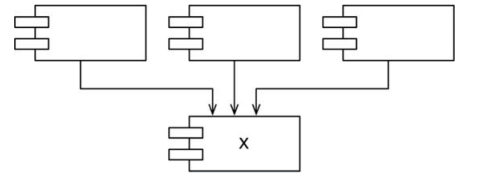

위 그림은 세 컴포넌트가 X 를 의존하기에, `X 를 변경하지 말아야할 이유가 세가지`라고 볼 수 있다.
이때 X 는 세 컴포넌트를 책임(responsible)지지만, X 가 변경되도록 만들 요인은 없으므로 독립적(independent)이다.

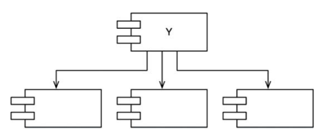

반대로 Y 는 불안정한 컴포넌트다. 어떤 컴포넌트도 Y 에 의존하지 않지 않지만, Y 를 변경시킬
요인이 세가지나 된다. 이 경우 Y 는 의존적이라고 말할 수 있다.

### 안정성 지표

안정성을 측정할 수 있는 방법이 있을까?

- 컴포넌트로 들어오고 나가는 의존성의 갯수를 세어보는 방법
- 이 숫자를 통해 컴포넌트가 위치상 `어느정도의 안정성`을 가지는지 계산할 수 있다
- Fan-in
  - 안으로 들어오는 의존성
  - 컴포넌트 내부의 클래스에 의존하는 컴포넌트 외부의 클래스 갯수
- Fan-out
  - 외부로 나가는 의존성
  - 컴포넌트 외부의 클래스에 의존하는 컴포넌트 내부의 클래스 갯수
- I(불안정성) = Fan-out / (Fan-in + Fan-out)
  - I 값이 1이라면, 어떤 컴포넌트도 해당 컴포넌트에 의존하지 않지만 해당 컴포넌트는 다른 컴포넌트에 의존한다
    - `최고 불안정한 상태`
    - 자신에게 의존하는 컴포넌트가 없으므로 변경하지 말아야할 이유가 없다
  - I 값이 0이라면, 해당 컴포넌트에 의존하는 다른 컴포넌트가 있지만 해당 컴포넌트는 다른 컴포넌트에 의존하지 않는다
    - 다른 컴포넌트를 책임지며 독립적이다
    - `최고로 안정된 상태`
    - 해당 컴포넌트는 변경하기 어렵지만, 변경하도록 강제하는 의존성은 갖지 않는 상태

SDP 에서는 컴포넌트의 I 지표는 `컴포넌트가 의존하는 다른 컴포넌트들의 I 보다 커야한다`고 말한다.
즉, `의존성 방향으로 I 지표 값이 감소`해야한다.

#### 모든 컴포넌트가 안정적이어야 하는 것은 아니다

모든 컴포넌트가 최고로 안정적인 시스템이라면 변경이 불가능하다. 우리가 설계 할 때, 
기대하는 것은 불안정한 컴포넌트도 있고 안정된 컴포넌트도 존재하는 것이다.

SDP 를 위배되는 경우 어떻게 해야할까?

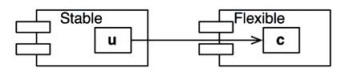

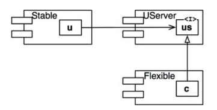

이 문제를 해결하기 위해선 의존성을 어떤식으로든 끊어 내야한다. `DIP`를 도입하면 이 문제를 해결할 수 있다.
여기서는 US 라는 인터페이스를 생성하여 UServer 컴포넌트에 넣었다. 이렇게 두 컴포넌트간의 의존성을 끊고
두 컴포넌트가 UServer 컴포넌트에 의존하도록 강제한다.

#### 추상컴포넌트

자바같은 정적 타입 언어를 사용할 때 꼭 필요한 전략이다. 추상 컴포넌트는 상당히 안정적이기에
덜 안정적인 컴포넌트가 의존할 수 있는 이상적인 대상

---

## Stable Abstractions Principle(SAP, 안정된 추상화 원칙)

> 컴포넌트는 안정된 정도만큼만 추상화되어야 한다

### 고수준 정책을 어디에 위치 시켜야하는가

업무로직이나 아키텍쳐와 관련된, 즉 고수준 정책을 캡슐화하는 소프트웨어는 반드시 안정된 컴포넌트(I=0)에 위치해야한다.
하지만, 고수준 정책을 안정된 컴포넌트에 위치 시키면 정책을 포함한 소스 코드의 수정이 어려워진다.
`안정된 상태이면서 변경에 충분히 대응`할 수 있게 만들 수 있는 방법이 있을까? 해답은 `OCP(개방 폐쇄 원칙)에서 발견`할 수 있다.

### 안정된 추상화 원칙

이는 안정성과 추상화 정도 사이의 관계를 정의한다. 이 원칙은 안정된 컴포넌트는 추상 컴포넌트여야 하며
이를 통해 `안정성이 컴포넌트 확장에 방해되서는 안된다`고 한다. 반대로 불안정한 컴포넌트는
구체 컴포넌트로 내부의 구체적인 코드를 쉽게 변결 할 수 있어야 하기 때문이다.

SAP 와 SDP 를 결합하면 컴포넌트에 대한 DIP 나 마찬가지가 된다.
SDP 는 의존성이 반드시 안정성의 방향으로 향해야 한다고 말하고, SAP 에서는 안정성이 추상화를 의미한다고 말하기 떄문이다.
따라서 `의존성은 추상화의 방향으로 향하게 된다`.

하지만, DIP 는 클래스에 대한 원칙이기에 추상적이거나 아니거나 둘 중 하나지만, 컴포넌트의 경우
어떤 부분은 추상적이면서 다른 부분은 안정적일 수 있다.

### 추상화 정도 측정하기

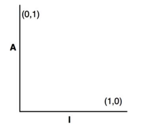

- A : 추상화 정도
  - Nc: 컴포넌트의 클래스 갯수
  - Na: 컴포넌트의 추상 클래스와 인터페이스 갯수
  - A = Na / Nc
- I : 안정성

A 지표는 0과 1사이의 값을 가지며 0이면 추상클래스가 하나도 없다는 것이며 1이면 모두 추상클래스라는 뜻이다.

### 주 계열

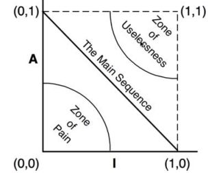

컴포넌트는 추상화와 안정화의 정도가 다양하기에 여러 지점에 위치할 수 있다.
추상클래스의 파생클래스는 추상적이면서 의존성을 가진다. 때문에 이 클래스는 추상적이지만 의존성으로 인해 안정성이 감소하게 된다.

모든 클래스가 (0,1)이나 (1,0)에 위치해야한다는 규칙을 강요할 수 없지만, 그래프에서 컴포넌트가 위치할 수 있는 합리적인 지점을 가정할 수 있다.
그 궤적 내에는 컴포넌트가 위치해서는 안되며 배제해야할 구역을 찾는 방식으로 추론할 수 있다.

#### Zone of Pain(고통의 구역)

(0,0) 주변에 위치한 컴포넌트는 매우 안정적이며 구체적이다.
추상적이지 않으므로 확장할 수 없고 안정적이므로 변경하기 상당히 어렵다.
데이터베이스의 스키마를 결정하는 엔티티가 고통의 구역에 위치하곤 하며 변동성이 높기에 관리하기 굉장히 어렵고 고통스럽다.

변동성이 없는 소프트웨어라면 문제될 것 없지만, 우리가 주의할 것은 변동성이 있는 컴포넌트가 위치하는 것이다.

#### Zone of Uselessness(쓸모없는 구역)

(1,1) 주변에 위치한 컴포넌트는 최고로 추상적이지만 누구도 컴포넌트에 의존하지 않는 것이다.
따라서 이러한 컴포넌트는 쓸모가 없다

#### 배제구역 벗어나기 (주 계열)

각 배제 구역으로 부터 최대한 떨어진 점의 계적이 (1,0)과 (0,1)을 잇는 선분 즉 `주 계열`이다.

주 계열에 위치한 컴포넌트는 안정성에 비해 너무 추상적이지도 않고 추상화 정도에 비해 너무 불안정하지도 않다.
컴포넌트가 위치할 수 있는 가장 바람직한 지점은 주계열의 종점이며, 대다수의 컴포넌트가 두 종점에 위치하도록 노력해야한다.
실무적으로 봤을 땐, 이는 불가능에 가까우므로 주계열 바로 위에 또는 가깝게 위치할 때 가장 이상적이다.

### 주 계열과의 거리

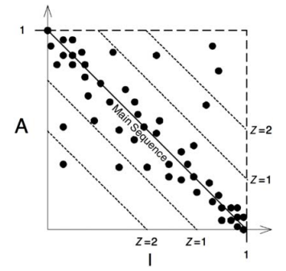

이상적인 상태로부터 컴포넌트가 얼마나 떨어져있는지 측정하는 지표를 만들어 볼 수 있다.

- D : 거리
  - D = |A+D-1|
  - 유효범위는 [0, 1]
  - D = 0, 컴포넌트가 주계열 바로 위에 위치
  - D = 1, 컴포넌트가 주계열로부터 가장 멀리 위치

위 지표를 토대로 주계열에 대체로 일치하도록 설계되었는지 분석할 수 있다. 각 컴포넌트에 대해 D 를 계산하고
0에 가깝지 않다면 해당 컴포넌트를 재구성할 수 있다.

또한 위 그래프처럼 설계에 포함된 컴포넌트에 대해 D 지표의 평균과 분산을 통해 
설계를 통계적으로 분석하는 일 또한 가능해진다. 컴포넌트의 표준 편차가 1(Z=1) 영역을 벗어난다면
그 컴포넌트를 확인해야할 가치가 존재한다.

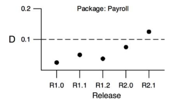

또한 위 그림처럼 D 지표를 시간에 따라 그려봄으로써, 릴리즈에 따른 변화를 감지할 수 있다.
예시는 관리 한계가 D = 0.1 지점으로 R2.1 지점에서 관리 한계를 벗어난 원인을 조사할 근거가 될 수 있다.

## 결론

이번 장에서 설명한 의존성 관리 지표는 설계의 의존성과 추상화 정도를 수치적으로 측정할 수 있게 해준다.
너무 지표를 맹신하는 것은 좋지 않지만 지표를 통해 유의미한 무언가를 찾는데 도움이 될 수 있다.