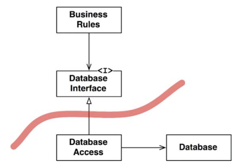
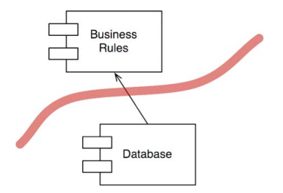
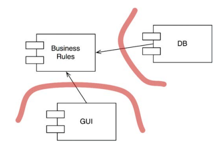

# 17장. 경계: 선 긋기

소프트웨어 아키텍쳐는 선을 긋는 기술이며, 이러한 선을 `경계(boundary)`라고 부른다.
경계는 소프트웨어 요소를 서로 분리하고 경계 한편에 있는 요소가 반대편에 있는 요소를 알지 못하도록 막는다.
초기에 그어지는 선들은 가능한 오랫동안 `결정을 연기`시키기위해, 핵심적인 업무로직을 오염시키지 못하게 만들려는 목적으로 쓰인다.

아키텍트의 목표는 시스템을 만들고 유지하는데 필요한 인적자원을 최소화하는 것이다.
인적 자원의 효율을 떨어뜰니느 요인은 `결합(coupling)`이다.

어떤 종류의 결정이 이른 결정일까? 시스템의 업무 요구사항, 즉 유스케이스와 아무런 관련이 없는 결정이다.

## 어떻게, 언제 선을 그어야할까?

관련이 있는 것과 없는 것 사이에 선을 긋는다.

- GUI와 업무 규칙과는 관련이 없기에 둘 사이에는 선을 긋는다
- 데이터베이스와 GUI와는 관련이 없기에 이 둘 사이에도 선을 긋는다
- 데이터베이스와 업무규칙과 관련이 없으므로 둘 사이에 선이 존재해야한다

데이터 베이스는 업무 규칙이 떼어놓을 수 없는 관계라고 생각할 수 있다. 하지만, 데이터베이스는
`업무 규칙이 간접적으로 사용할 수 있는 도구`다. 업무 규칙이 알아야 할 것은 데이터를 가져오고 저장할 때 
사용할 수 있는 함수 집합이 존재한다는 사실이 전부이다.

이 도표에서 클래스와 인터페이스는 상징적이다. 실제 어플리케이션에서는 수많은 클래스와 구현체가 존재한다.
하지만 이 모든 것은 이 패턴을 거의 동일하게 따른다.

화살표의 방향에 주목해야한다. Database는 BusinessRules에 대해 알고 있다.
반면, BusinessRules는 Database에 대해 알지 못한다.

이 선의 방향이 중요하다. BusinessRules에 있어 Database는 문제가 되지 않지만, Database는
BusinessRules 없니는 존재할수 없다는 사실을 방향을 통해 알 수 있다. 즉, Database 컴포넌트는
BusinessRules가 만들어 낸 호출을 쿼리 언어로 변환하는 코드를 담고 있다.

## 입력과 출력

우리가 알아야할 것은 `입력과 출력은 중요하지 않다는 사실`이다. 사용자 경험은 GUI, 즉 인터페이스에 의해 좌우된다.
하지만 이러한 인터페이스 뒤에는 인터페이스를 조작하는 모델이 존재한다는 사실을 잊으면 안된다.
중요한건 모델은 인터페이스를 전혀 필요로 하지 않는다는 점이다. 가장 `중요한건 업무 규칙`이다.
GUI는 다른 종류의 인터페이스로 얼마든지 교체할 수 있으며, BusinessRules는 전혀 개의치 않는다.

## 플러그인 아키텍쳐

데이터베이스와 GUI에 대해 내린 두가지 결정을 하나로 합쳐보면, 시스템에서 서드파티 플러그인을 사용할 수 있게 하는 패턴과 동일하다.
소프트웨어 개발 기술의 역사는 플러그인을 손쉽게 생성하여확장가능하며 유지보수가 쉬운 시스템 아키텍쳐를 확립하는 방법의 역사이다.

물론 교체 작업이 사소한 일은 아니다. 하지만 플러그인 구조를 가정한 채 시작함으로써,
최소한 우리는 이러한 변경 작업을 현실성 있도록 할 수 있다.

## 플러그인에 대한 논의

시스템을 플러그인 아키텍쳐로 배치함으로써 `변경이 전파될수 없는 방화벽`을 생성할 수 있다.

경계는 `변경의 축(axis of change)`이 있는 지점에 그어진다. 경계의 한쪽에 위치한 컴포넌트는
경계 반대편의 컴포넌트와는 다른 속도, 다른 이유로 변경된다.

단일 책임 원칙은 어디에 경계를 그어야할지를 알려준다.

## 결론

- 소프트웨어 아키텍쳐에서 경계선을 그리려면 먼저 시스템을 컴포넌트 단위로 분할 해야한다
  - 일부 컴포넌트는 핵심 업무 규칙에 해당
- 이후, 컴포넌트 사이의 화살표가 특정 방향, 즉 핵심 업무를 향하도록 이들 컴포넌트의 소스를 배치한다
- 의존성 역전 원칙과 안정된 추상화 원칙을 응용
- 의존성 화살표는 저수준 세부사항에서 고수준의 추상화를 향하도록 배치된다

