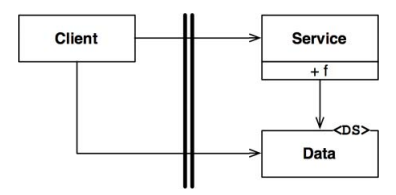
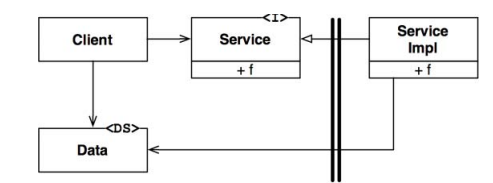

# 경계 해부학

## 경계 횡단하기

런타임에 경계를 횡단한다

- 경계 한쪽에 있는 기능에서 반대편 기능을 호출하여 데이터를 전달하는 일
- 적절한 위치에서 경계를 횡단하게 하는 비결은 소스코드 의존성 관리
  - 소스코드 모듈 하나가 변경되면 의존하는 다른 모듈도 변경되거나 컴파일, 배포되야 할 수도 있기에
  - 경계는 이러한 변경이 전파되는 것을 막는 방화벽

## 두려운 단일체

경계 중 가장 단순하며 흔한 형태는 물리적으로 염격하게 구분되지 않는 형태다.
같은 주소 공간을 공유하며 그저 나름의 규칙에 따라 분리되어 있는 것으로, 이전 장에 `소스 수준 분리 모드`라고 불렀다.

배포 관점에서 단일체(monolith)라 불리는 단일 실행파일에 지나지 않는다.
단일체는 하나의 파일로 배포하기에 경계가 드라나지 않는다. 그렇다고 경계 자체가 무의미하다는 뜻은 아니다.
다양한 컴포넌트를 개발하고 바이너리로 만드는 과정을 독립적으로 수행할 수 있게 하는 일은 가치 있는 일이다.

이런 아키텍쳐는 거의 대부분 특정한 `제네릭과 템플릿과 같은 동적 다형성`에 의존하여 내부 의존성을 관리한다.
이 때문에 최근 수십년동안 객체 지향 개발이 아주 중요한 패러다임이 될 수 있었다.

가장 단순한 형태의 경계 횡단은 `저수준 클라이언트에서 고수준 서비스`로 향하는 함수 호출이다.
이 경우 `런타임 의존성과 컴파일타임 의존성은 모두 같은 방향, 즉 저수준에서 고수준 컴포넌트`로 향한다.

제어 흐름은 왼쪽에서 오른쪽 경계를 횡단한다. 위 그림에서 주목할 점은 경계에서 `호출되는 쪽`에 Data에 대한 정의가 위치한다는 점이다.

반면 `고수준 클라이언트가 저수준 서비스를 호출`해야 한다면 동적 다형성을 사용하여 제어흐름과는 반대 방향으로 `의존성을 역전`시킬 수 있다.
이렇게 하면 `런타임 의존성은 컴파일타임 의존성과는 반대`가 된다.

고수준 Client는 Service 인터페이스를 통해 저수준인 ServiceImpl의 함수 f()를 호출한다.
여기서 주목할 점은 경계를 횡단할 때 의존성은 모두 오른쪽에서 왼쪽으로, 즉 고수준 컴포넌트를 향한다는 점이다.
또한 데이터 구조의 정의 또한 `호출하는 쪽`에 위치한다.

정적 링크된 모놀리틱 구조의 실행파일 이더라도 이처럼 규칙적인 방식으로 구조를 분리하면,
팀들은 서로의 영역에 침범하지 않고 독립적으로 컴포넌트 개발이 가능하다. 고수준 컴포넌트는 저수준 세부사항으로부터 독립적으로 유지된다.

## 배포형 컴포넌트

아키텍쳐의 경계가 물리적으로 드러날 수도 있는 가장 단순한 형태는 동적 링크 라이브러리(DLL) 이다.
이 형태로 배포하면 따로 컴파일하지 않고 곧바로 사용할 수 있으나, 컴포넌트는 바이너리와 같이 배포가능한 형태로 전달되어야한다.
이를 이전장에서 `배포 수준 결합 분리 모드`라 하였다.

하지만 배포과정에서만 차이가 날 뿐, 컴포넌트를 분리하거나 컴포넌트 간 의존성을 관리하는 전략은 단일체와 동일하다.

### 스레드(Thread)

단일체와 배포형 컴포넌트 모두 스레드를 활용 가능하다. 하지만 스레드는 아키텍쳐 경계도 아니고 배포단위도 아니다.
스레드는 실행 계획과 순서를 체계화하는 방법에 가깝다.

## 로컬 프로세스

보다 강한 물리적 형태를 띠는 아키텍쳐 경계에는 `로컬 프로세스`가 있다.
로컬 프로세스는 주로 명령행이나 그와 유사한 시스템 호출을 통해 생성된다. 여러 프로세서들에서 실행되지만,
각각 독립된 주소 공간에서 실행된다. 대개 로컬 프로세스는 소켓, 메일박스, 메시지 큐와 같은 운영체제에서 제공하는 통신 기능을 이용해 통신한다.

각 로컬 프로세스는 정적으로 링크된 단일체 이거나 동적으로 링크된 여러개의 컴포넌트로 구성될 수 있다.

- 링크된 단일체
  - 여러 모놀리틱 프로세스가 같은 컴포넌트를 가짐
  - 컴파일, 정적링크 과정에서 컴포넌트의 바이너리가 단일체에 물리적으로 복사되기에
- 동적으로 링크된 여러개의 컴포넌트
  - 동적으로 링크된 배포형 컴포넌트들을 서로 공유

로컬 프로세스를 일종의 `최상위 컴포넌트`로 생각하자. 즉, 컴포넌트 간 의존성을 동적 다형성을 통해
관리하는 저수준 컴포넌트로 구성된다.

로컬 프로세스 간 분리전략은 단일체나 바이너리 컴포넌트의 경우와 동일하게 `소스코드의 의존성의 방향은 고수준 컴포넌트로` 향한다.
따라서 로컬 프로세스에서는 고수준 프로세스사 저수준 프로세스의 이름이나 물리주소 등을 포함해서는 안된다.
`저수준 프로세스가 고수준 프로세스의 플러그인이 되도록 만드는 것`이 목표이다.

로컬 프로세스 경계를 지나는 통신은 비싼 작업에 속하므로 통신이 빈번하게 이뤄지지 않도록 해야한다.

## 서비스

가장 강력한 경계는 서비스이다. 서비스는 프로세스로 일반적으로 명령행 또는 그와 동등한 시스템의 호출을 통해 구동된다.
서비스들은 모든 통신이 네트워크를 통해 이뤄진다고 가정한다. 따라서 서비스 경계를 지나는 통신은 함수 호출에 비해 상당히 느리다.
가능하다면 빈번하게 통신하는 일을 피해야하며, `지연에 따른 문제`를 고수준에서 처리할 수 있어야한다.

이를 제외하고는 로컬 프로세스에서 적용한 규칙이 서비스에도 그대로 적용된다.
저수준 서비스는 반드시 고수준 서비스에 플로그인 되어야한다.

## 결론

- 단일체를 제외한 대다수의 시스템은 한 가지 이상의 경계 전략을 사용
- 서비스 경계를 활용하는 시스템이라면 로컬 프로세스 경계도 일부 포함
- 개별 서비스 또는 로컬 프로세스는 거의 언제나 소스 코드 컴포넌트로 구성된 단일체 이거나 배포형 컴포넌트의 집합
- 즉, 한 시스템 안에서도 통신이 빈번한 로컬 경계와 지연을 중요하게 고려하는 경계가 혼합되어 있다