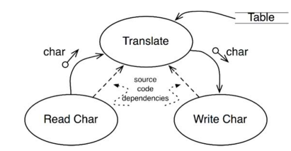
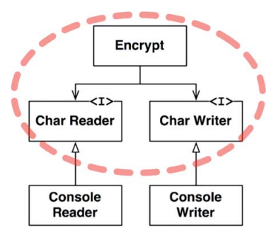
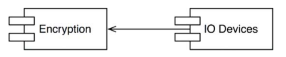

# 정책과 수준

소프트웨어 시스템이란 정책을 기술한 것으로 프로그램은 입력을 출력으로 변환하는 정책을 상세하게 기술한 설명서이다.

시스템에서 하나의 정책은 이 정책을 서술하는 여러개의 조그만 정책들로 나눌 수 있다.
소프트웨어 아키텍쳐의 기술은 이런 정책을 신중하게 분리하고, 정책이 변경되는 상황에 따라 정책을 재편성하는 일도 포함된다
동일한 이유로, 동일한 시점에 변경되는 정책은 동일한 수준에 위치하고 같은 컴포넌트에 속해야한다.
반면 다른 이유로, 다른 시점에 변경되는 정책은 다른 수준에 위치하고 다른 컴포넌트로 분리해야한다.

재편성된 컴포넌트들은 비순환 방향 그래프(directed acyclic graph, DAG)로 구성할 수 있다.
그래프의 `정점은 동일한 수준의 정책을 포함하는 컴포넌트`이고 `간선은 컴포넌트 사이의 의존성`을 나타낸다.

이러한 의존성은 소스 코드, 컴파일타임의 의존성이다. 자바의 경우 import 구문에 해당한다.
좋은 아키텍쳐라면 각 컴포넌트를 연결할 때 `의존성의 방향이 컴포넌트의 수준을 기반`으로 연결되도록 해야한다.
즉, 저수준 컴포넌트가 고수준 컴포넌트에 의존하도록 설계해야한다.

## 수준

수준은 입력과 출력까지의 거리이다. 입력과 출력 모두로부터 멀리 위치할 수록 정책의 수준이 높아진다.

Translate 컴포넌트는 위 그림에서 최고 수준의 컴포넌트로, 입력과 출력에서부터 가장 멀리 떨어져있기 때문이다.

데이터의 흐름은 실선, 소스 코드의 의존성은 점선으로 표현한다.
여기서 중요한건 데이터 흐름과 소스 코드 의존성이 항상 같은 방향을 가리키지 않는다는 것이다.
소스 코드 의존성은 그 수준에 따라 결합되어야하며, 데이터 흐름을 기준으로 결합되어서는 안된다.

Encrypt 클래스, CharWriter, CharReader 인터페이스를 둘러싼 점선으로 된 경계가 중요하다.
이 경계를 횡단하는 의존성은 모두 경계 안쪽으로 향한다. 즉, 경계로 묶인 영역이 `최고 수준의 구성요소`가 된다.

고수준의 암호화 정책을 저수준의 입, 출력 정책으로 분리하는 방식을 통해 입, 출력이 변화하더라도 암호화 정책은
거의 영향을 받지 않게된다.

정책을 컴포넌트로 묶는 기준은 정책이 변경되는 방식에 따라 달려있다. 단일 책임 원칙(SRP)와
공통 폐쇄 원칙(CCP)에 따르면 동일한 이유로 동일한 시점에 변경되는 정책은 함께 묶인다.
고수준 정책은 저수준 정책에 비해 덜 변경되고 중요한 이유로 변경된다. 반면 저수준 정책,
입출력과 가까운데 위치한 정책들은 빈번하게 변경되고 긴급성을 요하며 덜 중요한 이유로 변경된다.

저수준 컴포넌트가 고수준 컴포넌트에 플러그인 되어야한다는 관점으로 볼 수 있다.

## 결론

정책에 대한 논의는 단일 책임 원칙, 개방 폐쇄 원칙, 공통 폐쇄 원칙, 의존성 역전 원칙,
안정된 의존성 원칙, 안정된 추상화 원칙을 모두 포함한다.

