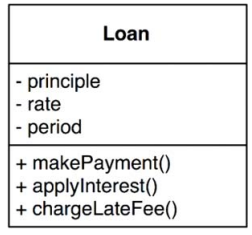
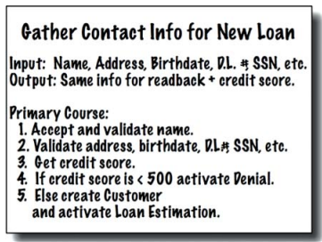

# 업무 규칙

업무 규칙과 플러그인을 구분하려면 업무 규칙이 실제로 무엇인지 이해해야한다.

업무 규칙은 사업적으로 수익을 얻거나 비용을 줄일 수 있는 규칙 또는 절차이다.
이는 컴퓨터로 구현했는지와 상관없이 사업적으로 수익을 얻거나 비용을 줄일 수 있어야한다.
예를들어 이자를 부과하는 업무 규칙은 컴퓨터 프로그램이 아니더라도 직원이 직접 이 규칙을 실행해 수익을 얻게 된다.

이런 규칙을 `핵심 업무 규칙`이라고 하며, 사업 자체가 핵심이고 규칙을 자동화하는 시스템이 
없더라도 업무 규칙은 그대로 존재해야한다.

핵심 업무 규칙은 데이터를 필요로하며 이런 데이터를 핵심 업무 데이터라고 한다.
이 또한 자동화하지 않는 경우에도 존재하는 데이터이다.

`핵심 규칙과 핵심 데이터는 본질적으로 결합`되어 있으며 객체로 만들 좋은 후보가 된다.
이러한 유형의 객체를 `엔티티(Entity)` 라고 한다.

## 엔티티(Entity)

엔티티는 컴퓨터 시스템의 내부 객체로 핵심 업무 데이터를 기반으로 핵심 업무 규칙을 구체화한다.
엔티티 객체는 핵심 업무 데이터를 포함하거나 쉽게 접근 가능하며, 엔티티의 인터페이스는 
핵심 업무 데이터를 기반으로 동작하는 핵심 업무 규칙을 구현한 함수들로 구성된다.

엔티티는 순전히 업무에 대한 것이며, 그 이외의 것은 없다.

## 유스케이스(Use case)

엔티티처럼 순전히 업무에 관한 것과 달리 자동화된 시스템이 동작하는 방법을 정의함으로써
수익을 얻거나 비용을 줄이는 업무 규칙 또한 존재한다. 이런 규칙들의 특징은 시스템의 요소로 존재하며
수동 환경에서는 사용될 수 없다.

예를 들어 대출 신청 시 신상정보를 토대로 신용점수를 획득하고 그 점수가 특정 점수 이상에게만 대출이 가능하다 와 같은 조건이 존재할 수 있다.
이를 유스케이스라고 하며 `유스케이스는 자동화된 시스템이 사용되는 방법`을 설명한다.
엔티티 내 핵심 업무 규칙과는 반대로, 유스케이스는 어플리케이션에 특화된 업무 규칙을 설명한다.

위 그림 5번의 Customer 를 주의깊게 볼 필요가 있다. 이는 Customer 라는 엔티티에 대한 참조이며
은행과 고객의 관걔를 결정짓는 핵심 업무 규칙이 Customer 엔티티에 포함되게 된다.

즉, 유스케이스는 엔티티 내부의 핵심 업무 규칙을 어떻게 그리고 언제 호출할지 명시하는 규칙을 담는다.
`엔티티가 어떻게 동작할지를 유스케이스가 제어`하는 것이다.

인터페이스로 들어오는 데이터와 인터페이스에서 리턴되는 데이터에 대한 형식이 존재하지 않는다는 점도 중요하다.
유스케이스는 사용자 인터페이스를 기술하지 않는다. 즉, 사용자에게 어떻게 보이는지가 아닌
사용자와 엔티티 사이의 상호작용을 규정한다.

엔티티는 자신을 제어하는 유스케이스에 대해 알지 못한다. 엔티티와 같은 고수준 개념은 유스케이스와 같은
저수준 개념에 대해 아무것도 알지 못하며, 반대로 저수준의 유스케이스는 고수준인 엔티티에 대해 알고 있다.
즉, 유스케이스는 엔티티에 의존하고 반면 엔티티는 유스케이스에 의존하지 않는다.

## 요청 및 응답 모델

유스케이스는 입력 데이터를 받아 출력 데이터를 생성한다. 하지만 제대로 구성된 유스케이스라면
데이터를 사용자나 다른 컴포넌트와 주고 받는 방식에 대해 눈치챌 수 없어야한다.

이런 의존성을 제거하는 일은 매우 중요하며, 요청 및 응답 모델이 독립적이지 않다면 유스케이스도 결국
해당 모델의 의존성에 간접적으로 결합되어 버린다.

## 결론

- 업무 규칙은 소프트웨어 시스템이 존재하는 이유며 핵심적인 기능이다
- 업무 규칙은 사용자 인터페이스나 데이터베이스와 같은 저수준의 관심사로 인해 오염되어서는 안된다
- 이상적으로는 업무 규칙은 시스템의 심장부에 위치하고 덜 중요한 부분은 이에 플러그인 되어야한다
- 업무 규칙은 시스템에서 가장 독립적이며 가장 많이 재사용할 수 있는 코드여야 한다