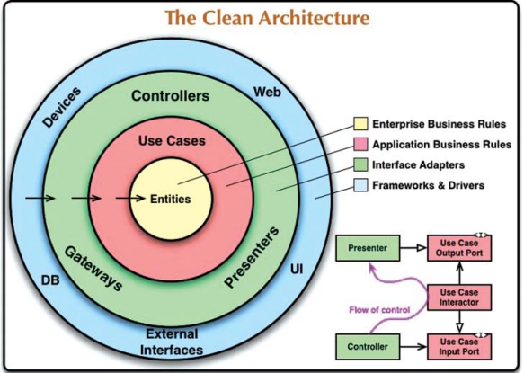
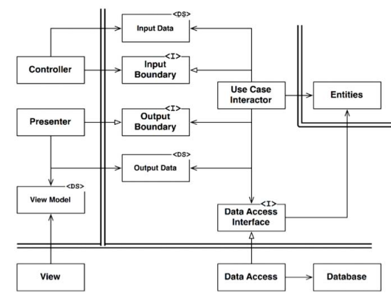

# 22장. 클린 아키텍쳐

지난 수십년간 다음과 같은 시스템 아키텍쳐와 관련된 여러가지 아이디어들이 존재했다.

- 육각형 아키텍쳐
- DCI
- BCE

세부적인면은 다를 수 있으나, 이들의 목표는 모두 `관심사의 분리(separation of concerns)`이다.
소프트웨어를 계층으로 분리하여 관심사의 분리라는 목표를 달성할 수 있었다.
각 아키텍쳐는 최소한 업무 규칙을 위한 계층 하나와, 사용자와 시스템 인터페이스를 위한 또 다른 계층 하나를 반드시 포함한다.
이 아키텍쳐들은 다음과 같은 특징을 지닌다.

- 프레임워크 독립성
  - 프레임워크 존재여부에 의존하지 않음
  - 프레임워크를 도구로 사용할 수 있음
- 테스트 용이성
  - 외부 요소가 없이도 테스트 가능
- UI 독립성
  - 시스템의 나머지 부분을 변경하지 않아도 UI를 변경 가능
- 데이터베이스 독립성
  - 업무 규칙은 데이터베이스에 결합되지 않는다
- 모든 외부 에이전시에 대한 독립성
  - 업무 규칙은 외부 세계와의 인터페이스에 대해 알지 못함

## 의존성 규칙

보통 안으로 들어갈 수록 고수준의 소프트웨어가 된다. 바깥쪽 원은 메커니즘 안쪽 원은 정책이다.
이런 아키텍쳐를 동작하게 하는 가장 중요한 규칙은 `의존성 규칙`이다.

> 소스 코드 의존성은 반드시 안쪽으로, 고수준의 정책을 향해야 한다

내부의 원에 속한 요소는 외부의 원에 속한 어떤 것도 알지 못한다.
같은 이유로, 외부의 원에 선언된 데이터 형식도 내부의 원에서 절대로 사용해서는 안된다.

### 엔티티

- 전사적인 핵심 업무 규칙을 캡슐화
- 고수준인 규칙을 캡슐화한다
- 외부의 무언가가 변경되더라도 엔티티가 변경될 가능성은 지극히 낮아야한다

### 유스케이스

- 어플리케이션에 특화된 업무 규칙을 포함
- 시스템의 모든 유스케이스를 캡슐화하고 구현
- 엔티티로 들어오고 나가는 데이터 흐름을 조정
  - 엔티티가 자신의 핵심 업무 규칙을 사용해서 유스케이스의 목적을 달성하도록 리드
- 유스케이스의 세부사항이 변하면 같은 계층의 코드 일부는 영향을 받음

### 인터페이스 어댑터

- 일련의 어댑터들로 구성
- 유스케이스와 엔티티에게 가장 편리한 형식에서 데이터베이스나 웹같은 외부 에이전시에게 편리한 형식으로 변환
- 외부적인 형식에서 유스케이스나 엔티티에서 사용되는 내부적인 형식으로 변환하는 또다른 어댑터 또한 필요

### 프레임워크와 드라이버

- 가장 바깥쪽 계층은 일반적으로 데이터베이스나 웹 프레임워크 같은 도구들로 구성
- 모든 세부사항이 위치하는 곳
- 외부에 위치시켜서 변경으로 인한 피해를 최소화

### 다이어그램의 원이 네개여야 하나?

- 항상 네 개만 사용해야한다는 규칙은 없다
- 하지만, 어떤 경우에도 의존성 규칙은 적용
  - 소스 코드 의존성은 항상 안쪽으로
  - 안쪽으로 이동할수록 추상화와 정책의 수준을 높임
  - 가장 바깥쪽 원은 저수준의 구체적인 세부사항
  - 가장 안쪽 원은 가장 범용적이며 높은 수준을 가지게

### 경계 횡단하기

다이어그램의 제어흐름을 살펴보자

- 제어흐름은 컨트롤러에서 시작해서 유스케이스를 지나고 프레젠터에서 실행
- 소스 코드 의존성을 보면, 각 의존성은 유스케이스를 향해 안쪽을 가리킴
- 제어흐름과 의존성의 방향이 반대여야하는 경우 `의존성 역전 원칙`을 사용하여 해결

예를 들어 유스케이스에서 프레젠터를 호출해야한다고 가정

- 절대로 직접 호출해버리면 안됨
  - 의존성 규칙인 `내부의 원에서 외부의 원에 대해서 알면 안된다`를 위반
- `유스케이스`가 `내부 원의 인터페이스를 호출`하도록하고, `외부 원`의 프레젠터가 그 `인터페이스를 구현`

동적 다형성을 이용해 소스 코드 의존성을 제어흐름과 반대로 만들 수 있다.
이를 통해 제어흐름이 어느 방향으로 흐르더라도 의존성 규칙을 준수할 수 있다

### 경계를 횡단하는 데이터는 어떤 모습인가

- 경계를 가로지르는 데이터는 간단한 데이터 구조로서 간단한 데이터 전송 객체(DTO)나 구조체일 수 있다.
- 중요한건 `격리되어 있는 DTO`가 경계를 가로질러 전달되어야 한다는 사실
  - 엔티티 객체나 데이터베이스의 행을 전달해서는 안된다
  - 데이터 구조가 어떤 의존성을 가져 의존성 규칙을 위배하게 될 수 있다
- 경계를 가로질러 데이터를 전달할 때 데이터는 항상 내부의 원에서 사용하기 가장 편리한 형태를 가져야 한다

## 전형적인 시나리오

의존성의 방향에 주목해야한다. 모든 의존성은 경계선을 안쪽으로 가로지르며 `의존성 규칙을 준수`한다

## 결론

- 소프트웨어를 계층으로 분리하고 의존성 규칙을 준수한다면 테스트하기 쉬운 시스템을 만들 수 있음
- 또한 데이터베이스나 프레임워크같은 외부요소가 변경되더라도 복잡하지 않게 교체 가능
