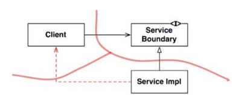
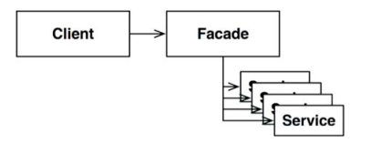

# 24장. 부분적 경계

아키텍쳐 경계를 완벽하게 만드는 데는 비용이 많이 든다. 그렇다면 부분적 경계를 구현해볼 수 있다.

## 마지막 단계를 건너뛰기

부분적 경계를 생성하는 방법 하나는 독립적으로 컴파일하고 배포할 수 있는 컴포넌트를 만들기 위한 작업은 모두 수행한 후,
단일 컴포넌트에 그대로 모아만 두는 것이다.

부분적 경계를 만들려면 완벽한 경계를 만들 때 만큼의 코드량과 사전 설계가 필요하다.
하지만 `다수의 컴포넌트를 관리하는 작업은 하지 않아도 된다`. 추적을 위한 버전도 배포 관리의 부담도 없다.

## 일차원 경계

완벽한 형태의 아키텍쳐 경계는 양방향으로 격리된 상태를 유지해야 하므로 쌍방향 Boundary 인터페이스를 사용한다.
양방향으로 격리된 상태를 유지하려면 초기 설정할 때나 지속적으로 유지할 때도 많은 비용이 든다.

추후 완벽한 형태의 경계로 확장할 수 있는 공간을 확보하고자 할 때 활용할 수 있는 더 간단한 구조는 위와 같다.
전통적인 Strategy 패턴을 사용한 사례이다. 

Client를 ServiceImpl로부터 격리 시키는 의존성 역전이 이미 적용되어 있기 때문이다. 
하지만, 쌍방향 인터페이스가 없고 제대로 훈련이 되어있지 않다면 점선과 같이 통로가 생기는걸 막을 수 없다.

## 퍼사드

더 단순한 경계는 퍼사드 패턴으로 의존성 역전까지 희생한다.
서비스 호출이 발생하면 해당 서비스 클래스로 호출을 전달한다. 클라이언트는 이들 서비스 클래스에 직접 접근할 수 없다.
하지만 Client가 모든 서비스 클래스에 대해 `추이 종속성`을 가지게 된 것을 주목해야한다.

## 결론

- 각 접근법은 나름의 비용과 장점을 지닌다
- 아키텍쳐 경계가 언제 어디에 존재해야 할지 또는 완벽하게 구현할지 부분적으로 구현할지는 이키텍트의 역할이다.