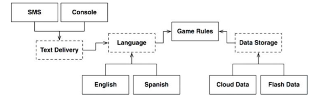
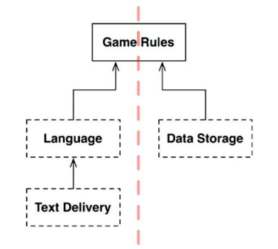
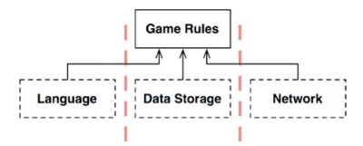

# 25장. 계층과 경계

시스템이 UI, 업무 규칙, 데이터베이스로만 구성된다고 생각하기 쉽다.
하지만 이게 전부일까?

## 클린 아키텍쳐

변경의 축에 의해 정의된 아키텍쳐 경계가 잠재되어 있을 수 있다.

English, SMS, CloudData와 같은 변형들은 추상 API 컴포넌트가 정의하는 다형적 인터페이스를 통해 제공되고,
실제로 서비스하는 구체 컴포넌트가 해당 인터페이스를 구현한다.

이러한 변형들을 모두 제거하고 순전히 API 컴포넌트만 집중하면 다이어그램을 단순화 할 수 있다.
모든 화살표가 위를 향하도록 맞춰져있다는 점에 주목해야한다. 

이 구성은 데이터 흐름을 두개의 흐름으로 효과적으로 분리한다.
왼쪽은 사용자와의 통신에 관여하며 오른쪽은 데이터 영속성에 관여한다. 두 흐름은 상단 GameRules에서 만나며 
두 흐름이 모두 거치게 되는 데이터에 대한 최종적인 처리가 GameRules에서 이뤄진다.

시스템이 복잡해질수록 컴포넌트 구조는 더 많은 흐름으로 분리된다.

## 결론

- 아키텍쳐 경계는 어디에나 존재한다
- 이러한 경계를 제대로 구현하려면 비용이 많이든다는 사실을 인지해야한다
  - 이러한 경계가 무시되었다면 나중에 다시 추가되는 비용이 크다

그렇다면 우리는 어떻게 해야할까?

- YAGNI(You Arent Going to Need)의 철학처럼 추상화가 필요하리라고 미리 예측해서는 안된다
  - 오버 엔지니어링은 언더 엔지니어링보다 나쁠 때가 훨씬 많기 때문
- 하지만 이 경우 경계를 추가히기 위해 많은 비용을 지불해야한다

결국 초반에는 구현할 경계가 무엇인지와 무시할 경계가 무엇인지 쉽게 결정할 수 없다.
하지만 시간이 지나며 경계가 존재하지 않아 생기는 조짐을 관찰해야한다.

- 해당 경계를 구현하는 비용과 무시할 때 감수해야할 비용을 가늠하고 자주 검토해야한다.
- 경계를 무시해서 생기는 비용 > 경계의 구현비용 -> 경계를 구현!

