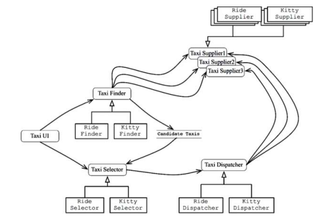
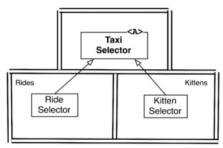

# 27장. 크고 작은 모든 서비스들

서비스 지향 아키텍쳐와 마이크로 서비스 아키텍쳐는 왜 인기를 끌고 있을까?

- 서비스를 사용하면 상호 결합이 철저하게 분리되는 것처럼 보임
- 서비스를 사용하면 개발과 배포 독립성을 지원하는 것처럼 보임

## 서비스 아키텍쳐

서비스를 사용하는 것은 본질적으로 아키텍쳐에 해당하지는 않는다.
왜냐면 아키텍쳐는 의존성 규칙을 준수하며 `고수준의 정책을 저수준의 세부사항으로 분리하는 경계`에 의해 정의된다.
`행위를 분리할 뿐인 서비스는 값비싼 함수 호출`에 불과하다.

하지만 기능을 프로세스나 플랫폼에 독립적이게 서비스를 생성하면 의존성 규칙 준수 여부와 상과없이 도움이 될 떄가 많다.
그렇다고 서비스 자체로는 아키텍쳐를 정의하지 않는다.

모놀리틱, 컴포넌트 기반 시스템에서 아키텍쳐를 정의하는 요소는 `의존성 규칙을 따르며 아키텍쳐 경계를 넘나드는 함수 호출`들이다.
마찬가지로 서비스 또한 프로세스나 플랫폼 경계를 가로지르는 함수 호출에 불과하다.

## 서비스의 이점?

### 결합 분리의 오류

서비스로 분리하게되면 서비스 사이의 결합이 확실히 분리된다는 이점을 예상할 수 있다.
하지만, 프로세서 내의 또는 네트워크 상의 공유 자원 때문에 결합될 가능성은 여전히 존재한다.
게다가 서로 `공유하는 데이터에 의해 서비스는 강력하게 결합`되어 버린다.

예를 들어, 서비스간의 인터페이스가 바뀌면 그 인터페이스를 사용하는 모든 서비스들도 반드시 변경되어야한다.
따라서, 서비스들은 데이터 레코드에 강하게 결합되고 서비스들 사이에는 간접적으로 결합되어 버린다.

### 개발 및 배포 독립성의 오류

서비스로 분리하면 개발팀이 서비스를 소유하고 운영할 수 있음을 예상할 수 있다.
이런 개발, 배포 독립성은 확장 가능한 것으로 간주되며, 대규모 엔터프라이즈 시스템을 독립적으로
개발, 배포 가능한 수많은 서비스로 구성할 수 있다고 생각하게 된다.

하지만, 이 또한 일부에 불과하다.

첫째로, 대규모 엔터프라이즈 시스템은 서비스 기반 시스템이 아니여도 모놀릭틱이나 컴포넌트 기반 시스템으로도 구축이 가능했다.
즉, 서비스는 확장 가능한 시스템을 구축하기 위한 유일한 선택지가 아니다.

둘째로, 앞서 결합 분리의 오류에서 말했듯 데이터나 행위에서 결합이 되어있다면, 결합에 따라
개발, 배포, 운영을 조정해야만 한다.

## 컴포넌트 기반 서비스

서비스는 SOLID 원칙대로 설계할 수 있으며, 컴포넌트 구조를 갖출 수도 있다. 이를 통해
서비스 내의 기존 컴포넌트들을 변경하지 않고도 새로운 컴포넌트를 추가할 수 있다.

서비스를 하나 이상의 jar 파일에 포함되는 추상 클래스들의 집합이라고 생각하라. 
새로운 기능은 새로운 jar 파일로 만들며, 이때 기존 jar 파일에 정의된 추상 클래스들을 확장해서 만든다.
그러면 새로운 기능 배포는 서비스를 재배포하는 것이 아닌, 서비스를 로드하는 경로에 새로운 jar 파일을 추가하는 문제로 바뀐다.

## 횡단 관심사

`아키텍쳐의 경계가 서비스 사이에 있지 않다`는 사실이 중요하다
모든 주요 시스템이 직면하는 `횡단 관심사`를 처리하려면, `서비스 내부는 의존성 규칙도 준수하는 컴포넌트 아키텍쳐`로 설계해야한다.
아키텍쳐 경계를 정의하는 것은 서비스 내에 위치하는 컴포넌트다.

## 결론

- 서비스는 시스템 확장성과 개발 가능성 측면에서는 유용하지만 그자체로는 아키텍쳐적으로는 중요하진 않다.
- 아키텍쳐는 시스템 내부에 그어진 경계와 그 경계를 넘나드는 의존성에 의해 정의
  - 즉, 서비스처럼 구성 요소가 통신하고 실행되는 물리적인 매커니즘에 의한 것이 아님
