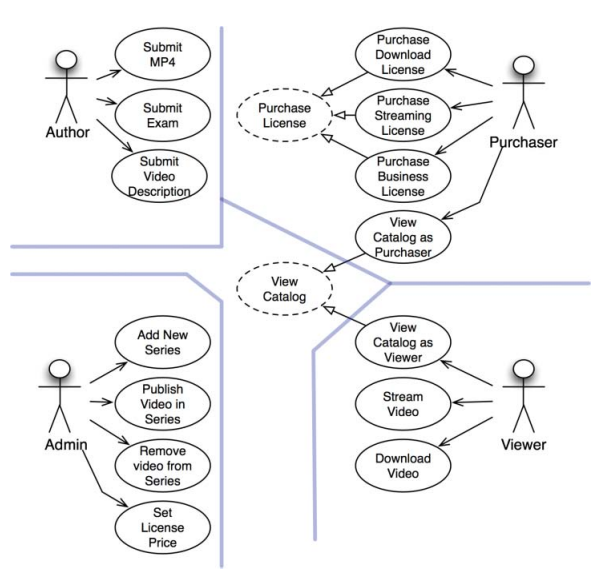
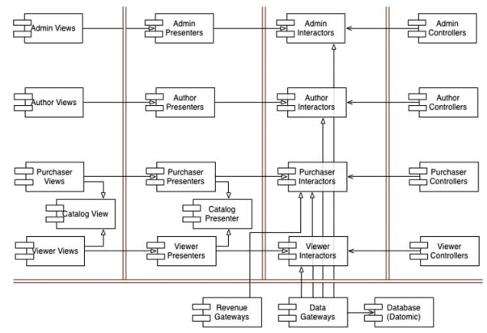

# 사례 연구

해당 챕터에서는 아키텍트가 하는 일을 처리하는 과정과 결정을 내리는 모습을 간단하게 표현한다.

## 제품

예시는 비디오 판매를 하는 소프트웨어이며, 비디오 제작자, 관리자, 비디오를 구매하는 구매자
그리고 스트리밍으로 비디오를 시청하는 시청자가 존재한다.

시스템 초기 아키텍쳐를 결정하는 첫 단계는 액터와 유스케이스를 식별하는 일이다.

## 유스케이스 분석

네개의 주요 액터는 분명하며 단일 책임원칙에 따라 신규 기능을 추가하거나 기존 기능을 변경할 때는
반드시 이들 액터 중 하나에게 해당 기능을 제공하기 위해서다. 시스템을 분할하여 특정 액터를 위한 변경이
나머지 액터에게는 전혀 영향을 끼치지 않게 만들고자 한다.

중앙의 점선으로 된 유스케이스는 추상 유스케이스로 범용적인 정책을 담고있으며 다른 유스케이스에서 이를 구체화한다.
이 추상화가 반드시 필요한 것은 아니지만, 두 유스케이스가 너무 비슷하기에 초기에 통합하는 방법을 선택했다.

## 컴포넌트 아키텍쳐

액터와 유스케이스를 식별했으면, 예비 단계의 컴포넌트 아키텍쳐를 만들어 볼 수 있다.
이중으로 된 선은 아키텍쳐의 경계를 나타내며, 뷰, 프레젠터, 인터랙터, 컨트롤러로 분리된 전형적인 분할방법을 볼 수 있다.
각 컴포넌트는 단일 .jar 파일이나 단일 .dll 파일에 해당한다.

시스템을 이런 컴포넌트들로 모두 분할해서 여러 jar 파일로 전달해야할까? 그럴수도 아닐 수 도 있다.
하지만 이렇게 하면 각 컴포넌트를 독립적으로 전달할 수 있게 빌드하는 것이 가능해진다.

이처럼 선택지를 열어두면, 후에 시스템이 변경되는 양상에 맞춰 시스템 배포방식을 조절할 수 있다.

## 의존성 관리

제어흐름은 오른쪽에서 왼쪽으로 이동한다. 입력이 컨트롤러를 통해 인터랙터에 의해 처리되어 결과를 만든다.
이후 프레제터가 결과의 포맷을 변경하고 뷰에 화면을 표시한다.

사실 대다수 화살표는 왼족에서 오른쪽으로 향하는데, 이는 아키텍쳐가 `의존성 규칙을 준수`하기 때문이다.
모든 의존성은 경계선을 한 방향으로만 가로지르며, 더 높은 수준의 정책을 포함하는 컴포넌트를 향한다.

사용 관계(열린 화살표)는 제어흐름과 같은 방향을, 상속 관계(닫힌 화살표)는 제어흐름과는 반대 방향을 가리킨다.
저수준의 세부사항에서 발생한 변경이 상위로 파급되어서 상위수준에 영향을 미치지 않음을 보장할 수 있다.

## 결론

- 두가지 서로 다른 차원의 분리 개념을 설명
  - 단일 책임 원칙에 기반한 액터의 분리
  - 의존성 규칙